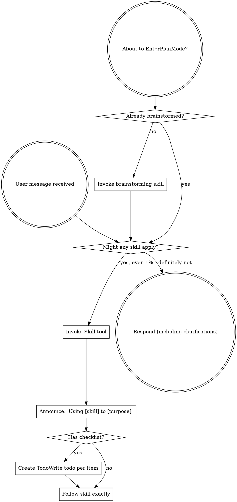

Reading additional input from stdin...
OpenAI Codex v0.128.0 (research preview)
--------
workdir: /Users/yangyihan/Downloads/hail-mary-chat
model: gpt-5.5
provider: openai
approval: never
sandbox: read-only
reasoning effort: xhigh
reasoning summaries: none
session id: 019e3f3d-967a-7120-932c-c9a75cdb73cf
--------
user
Round 2 cross-review of the companion mode design spec.

Read these three files in this order:
1. docs/superpowers/specs/2026-05-19-companion-mode-design.md (the original spec)
2. docs/superpowers/specs/companion-review/round-1-codex.md (your Round 1 findings)
3. docs/superpowers/specs/companion-review/round-2-claude.md (author's responses to your Round 1)

Your Round 2 job:
(a) Verify each AGREE-d fix in round-2-claude.md would actually resolve the underlying Round 1 issue.
(b) Find NEW concerns introduced by the proposed fixes (especially: audioPlayback extension ripple effects on useRockyTTS/FavoritesScreen/EchoInterface — read those files; public R2 bucket vs existing rocky-audio bucket access policy — does the rocky-audio bucket exist as public or private, what's required for public assets).
(c) Push back on any fix that's still inadequate.
(d) List open questions that MUST be resolved before plan phase.

Output (under 800 words, structured):
- Adequacy verdict per fix (one line each: 'fix N: adequate' or 'fix N: inadequate because X')
- NEW concerns from the proposed fixes
- Open questions MUST be resolved before plan
- Final verdict: 'ready for plan after revisions' or 'still needs another round'

Be sharp.
codex
I’m using `superpowers:using-superpowers` for the session workflow, then I’ll read the three review files in order and inspect the affected audio code and storage policy.
exec
/bin/zsh -lc "sed -n '1,220p' /Users/yangyihan/.codex/plugins/cache/openai-curated/superpowers/eed16198/skills/using-superpowers/SKILL.md" in /Users/yangyihan/Downloads/hail-mary-chat
 succeeded in 0ms:
---
name: using-superpowers
description: Use when starting any conversation - establishes how to find and use skills, requiring Skill tool invocation before ANY response including clarifying questions
---

<SUBAGENT-STOP>
If you were dispatched as a subagent to execute a specific task, skip this skill.
</SUBAGENT-STOP>

<EXTREMELY-IMPORTANT>
If you think there is even a 1% chance a skill might apply to what you are doing, you ABSOLUTELY MUST invoke the skill.

IF A SKILL APPLIES TO YOUR TASK, YOU DO NOT HAVE A CHOICE. YOU MUST USE IT.

This is not negotiable. This is not optional. You cannot rationalize your way out of this.
</EXTREMELY-IMPORTANT>

## Instruction Priority

Superpowers skills override default system prompt behavior, but **user instructions always take precedence**:

1. **User's explicit instructions** (CLAUDE.md, GEMINI.md, AGENTS.md, direct requests) — highest priority
2. **Superpowers skills** — override default system behavior where they conflict
3. **Default system prompt** — lowest priority

If CLAUDE.md, GEMINI.md, or AGENTS.md says "don't use TDD" and a skill says "always use TDD," follow the user's instructions. The user is in control.

## How to Access Skills

**In Claude Code:** Use the `Skill` tool. When you invoke a skill, its content is loaded and presented to you—follow it directly. Never use the Read tool on skill files.

**In Copilot CLI:** Use the `skill` tool. Skills are auto-discovered from installed plugins. The `skill` tool works the same as Claude Code's `Skill` tool.

**In Gemini CLI:** Skills activate via the `activate_skill` tool. Gemini loads skill metadata at session start and activates the full content on demand.

**In other environments:** Check your platform's documentation for how skills are loaded.

## Platform Adaptation

Skills use Claude Code tool names. Non-CC platforms: see `references/copilot-tools.md` (Copilot CLI), `references/codex-tools.md` (Codex) for tool equivalents. Gemini CLI users get the tool mapping loaded automatically via GEMINI.md.

# Using Skills

## The Rule

**Invoke relevant or requested skills BEFORE any response or action.** Even a 1% chance a skill might apply means that you should invoke the skill to check. If an invoked skill turns out to be wrong for the situation, you don't need to use it.



## Red Flags

These thoughts mean STOP—you're rationalizing:

| Thought | Reality |
|---------|---------|
| "This is just a simple question" | Questions are tasks. Check for skills. |
| "I need more context first" | Skill check comes BEFORE clarifying questions. |
| "Let me explore the codebase first" | Skills tell you HOW to explore. Check first. |
| "I can check git/files quickly" | Files lack conversation context. Check for skills. |
| "Let me gather information first" | Skills tell you HOW to gather information. |
| "This doesn't need a formal skill" | If a skill exists, use it. |
| "I remember this skill" | Skills evolve. Read current version. |
| "This doesn't count as a task" | Action = task. Check for skills. |
| "The skill is overkill" | Simple things become complex. Use it. |
| "I'll just do this one thing first" | Check BEFORE doing anything. |
| "This feels productive" | Undisciplined action wastes time. Skills prevent this. |
| "I know what that means" | Knowing the concept ≠ using the skill. Invoke it. |

## Skill Priority

When multiple skills could apply, use this order:

1. **Process skills first** (brainstorming, debugging) - these determine HOW to approach the task
2. **Implementation skills second** (frontend-design, mcp-builder) - these guide execution

"Let's build X" → brainstorming first, then implementation skills.
"Fix this bug" → debugging first, then domain-specific skills.

## Skill Types

**Rigid** (TDD, debugging): Follow exactly. Don't adapt away discipline.

**Flexible** (patterns): Adapt principles to context.

The skill itself tells you which.

## User Instructions

Instructions say WHAT, not HOW. "Add X" or "Fix Y" doesn't mean skip workflows.

codex
`superpowers:receiving-code-review` also fits because this is a review-response validation task, so I’m loading that guidance before judging the proposed fixes.
exec
/bin/zsh -lc "sed -n '1,240p' /Users/yangyihan/.codex/plugins/cache/openai-curated/superpowers/eed16198/skills/receiving-code-review/SKILL.md" in /Users/yangyihan/Downloads/hail-mary-chat
 succeeded in 0ms:
---
name: receiving-code-review
description: Use when receiving code review feedback, before implementing suggestions, especially if feedback seems unclear or technically questionable - requires technical rigor and verification, not performative agreement or blind implementation
---

# Code Review Reception

## Overview

Code review requires technical evaluation, not emotional performance.

**Core principle:** Verify before implementing. Ask before assuming. Technical correctness over social comfort.

## The Response Pattern

```
WHEN receiving code review feedback:

1. READ: Complete feedback without reacting
2. UNDERSTAND: Restate requirement in own words (or ask)
3. VERIFY: Check against codebase reality
4. EVALUATE: Technically sound for THIS codebase?
5. RESPOND: Technical acknowledgment or reasoned pushback
6. IMPLEMENT: One item at a time, test each
```

## Forbidden Responses

**NEVER:**
- "You're absolutely right!" (explicit CLAUDE.md violation)
- "Great point!" / "Excellent feedback!" (performative)
- "Let me implement that now" (before verification)

**INSTEAD:**
- Restate the technical requirement
- Ask clarifying questions
- Push back with technical reasoning if wrong
- Just start working (actions > words)

## Handling Unclear Feedback

```
IF any item is unclear:
  STOP - do not implement anything yet
  ASK for clarification on unclear items

WHY: Items may be related. Partial understanding = wrong implementation.
```

**Example:**
```
your human partner: "Fix 1-6"
You understand 1,2,3,6. Unclear on 4,5.

❌ WRONG: Implement 1,2,3,6 now, ask about 4,5 later
✅ RIGHT: "I understand items 1,2,3,6. Need clarification on 4 and 5 before proceeding."
```

## Source-Specific Handling

### From your human partner
- **Trusted** - implement after understanding
- **Still ask** if scope unclear
- **No performative agreement**
- **Skip to action** or technical acknowledgment

### From External Reviewers
```
BEFORE implementing:
  1. Check: Technically correct for THIS codebase?
  2. Check: Breaks existing functionality?
  3. Check: Reason for current implementation?
  4. Check: Works on all platforms/versions?
  5. Check: Does reviewer understand full context?

IF suggestion seems wrong:
  Push back with technical reasoning

IF can't easily verify:
  Say so: "I can't verify this without [X]. Should I [investigate/ask/proceed]?"

IF conflicts with your human partner's prior decisions:
  Stop and discuss with your human partner first
```

**your human partner's rule:** "External feedback - be skeptical, but check carefully"

## YAGNI Check for "Professional" Features

```
IF reviewer suggests "implementing properly":
  grep codebase for actual usage

  IF unused: "This endpoint isn't called. Remove it (YAGNI)?"
  IF used: Then implement properly
```

**your human partner's rule:** "You and reviewer both report to me. If we don't need this feature, don't add it."

## Implementation Order

```
FOR multi-item feedback:
  1. Clarify anything unclear FIRST
  2. Then implement in this order:
     - Blocking issues (breaks, security)
     - Simple fixes (typos, imports)
     - Complex fixes (refactoring, logic)
  3. Test each fix individually
  4. Verify no regressions
```

## When To Push Back

Push back when:
- Suggestion breaks existing functionality
- Reviewer lacks full context
- Violates YAGNI (unused feature)
- Technically incorrect for this stack
- Legacy/compatibility reasons exist
- Conflicts with your human partner's architectural decisions

**How to push back:**
- Use technical reasoning, not defensiveness
- Ask specific questions
- Reference working tests/code
- Involve your human partner if architectural

**Signal if uncomfortable pushing back out loud:** "Strange things are afoot at the Circle K"

## Acknowledging Correct Feedback

When feedback IS correct:
```
✅ "Fixed. [Brief description of what changed]"
✅ "Good catch - [specific issue]. Fixed in [location]."
✅ [Just fix it and show in the code]

❌ "You're absolutely right!"
❌ "Great point!"
❌ "Thanks for catching that!"
❌ "Thanks for [anything]"
❌ ANY gratitude expression
```

**Why no thanks:** Actions speak. Just fix it. The code itself shows you heard the feedback.

**If you catch yourself about to write "Thanks":** DELETE IT. State the fix instead.

## Gracefully Correcting Your Pushback

If you pushed back and were wrong:
```
✅ "You were right - I checked [X] and it does [Y]. Implementing now."
✅ "Verified this and you're correct. My initial understanding was wrong because [reason]. Fixing."

❌ Long apology
❌ Defending why you pushed back
❌ Over-explaining
```

State the correction factually and move on.

## Common Mistakes

| Mistake | Fix |
|---------|-----|
| Performative agreement | State requirement or just act |
| Blind implementation | Verify against codebase first |
| Batch without testing | One at a time, test each |
| Assuming reviewer is right | Check if breaks things |
| Avoiding pushback | Technical correctness > comfort |
| Partial implementation | Clarify all items first |
| Can't verify, proceed anyway | State limitation, ask for direction |

## Real Examples

**Performative Agreement (Bad):**
```
Reviewer: "Remove legacy code"
❌ "You're absolutely right! Let me remove that..."
```

**Technical Verification (Good):**
```
Reviewer: "Remove legacy code"
✅ "Checking... build target is 10.15+, this API needs 13+. Need legacy for backward compat. Current impl has wrong bundle ID - fix it or drop pre-13 support?"
```

**YAGNI (Good):**
```
Reviewer: "Implement proper metrics tracking with database, date filters, CSV export"
✅ "Grepped codebase - nothing calls this endpoint. Remove it (YAGNI)? Or is there usage I'm missing?"
```

**Unclear Item (Good):**
```
your human partner: "Fix items 1-6"
You understand 1,2,3,6. Unclear on 4,5.
✅ "Understand 1,2,3,6. Need clarification on 4 and 5 before implementing."
```

## GitHub Thread Replies

When replying to inline review comments on GitHub, reply in the comment thread (`gh api repos/{owner}/{repo}/pulls/{pr}/comments/{id}/replies`), not as a top-level PR comment.

## The Bottom Line

**External feedback = suggestions to evaluate, not orders to follow.**

Verify. Question. Then implement.

No performative agreement. Technical rigor always.

codex
I’ll now read the original spec, my earlier findings, and the author’s Round 2 response in the order requested, then I’ll verify each proposed change against the current repo.
exec
/bin/zsh -lc "sed -n '1,260p' docs/superpowers/specs/2026-05-19-companion-mode-design.md" in /Users/yangyihan/Downloads/hail-mary-chat
 succeeded in 0ms:
# Companion Mode v1 — Design

_Date: 2026-05-19_
_Status: design draft — awaiting cross-review (Claude × codex, 3 rounds)_
_Author: Claude (brainstormed with @yangyihan)_

---

## 1. North star

Pre-recorded **non-verbal audio companion** mode. A user opens it
from the home screen or from inside a chat, and Rocky's presence
becomes ambient: a continuously-looping spaceship environment bed,
overlaid with occasional Rocky non-verbal triggers (hums, taps,
breaths, scrapes, rummaging). The user is not chatting — they are
studying, working, or going to sleep, and they want to know Rocky
is still there.

Aligned with PHM canon: Eridians sense the world via sound
vibration, not vision, so audio-only presence is the most
"Rocky-true" interaction in the product.

### Why now

- **L1 retention** is the bottleneck. Users who don't want to chat
  right now have no reason to open the app — companion mode gives
  them one.
- **Zero marginal cost**: static R2 assets, no LLM, no TTS spend.
- **Lore wedge**: nothing else in the app exploits the
  vibration-sense canon.

### Out of scope (v1)

- Multi-channel menu ("Rocky working" / "Rocky resting" / etc.) — v2
- Adaptive trigger cadence (idle-aware) — v2
- Rocky verbal lines — use chat
- Affinity / rapport changes — explicitly no, regardless of usage
- voice_credits consumption — companion is free
- Bedtime stories — PR #38 paused, separate scope
- Cross-device companion sync — future

---

## 2. Architecture

```
[Client]
  ├─ CompanionScreen.tsx        (new — full-screen surface)
  ├─ useCompanionAudio.ts       (new — env loop + trigger scheduler + sleep timer)
  ├─ wakeLock.ts                (new, ~30 LOC — Screen Wake Lock API w/ iOS fallback)
  ├─ audioPlayback.ts           (existing, modified — add 'companion' slot type)
  └─ MediaSession metadata      (existing pattern)

[Server]
  └─ GET /api/companion/asset-urls   (new, tiny — returns presigned GETs for
                                       env bed + 20 triggers in one response)
     no other new endpoints

[Storage R2]
  rocky-audio/companion/v1/
  ├─ env-bed-01.mp3                       (~10 min, ~7 MB, seamless loop, 96kbps)
  └─ triggers/                            (20 short clips, ~1.5 MB total, 128kbps)
      ├─ hum-{01..04}.mp3
      ├─ tap-{01..04}.mp3
      ├─ scrape-{01..04}.mp3
      ├─ breath-{01..04}.mp3
      └─ rummage-{01..04}.mp3
```

**Total first-load weight: ~8-9 MB.** Subsequent opens hit the browser
HTTP cache via the same R2 object keys.

### Components & responsibilities

| Component | Type | Responsibility |
|---|---|---|
| `CompanionScreen.tsx` | new | Full-screen surface. Renders breathing dot + elapsed counter + sleep-timer control + Exit + Dim toggle. On mount: `audioPlayback.claimSlot('companion')`. On unmount: `releaseSlot`. |
| `useCompanionAudio.ts` | new | Two `HTMLAudioElement`s — base loop (`loop=true`) + single trigger element (reassigned per trigger). 30s–2min random interval, "no adjacent duplicates" algorithm. Sleep-timer fade (8s base volume → 0). States: `loading / playing / fading / done / error`. |
| `wakeLock.ts` | new | `navigator.wakeLock.request('screen')` wrapper. Silent fallback on iOS Safari (which currently does not support it on lock screen). |
| `audioPlayback.ts` | modified | Add `'companion'` slot type. `claimSlot('companion')` stops any in-flight TTS. Inverse defense: a TTS `claimSlot` during companion → companion auto-pauses + logs (defense — should not happen due to UI mutex). |
| `StartScreen.tsx` | modified | Add third CTA "STAY CONNECTED" / "陪着我" below `DIAL IN` / `OPEN CHANNEL` row. |
| `ChatInterface.tsx` | modified | Add new icon button in `status-actions` row near red hangup, labeled "STAY ON LINE". On click: `endSession()` (runs through existing consolidate path) → navigate to companion. |
| `App.tsx` | modified | Phase machine: `'home' \| 'echo' \| 'favorites' \| 'chat'` → add `'companion'`. Mutex enforced at navigation layer: entering companion forces chat exit; entering chat forces companion exit. |

---

## 3. Asset library

| Type | Count | Length | Bitrate | Total size |
|---|---|---|---|---|
| Env bed | 1 | ~10 min | 96 kbps mp3 | ~7 MB |
| Rocky triggers (5 groups × 4 variants) | 20 | 0.5–3s each | 128 kbps mp3 | ~1.5 MB |
| **Total** | **21 files** | — | — | **~8.5 MB** |

Groups: `hum` (4), `tap` (4), `scrape` (4), `breath` (4), `rummage` (4).

### Sourcing plan (per project directive: search online before recording)

| Asset | Step 1 — search online | Step 2 — clip existing | Step 3 — fresh recording |
|---|---|---|---|
| Env bed | **Freesound / Pixabay / Zapsplat** for "spaceship ambience", "sci-fi room tone", "fan hum", "control room ambient" (CC0 / CC-BY preferred). Audacity remix into seamless 10-min loop. | n/a | Only if step 1 yields nothing usable. |
| Rocky non-verbal triggers | n/a — must be Rocky's voice line, not findable online | Scan `rocky_voice_human.MP3` + `rocky_voice_human_2.MP3` for clippable non-verbal segments (hums, mouth-clicks, breaths, page flips). Optimistic estimate: ~10 of 20 triggers come from existing material. | Studio session for the rest (1–2 days). |

### Production estimate

| Phase | Duration | Notes |
|---|---|---|
| Recon: scan old recordings + Freesound search | 1 day | Plan-phase deliverable: "x of 20 triggers covered by existing material, y CC0 ambient candidates for env bed" |
| Env bed production (search-or-record + Audacity loop work) | 1–2 days | Step 1 path: 1 day. Step 3 fallback: 2 days. |
| Trigger recording (gaps not covered by old material) | 1–2 days | Depends on recon outcome. |
| Mix + seamless-loop QA + bitrate encoding | 1 day | One pass per asset; verify no audible loop click; verify trigger peaks consistent |
| **Total** | **3–6 working days** | Range depends on how much recon reduces fresh recording |

---

## 4. UX state machine

```
[home / chat]
   │
   ↓  CTA: "Stay Connected"  (home)
   ↓  CTA: "Stay On Line"    (chat → endSession() first)
   │
[loading]   ← parallel fetch env bed + 20 triggers; UI shows breathing dot + "tuning in…"
   │
   ↓  all critical assets loaded (env bed + at least 4 triggers)
   ↓  triggers still loading in background lazy
   │
[playing]
   │
   ↓  user taps Exit  |  sleep timer hits 0
   │
[fading]    ← 8s base volume → 0, trigger schedule stopped
   │
   ↓  fade complete
   │
[done]
   │
   ↓
[home]

side branch:
[error]   ← env bed fetch failed | network gone
   │
   ↓  retry button | exit
```

### Phase transitions

| From | To | Trigger |
|---|---|---|
| `home` | `loading` | user taps "Stay Connected" |
| `chat` | `loading` | user taps "Stay On Line" → `endSession()` runs (existing consolidate path) → navigate companion |
| `loading` | `playing` | env bed + ≥4 triggers loaded (rest lazy) |
| `loading` | `error` | env bed fetch fails (5s timeout or HTTP error) |
| `playing` | `fading` | user Exit | sleep timer = 0 |
| `fading` | `done` | 8s fade elapsed |
| `done` | `home` | automatic |
| `error` | `loading` | retry |
| `error` | `home` | exit |

---

## 5. UI specs

### Default chrome ("a-style")

```
┌─────────────────────────────────────┐
│  ☾                                ✕ │  ← dim toggle (top-left) | exit (top-right)
│                                     │
│                                     │
│              ◯                      │  ← breathing dot (slow pulse, 4s cycle)
│           Rocky · 在                 │  ← static label
│                                     │
│            32:14                    │  ← elapsed time, large
│                                     │
│  ┌─────────────────────────────┐    │
│  │  ⏱ Sleep timer · 剩 23:14  │   │  ← sleep-timer pill, tappable opens picker
│  └─────────────────────────────┘    │
│                                     │
└─────────────────────────────────────┘
```

### Dim chrome ("c-style", same component, `companionDim=true`)

```
┌─────────────────────────────────────┐
│                                     │
│                                     │
│           (nearly black)            │
│                                     │
│                                     │
│                                     │
│                                     │
│                                     │
│                                     │
│  🛰 Rocky · 32:14 · 剩 23 min        │  ← bottom bar only, low-contrast
└─────────────────────────────────────┘
```

The dim chrome reuses the same React component tree; only the styles
collapse + opacity drop. Tapping anywhere on screen toggles back to
full chrome briefly (3s auto-redim) for sleep-timer adjustment.

### Sleep timer picker

Bottom sheet, 5 options: `off / 15 / 30 / 45 / 60 min`.
Default selection: **30 min**.
Re-tapping the same option closes the sheet.
Changing the option resets the countdown from the new value (does
NOT accumulate against elapsed time).

### Breathing dot animation

Pure CSS: `box-shadow` + `opacity` keyframe, 4s cycle, ease-in-out.
On every Rocky trigger fire, the dot briefly brightens (300ms
boost) — a subliminal visual coupling between sound and visual.

---

## 6. Audio coordination

**Critical lesson from PR #38 review**: any new audio source MUST
integrate with `audioPlayback.ts` slot system, otherwise companion
audio can play simultaneously with chat TTS.

### Changes to `audioPlayback.ts`

```ts
type AudioSlotType = 'tts' | 'favorite' | 'echo' | 'companion';  // 'companion' new

// claimSlot('companion') stops any in-flight TTS and releases all
// other slot types. Same exclusivity contract as existing types.
// releaseSlot('companion') is called on CompanionScreen unmount.
```

### Mutex enforcement (defense in depth)

1. **UI-level**: navigation to `phase='companion'` exits chat;
   navigation back to chat exits companion. The two phases cannot
   coexist.
2. **Audio-level**: `audioPlayback` slot system guarantees only one
   slot owner at any time. If a defensive bug somewhere triggers a
   TTS claim during companion, companion auto-pauses and logs a
   warning (caught by future telemetry; ignored by user as a stop).

---

## 7. Background playback (screen off / lock / app-background)

| Mechanism | Purpose | iOS Safari behavior |
|---|---|---|
| `HTMLAudioElement` | Plays audio in background tab + lock screen | ✅ Supported; subject to OS-level audio session policy |
| MediaSession metadata | Lock-screen "now playing" UI | ✅ Supported — set `title="Rocky · Companion"`, `artist="Hail Mary Chat"`, `artwork=[<rocky-avatar-url>]` |
| MediaSession actions | Play/pause from lock screen | ✅ Supported — wire `play`, `pause`, `stop` |
| Screen Wake Lock API | Prevent screen sleep | ❌ Not supported on iOS Safari (as of iOS 16.4+, partial; before, none). Silent fallback; audio continues regardless. |

### iOS background-kill recovery


exec
/bin/zsh -lc "sed -n '261,520p' docs/superpowers/specs/2026-05-19-companion-mode-design.md" in /Users/yangyihan/Downloads/hail-mary-chat
 succeeded in 0ms:
iOS will sometimes pause/kill HTMLAudio in background after extended
periods (varies by device, battery state, OS version). On resume:

1. `<audio>` element state is checked on visibility-change event
2. If `paused` and our state says `playing` → show "Tap to resume Rocky"
   toast at bottom of screen
3. One tap re-issues `audio.play()` (which counts as a user gesture
   for autoplay policy)
4. Trigger schedule resumes from current wall-clock offset (no rewind)

---

## 8. Error handling

| Scenario | Behavior |
|---|---|
| Env bed HTTP fetch fails | `error` state, retry button + exit. Triggers don't start without bed. |
| Single trigger fetch fails | Skip silently, log to console; next trigger fires normally. With 20 triggers, one missing isn't user-detectable. |
| Wake Lock API denied | Silent fallback; audio continues; screen may dim per OS settings. No user-facing message (Wake Lock failure on iOS is expected). |
| `endSession()` from chat fails | Show toast "Couldn't end chat cleanly — companion not started"; stay on chat. (Defensive: never strand the user in a half-state.) |
| iOS pauses audio in background | On visibility-change, detect paused state, show "Tap to resume Rocky" |
| Network drops mid-session | Already-loaded audio keeps playing; if a trigger fails to load mid-stream, log + skip + try next |
| User auth state expires | Companion continues (presigned URLs were issued at companion-mount time, 1h expiry — covers all sleep timer durations) |
| Long session > 1h, presigned URL expires | On URL expiry detection (audio fetch 403): re-fetch `/api/companion/asset-urls` and reassign `audio.src`. Seamless if env bed buffer is enough; brief gap acceptable. |

---

## 9. Server / data model

**v1 verdict: one new endpoint, zero new DB tables.**

### `GET /api/companion/asset-urls` (new)

Auth: optional (companion is free for all, but signing presigned
URLs requires server context anyway). Anonymous users get a stub
session token good enough to call this endpoint.

Response:
```json
{
  "env_bed": "https://r2-presigned/.../env-bed-01.mp3?...",
  "triggers": [
    { "id": "hum-01", "url": "https://r2-presigned/.../hum-01.mp3?..." },
    ...
    { "id": "rummage-04", "url": "https://r2-presigned/.../rummage-04.mp3?..." }
  ],
  "expires_at": 1729123456  // unix seconds, 1h from issue
}
```

All 21 URLs in one response. Client caches the response for ~55min
(short of expiry) and re-fetches if it stays past that.

### DB

No new tables. No writes during companion. Defer "who used
companion, how long" to v2 when we want analytics.

### Storage

Asset paths are static: `rocky-audio/companion/v1/env-bed-01.mp3`,
`rocky-audio/companion/v1/triggers/<group>-<n>.mp3`. Uploaded
manually via `edgespark storage` once at v1 ship time. No dynamic
upload path.

---

## 10. Test plan (manual, v1 ship gate)

### Happy path
- [ ] Home → "Stay Connected" → audio starts within 2s on cold cache, ≤0.5s on warm
- [ ] Chat → "Stay On Line" → chat ends + consolidate runs + companion starts
- [ ] Sleep timer 30min → audio fades over last 8s → home
- [ ] Exit button → 8s fade + home

### Background / screen-off
- [ ] Phone lock → audio continues
- [ ] Switch tab → audio continues
- [ ] iOS Safari lock-screen MediaSession shows "Rocky · Companion · MM:SS"
- [ ] MediaSession play/pause from lock screen works
- [ ] iOS long-background pause → resume toast appears → one tap resumes

### Trigger correctness
- [ ] Trigger interval roughly 30s–2min over a 30-min sample
- [ ] No adjacent duplicate triggers in a 30-min sample
- [ ] env bed loops seamlessly (no audible click at boundary)
- [ ] Breathing dot brightens on each trigger fire

### Mutex / coordination
- [ ] In companion → tap home → companion unwinds cleanly
- [ ] In chat with TTS playing → tap "Stay On Line" → TTS stops, companion starts
- [ ] Wake Lock denied (iOS) → audio still plays
- [ ] Network drops 5s then recovers → trigger schedule continues without crash

### Error states
- [ ] Block `/api/companion/asset-urls` → loading → error state → retry works
- [ ] Block env bed URL only → loading → error state → retry works
- [ ] Block one trigger URL → other triggers play normally; that one silently skipped

### Dim toggle
- [ ] Toggle on → UI collapses to bottom-bar only
- [ ] Tap screen in dim mode → full chrome briefly visible (3s auto-redim)
- [ ] localStorage persists across reload

---

## 11. Performance & cost

| | v1 estimate |
|---|---|
| First-load bandwidth | ~8.5 MB |
| Steady-state bandwidth | 0 (assets loop locally) |
| Server CPU per session | ~1 request total (`/api/companion/asset-urls`) |
| R2 GET ops per session | 21 (one per asset, presigned) |
| Cost @ 1k DAU × 30 min/day | R2 GETs: 21k/day, ~$0.01/day; bandwidth: ~0.5 GB/day after cache, ~$0.05/day. Negligible. |

---

## 12. Open questions for plan phase

These get resolved at writing-plans time, not now:

- [ ] **Recon: clippable old material.** Run a 1-pass review of `rocky_voice_human.MP3` + `_2.MP3` and report "x of 20 triggers covered, y need fresh recording, z marginal".
- [ ] **Recon: CC0 ambient candidates.** Identify 3–5 specific Freesound / Pixabay candidates for env bed; verify license + seamless-loopability.
- [ ] **iOS Wake Lock fallback UX.** Confirm exact behavior: do we display anything when Wake Lock is denied, or fully silent? (Currently planned: fully silent.)
- [ ] **`App.tsx` phase machine refactor.** Map the minimal diff for adding `'companion'` phase + state propagation. May reveal opportunity for tighter abstraction; do not over-refactor.
- [ ] **Asset upload mechanism.** `edgespark storage put` from CLI vs commit assets into repo + sync via CI. v1: manual upload via CLI is fine; document the steps in ADMIN.md.
- [ ] **Companion screen accessibility.** Aria labels for breathing dot, screen reader announcements when trigger fires (or NOT — debatable for a meditative mode), keyboard nav for Exit + Sleep timer + Dim toggle.
- [ ] **i18n strings.** New keys for "Stay Connected" / "Stay On Line" / "Sleep timer" / "剩 X 分钟" / etc. across en/zh/ja.

---

## 13. Validation checklist (pre-implementation)

Before plan phase begins, all of these must be ✅:

- [x] Use case (b: study/work/sleep companion) confirmed
- [x] Audio nature (c: non-verbal pre-recorded, Eridian-lore aligned) confirmed
- [x] v1 shape (b: single channel, env bed + triggers) confirmed
- [x] Entry points (c: home CTA + chat "stay on line") confirmed
- [x] Mutual exclusivity (companion ↔ chat) confirmed
- [x] #38 BedtimePlayer paused, lessons absorbed, not folded into companion v1
- [x] Cost / gating (free for all, no affinity gate, no voice_credits) confirmed
- [x] Asset structure (1 env bed + 20 triggers, 30s–2min cadence, no-adjacent-duplicate) confirmed
- [x] Visual surface (a-style default + dim toggle to c-style) confirmed
- [x] Sleep timer defaults (off/15/30/45/60, default 30, 8s fade) confirmed
- [x] No pause/resume in v1 confirmed
- [x] Asset sourcing policy: search online first for env-bed-class assets; Rocky non-verbal must be his voice line (clip existing or record fresh) confirmed

---

## 14. Cross-review status

This spec will go through 3 rounds of cross-review between Claude
and codex before being handed to the user for final approval. Each
round's findings + responses are appended below.

### Round 1
_pending_

### Round 2
_pending_

### Round 3
_pending_

### Consensus
_pending_

exec
/bin/zsh -lc "sed -n '1,260p' docs/superpowers/specs/companion-review/round-1-codex.md" in /Users/yangyihan/Downloads/hail-mary-chat
 succeeded in 0ms:
**Top 3 Load-Bearing Concerns**
1. Audio mutex design is not implementable as written. Current [audioPlayback.ts](/Users/yangyihan/Downloads/hail-mary-chat/web/src/utils/audioPlayback.ts:51) has untyped `claimSlot()` and tracks one bound `Audio`, but companion wants two `HTMLAudioElement`s.
2. Chat → companion transition is wrong. [endSession()](/Users/yangyihan/Downloads/hail-mary-chat/web/src/utils/sessionApi.ts:88) is fire-and-forget and swallows failures, so the spec’s “stay on chat if end fails” behavior cannot happen.
3. Free anonymous presign endpoint has no abuse story. One script can repeatedly mint 21 URLs and drive R2 GET/bandwidth costs.

**Findings**
- BLOCK §6.1: Spec invents `claimSlot('companion')`, `releaseSlot('companion')`, and slot types, but current API has no type parameter and one global token. `attachAudio()` replaces `currentBound` without stopping a previous same-token bound audio. Two companion elements would either be invisible to the mutex or leak/overlap. Suggested fix: redesign `audioPlayback` for explicit owners + multiple bound elements, or make companion a single managed/mixed audio source.

- BLOCK §2/§4/§8: Chat handoff depends on awaitable `endSession()`, but current `endSession` returns `void`; ChatInterface hangup immediately calls `onBack()` after a meaningless `try/catch`. Suggested fix: add an awaitable `endSessionStrict()` or change the spec to accept best-effort consolidation.

- BLOCK §9/§11: `/api/companion/asset-urls` is optional-auth and free, but no per-IP/device/session rate limit, bot gate, cache key strategy, or abuse logging is specified. Existing visible bot defense is register-only. Suggested fix: add rate limits before plan phase, preferably IP+device hourly caps and cacheable public/static asset delivery where possible.

- FIX §2/§4: App integration claim is stale. [App.tsx](/Users/yangyihan/Downloads/hail-mary-chat/web/src/App.tsx:12) uses `start | chat | echo | favorites`, not `home`; `home` is internal to StartScreen. Suggested fix: specify exact `AppPhase` and callback changes.

- FIX §7: Autoplay is under-specified. Companion starts after async fetches using new `Audio` objects; on iOS/Safari that may reject unless playback is tied to a user gesture or pre-unlocked element. Suggested fix: synchronous tap-to-start/unlock path and explicit `play().catch(NotAllowedError)` UI.

- FIX §7: MediaSession claims are too strong. Repo has no existing `mediaSession` pattern from `rg`; MDN marks MediaSession limited availability. “MM:SS” lock-screen display is not guaranteed by metadata alone. Suggested fix: feature-detect, wrap unsupported handlers, test real iOS Safari, and clear handlers on unmount.

- FIX §4/§8: Sleep timer repeats PR #38 ambiguity. It mixes countdown, wall-clock resume, paused background audio, and playback fade without defining whether time advances while audio is paused/killed. Suggested fix: choose wall-clock or playback-time and test pause/background cases.

- FIX §5/§10: PR #38 lessons not fully absorbed. No Escape-key behavior, no reduced-motion requirement for breathing dot/boost/auto-redim, and accessibility is deferred to open questions. Suggested fix: make these v1 acceptance criteria.

- FIX §10/§13: Test plan is almost entirely manual. No unit tests for scheduler no-adjacent-duplicate, timer math, stale-token cleanup, URL expiry retry, or endpoint rate limiting. Suggested fix: add automated hook/util tests plus server tests.

- FIX §11: Cache/cost estimate is suspect. Presigned URLs usually vary by query string, so “same R2 object keys” does not guarantee browser cache hits. 1k cold users × 8.5 MB is ~8.5 GB, not 0.5 GB. Suggested fix: use immutable public/CDN URLs or prove cache headers/key behavior.

- FIX §3: 3-6 asset days is optimistic. License review, loop QA, normalization, device checks, and missing mp3 renders are real work. Suggested fix: split recon from production and include asset acceptance criteria.

- NIT §13: “#38 lessons absorbed” is prematurely checked. The spec still repeats audio integration, reduced motion, Escape, timer, and render/asset gaps.

**Final Verdict**
needs revision before plan phase

Sources used for browser/API checks: MDN Autoplay Guide, MDN MediaSession, MDN Screen Wake Lock.

exec
/bin/zsh -lc "sed -n '1,320p' docs/superpowers/specs/companion-review/round-2-claude.md" in /Users/yangyihan/Downloads/hail-mary-chat
 succeeded in 0ms:
# Round 2 — Claude's responses to Round 1 codex review

Marked **AGREE** / **PARTIAL** / **DISAGREE**, each with a concrete fix plan or pushback.

## Top 3 load-bearing concerns

### 1. Audio mutex — **AGREE**

Spec invented an API that doesn't exist. Real plan:

- Extend `web/src/utils/audioPlayback.ts` with one small surgical addition: `claimSlot({ onSlotLost?: () => void })` returning `{ token, signal }`. ~10 LOC change, fully backward compatible (current callers pass no opts).
- Companion calls `claimSlot()` once on mount and registers `onSlotLost`.
- Companion manages its TWO `HTMLAudioElement`s (base + trigger) INTERNALLY. It never calls `attachAudio`.
- When any other slot user (`useRockyTTS`, `FavoritesScreen`, `EchoInterface`) later calls `claimSlot()`, `audioPlayback` fires companion's `onSlotLost` callback first, then proceeds with the new claim. Companion's `onSlotLost` stops both its audios.
- On companion unmount: `releaseSlot()` + companion explicitly stops both audios.
- `audioPlayback`'s single-slot mental model is preserved. From its POV, companion is just one slot owner.

### 2. `endSession` is fire-and-forget — **AGREE on the bug, REVISE the spec**

`endSession()` is fire-and-forget BY DESIGN — it uses `keepalive: true` to survive page unload during consolidation. It cannot be awaited; errors are unobservable.

Spec change: drop the "stay on chat if end fails" clause from §8. New behavior: "Stay On Line" tap calls `endSession(session_id)` synchronously, then navigates to companion in the same tick. Consolidation runs in background. No failure path keeps the user in chat — that path is impossible given the current API.

### 3. Anonymous presign endpoint abuse — **AGREE**

Kill the endpoint entirely. Use a **public R2 bucket** (or public-readable prefix on `rocky-audio`) with stable URLs:

```
https://<r2-public-host>/companion/v1/env-bed-01.mp3
https://<r2-public-host>/companion/v1/triggers/hum-01.mp3
...
```

`Cache-Control: public, max-age=31536000, immutable` on each object.

No `/api/companion/asset-urls`. No presigning. No rate limiting needed. No auth at all. Side benefit: stable URLs → real browser cache (resolves codex's §11 caching point).

## Findings

- **BLOCK §6.1**: see Top 3 #1.
- **BLOCK §2/§4/§8**: see Top 3 #2.
- **BLOCK §9/§11**: see Top 3 #3.

- **FIX §2/§4 phase literal — AGREE**: `AppPhase` becomes `'start' | 'chat' | 'echo' | 'favorites' | 'companion'`. New `onCompanion` callback alongside existing `onEcho` / `onFavorites` in StartScreen. ChatInterface gets a new `onStayOnLine` callback prop.

- **FIX §7 autoplay — AGREE**: two-part fix.
  - (a) Inside the entry-tap handler (synchronous gesture context): create both `Audio` elements, call `audio.load()`, kick off a warm-up `audio.play()` with empty/silent src then immediate `audio.pause()` — this satisfies iOS's gesture-tied autoplay unlock.
  - (b) Async fetch of real src after gesture context; if `play()` rejects `NotAllowedError` despite warm-up, show "Tap to start" fallback UI requiring one more tap.

- **FIX §7 MediaSession — AGREE**: feature-detect `'mediaSession' in navigator`. Wrap handlers in try/catch. "MM:SS" on lock screen is best-effort and validated only via real-device QA on iOS Safari + Chrome Android — not guaranteed by metadata alone. Clear handlers on unmount.

- **FIX §4/§8 sleep timer — AGREE (explicit wall-clock)**: wall-clock semantics. Timer counts down based on `Date.now()` deltas, NOT audio playback time. If iOS pauses our audio in background, timer continues. If user returns from background after the timer would have hit 0, immediately fire fade+done. Reasoning: user mental model is "turn off in 30 min", not "play 30 min worth of audio".

- **FIX §5/§10 PR #38 lessons — AGREE (promote to v1 acceptance)**:
  - Escape key closes companion (modeled on existing ChatInterface hangup-confirm pattern at `web/src/components/ChatInterface.tsx:679`).
  - `prefers-reduced-motion` overrides on: breathing dot pulse, trigger-fire brightness boost, dim-toggle auto-redim animation, fade-out transitions.
  - Accessibility checklist (aria labels, keyboard nav, focus management) is v1 ship gate, not v2.

- **FIX §10/§13 automated tests — AGREE (add three unit tests)**:
  - `scheduler.test.ts`: `pickNextTrigger` never returns most-recent; distribution over 1000 picks within [30s, 120s].
  - `sleepTimer.test.ts`: wall-clock decrement; fade entry at 8s-remaining mark; terminal state idempotent.
  - `audioPlayback.test.ts`: `onSlotLost` fires on subsequent `claimSlot`; fires exactly once; does not fire on `releaseSlot` from same owner.

- **FIX §11 cache cost — AGREE (recalc)**: with public R2 + immutable cache:
  - Cold first-load: 8.5 MB
  - Browser cache after first load: 0 (immutable + max-age=31536000)
  - 1k cold users × 8.5 MB ≈ 8.5 GB/day worst case if every user is cold-cache (unrealistic)
  - With realistic returning-user ratio + browser cache + R2 edge cache: <1 GB/day
  - R2 egress: free up to 10 GB/month at current tier (or near-free). Practical cost ≈ $0.

- **FIX §3 asset days — AGREE (split estimate)**:
  - Recon: 1-2 days (scan old Rocky recordings + Freesound license review)
  - Production: 3-5 days (trigger recording + env bed remix + mix + seamless loop QA)
  - Integration QA: 1 day (test on real iOS device + various network conditions)
  - Total: **5-8 working days**

- **NIT §13 prematurely checked — AGREE**: the "audio coordination integrated" line gets unchecked until §6 revision actually lands in code.

## Disagreements

**None.** All Round 1 findings are valid.

## New concerns I noticed while drafting these responses

- **audioPlayback extension ripple effects**: The new `claimSlot(opts)` signature with optional `opts` must be backward-compatible — `opts` is optional, undefined behaves identically to today. But when companion is the slot owner, ANY existing user calling `claimSlot()` will preempt it (correct behavior). I should audit `useRockyTTS`, `FavoritesScreen`, `EchoInterface`, `MessageBubble` for stale-token assumptions. The current `isOwner(token)` check should handle this, but worth a unit test.

- **Audio unlock warm-up source**: Needs an actual silent/empty audio source for the warm-up `play()` call. Two options:
  - (a) Ship a tiny `silent.mp3` (~100 bytes) alongside the companion assets
  - (b) Generate a `data:audio/mpeg;base64,...` silent buffer at runtime
  - Lean (a) — fewer surprises, lives in the same asset directory.

codex
The Round 2 response changes the storage and audio shape materially: public static URLs instead of presigns, and companion-owned audio outside `attachAudio`. I’m checking those exact seams now rather than treating the proposed spec edits as self-evident.
exec
/bin/zsh -lc "rg --files | rg '("'^|/)(audioPlayback|useRockyTTS|FavoritesScreen|EchoInterface|MessageBubble|App|StartScreen|ChatInterface)'"\\.(ts|tsx)"'$'"'" in /Users/yangyihan/Downloads/hail-mary-chat
 succeeded in 0ms:
web/src/App.tsx
web/src/utils/audioPlayback.ts
web/src/hooks/useRockyTTS.ts
web/src/components/FavoritesScreen.tsx
web/src/components/StartScreen.tsx
web/src/components/MessageBubble.tsx
web/src/components/EchoInterface.tsx
web/src/components/ChatInterface.tsx

exec
/bin/zsh -lc 'rg -n "rocky-audio|bucket|R2|public|Cache-Control|edgespark storage|storage" .' in /Users/yangyihan/Downloads/hail-mary-chat
 succeeded in 0ms:
./P5_PLAN.md:26:- `GET /api/public/check-callsign?q=xxx` → `{ available: boolean }`
./P5_PLAN.md:71:- `/api/public/tts` 改造：需登录 + 验证 voice_credits 剩余 > 0，否则 402
./P5_PLAN.md:78:- 每次 TTS 播放前调 `/api/public/voice-credits/consume`
./P5_PLAN.md:118:- `/api/public/tts` 已在 Feature 2 中改造：`?favorite=true` 跳过积分扣除
./P5_PLAN.md:205:3. 下次 `/api/public/session/start`：检测 `pending_level_up` → 返回 `{ level_up: { from, to, gift_type } }`
./P5_PLAN.md:210:1. 服务端在 `/api/public/chat` 构建 system prompt 时，注入当前 level + 剩余媒体额度
./P5_PLAN.md:247:6. 存 EdgeSpark Storage (R2)
./P5_PLAN.md:341:  → 完成 → server 将结果存 R2 → 返回 media_url
./P5_PLAN.md:345:**音频合成额外步骤**：music API 结果 + TTS 结果 → 服务端 ffmpeg（或 Web Audio API 前端叠加）→ 合并为单文件存 R2
./P5_PLAN.md:347:**存储**：所有生成的媒体存 EdgeSpark Storage (R2)，MiniMax 返回的临时 URL 不可靠。
./P5_PLAN.md:364:  - `/api/public/session/start` 返回 level_up 信息
./P5_PLAN.md:365:  - `/api/public/chat` system prompt 注入 level 相关的能力提示
./P5_PLAN.md:400:- [ ] 生成的媒体 URL 有效期（是否需要转存到 R2）
./P5_PLAN.md:412:3. **R2 audio_cache 提前到 F2**：新表 `audio_cache`(content_hash, lang, voice_id, r2_key, created_at)。TTS 首次生成存 R2，收藏即绑 r2_key。重播走 presigned URL，不调 MiniMax
./P5_PLAN.md:414:5. **GIFT tag 服务端剥离**：`/api/public/chat` SSE 流在服务端检测 `[GIFT:...]` → 剥离文本 + 独立 `event: gift_trigger` 发送。校验 level + credits 后才发。前端不信任任何 text 里的 tag
./ADMIN.md:102:Secret storage is browser-only per EdgeSpark policy — agents never see
./PROGRESS.md:17:Express-on-Pages MVP → EdgeSpark Hono worker with D1 + R2. Forced
./PROGRESS.md:39:| **F2** Voice credits + cache | 10-credit grant + R2 `audio_cache` + daily CAS | ✅ |
./PROGRESS.md:68:| **Per-IP register rate limit** | `server/src/index.ts`, `register_rate_limit` table, migration `0008_low_trish_tilby.sql` | 10 `users`-row creations per IP per rolling UTC hour. Key = (ip, hour_bucket), CAS via `onConflictDoUpdate` with `setWhere: count < cap`. Reads `CF-Connecting-IP` header. Applies to the fallback insert branches of `adopt-device`, NOT the auth-first idempotent update path. |
./PROGRESS.md:99:  GET    /api/public/health
./PROGRESS.md:100:  GET    /api/public/check-callsign
./PROGRESS.md:113:  GET    /api/tts                        (cache-first R2)
./PROGRESS.md:125:### Storage (R2 bucket `rocky-audio`)
./PROGRESS.md:144:| Image T2I | `POST /v1/image_generation` `image-01` sync | ✅ 200, ~25s, OSS URL 7-day expiry → mirror to R2 |
./CLAUDE.md:40:- **Always** check `dev-workflow.md` for development workflows (database, storage, auth, vars, secrets, deploy)
./scripts/regen-default-audio.mjs:14:const OUTPUT_DIR = path.resolve('public/audio/defaults');
./scripts/regen-all-audio.mjs:14:const OUTPUT_DIR = path.resolve('public/audio/defaults');
./scripts/stress/RESULTS.md:8:**Cookie provided:** no — only unauthenticated / public probes ran. Scenarios
./scripts/stress/README.md:64:- `08-tts-cache-hit.mjs` — 同 text 两次 `/api/tts`，第二次必须 R2 缓存命中（无 MiniMax 消耗）
./scripts/regen-greeting-farewell.mjs:14:const OUTPUT_DIR = path.resolve('public/audio/defaults');
./server/drizzle/0006_orange_bushwacker.sql:17:	`r2_bucket` text,
./MERGE_CHECKLIST.md:24:- [ ] Trigger a TTS hit; confirm second hit of the same text is served from R2 cache (no new MiniMax call).
./scripts/gen-returning-greeting.sh:27:OUT_DIR="$(cd "$(dirname "$0")/.."; pwd)/web/public/audio/defaults"
./scripts/gen-default-audio.sh:7:OUT_DIR="$(dirname "$0")/../public/audio/defaults"
./docs/superpowers/specs/companion-review/round-2-codex.md:23:(b) Find NEW concerns introduced by the proposed fixes (especially: audioPlayback extension ripple effects on useRockyTTS/FavoritesScreen/EchoInterface — read those files; public R2 bucket vs existing rocky-audio bucket access policy — does the rocky-audio bucket exist as public or private, what's required for public assets).
./docs/superpowers/specs/companion-review/round-2-codex.md:35:I’m using `superpowers:using-superpowers` for the session workflow, then I’ll read the three review files in order and inspect the affected audio code and storage policy.
./docs/superpowers/specs/companion-review/round-2-codex.md:408:- **Zero marginal cost**: static R2 assets, no LLM, no TTS spend.
./docs/superpowers/specs/companion-review/round-2-codex.md:439:[Storage R2]
./docs/superpowers/specs/companion-review/round-2-codex.md:440:  rocky-audio/companion/v1/
./docs/superpowers/specs/companion-review/round-2-codex.md:451:HTTP cache via the same R2 object keys.
./docs/superpowers/specs/companion-review/round-2-codex.md:705:Asset paths are static: `rocky-audio/companion/v1/env-bed-01.mp3`,
./docs/superpowers/specs/companion-review/round-2-codex.md:706:`rocky-audio/companion/v1/triggers/<group>-<n>.mp3`. Uploaded
./docs/superpowers/specs/companion-review/round-2-codex.md:707:manually via `edgespark storage` once at v1 ship time. No dynamic
./docs/superpowers/specs/companion-review/round-2-codex.md:758:| R2 GET ops per session | 21 (one per asset, presigned) |
./docs/superpowers/specs/companion-review/round-2-codex.md:759:| Cost @ 1k DAU × 30 min/day | R2 GETs: 21k/day, ~$0.01/day; bandwidth: ~0.5 GB/day after cache, ~$0.05/day. Negligible. |
./docs/superpowers/specs/companion-review/round-2-codex.md:771:- [ ] **Asset upload mechanism.** `edgespark storage put` from CLI vs commit assets into repo + sync via CI. v1: manual upload via CLI is fine; document the steps in ADMIN.md.
./docs/superpowers/specs/companion-review/round-2-codex.md:820:3. Free anonymous presign endpoint has no abuse story. One script can repeatedly mint 21 URLs and drive R2 GET/bandwidth costs.
./docs/superpowers/specs/companion-review/round-2-codex.md:827:- BLOCK §9/§11: `/api/companion/asset-urls` is optional-auth and free, but no per-IP/device/session rate limit, bot gate, cache key strategy, or abuse logging is specified. Existing visible bot defense is register-only. Suggested fix: add rate limits before plan phase, preferably IP+device hourly caps and cacheable public/static asset delivery where possible.
./docs/superpowers/specs/companion-review/round-2-codex.md:841:- FIX §11: Cache/cost estimate is suspect. Presigned URLs usually vary by query string, so “same R2 object keys” does not guarantee browser cache hits. 1k cold users × 8.5 MB is ~8.5 GB, not 0.5 GB. Suggested fix: use immutable public/CDN URLs or prove cache headers/key behavior.
./docs/superpowers/specs/companion-review/round-2-codex.md:880:Kill the endpoint entirely. Use a **public R2 bucket** (or public-readable prefix on `rocky-audio`) with stable URLs:
./docs/superpowers/specs/companion-review/round-2-codex.md:883:https://<r2-public-host>/companion/v1/env-bed-01.mp3
./docs/superpowers/specs/companion-review/round-2-codex.md:884:https://<r2-public-host>/companion/v1/triggers/hum-01.mp3
./docs/superpowers/specs/companion-review/round-2-codex.md:888:`Cache-Control: public, max-age=31536000, immutable` on each object.
./docs/superpowers/specs/companion-review/round-2-codex.md:918:- **FIX §11 cache cost — AGREE (recalc)**: with public R2 + immutable cache:
./docs/superpowers/specs/companion-review/round-2-codex.md:922:  - With realistic returning-user ratio + browser cache + R2 edge cache: <1 GB/day
./docs/superpowers/specs/companion-review/round-2-codex.md:923:  - R2 egress: free up to 10 GB/month at current tier (or near-free). Practical cost ≈ $0.
./docs/superpowers/specs/companion-review/round-2-codex.md:947:The Round 2 response changes the storage and audio shape materially: public static URLs instead of presigns, and companion-owned audio outside `attachAudio`. I’m checking those exact seams now rather than treating the proposed spec edits as self-evident.
./docs/superpowers/specs/companion-review/round-1-codex.md:4:3. Free anonymous presign endpoint has no abuse story. One script can repeatedly mint 21 URLs and drive R2 GET/bandwidth costs.
./docs/superpowers/specs/companion-review/round-1-codex.md:11:- BLOCK §9/§11: `/api/companion/asset-urls` is optional-auth and free, but no per-IP/device/session rate limit, bot gate, cache key strategy, or abuse logging is specified. Existing visible bot defense is register-only. Suggested fix: add rate limits before plan phase, preferably IP+device hourly caps and cacheable public/static asset delivery where possible.
./docs/superpowers/specs/companion-review/round-1-codex.md:25:- FIX §11: Cache/cost estimate is suspect. Presigned URLs usually vary by query string, so “same R2 object keys” does not guarantee browser cache hits. 1k cold users × 8.5 MB is ~8.5 GB, not 0.5 GB. Suggested fix: use immutable public/CDN URLs or prove cache headers/key behavior.
./docs/superpowers/specs/companion-review/round-2-claude.md:26:Kill the endpoint entirely. Use a **public R2 bucket** (or public-readable prefix on `rocky-audio`) with stable URLs:
./docs/superpowers/specs/companion-review/round-2-claude.md:29:https://<r2-public-host>/companion/v1/env-bed-01.mp3
./docs/superpowers/specs/companion-review/round-2-claude.md:30:https://<r2-public-host>/companion/v1/triggers/hum-01.mp3
./docs/superpowers/specs/companion-review/round-2-claude.md:34:`Cache-Control: public, max-age=31536000, immutable` on each object.
./docs/superpowers/specs/companion-review/round-2-claude.md:64:- **FIX §11 cache cost — AGREE (recalc)**: with public R2 + immutable cache:
./docs/superpowers/specs/companion-review/round-2-claude.md:68:  - With realistic returning-user ratio + browser cache + R2 edge cache: <1 GB/day
./docs/superpowers/specs/companion-review/round-2-claude.md:69:  - R2 egress: free up to 10 GB/month at current tier (or near-free). Practical cost ≈ $0.
./docs/superpowers/specs/2026-05-19-companion-mode-design.md:28:- **Zero marginal cost**: static R2 assets, no LLM, no TTS spend.
./docs/superpowers/specs/2026-05-19-companion-mode-design.md:59:[Storage R2]
./docs/superpowers/specs/2026-05-19-companion-mode-design.md:60:  rocky-audio/companion/v1/
./docs/superpowers/specs/2026-05-19-companion-mode-design.md:71:HTTP cache via the same R2 object keys.
./docs/superpowers/specs/2026-05-19-companion-mode-design.md:321:Asset paths are static: `rocky-audio/companion/v1/env-bed-01.mp3`,
./docs/superpowers/specs/2026-05-19-companion-mode-design.md:322:`rocky-audio/companion/v1/triggers/<group>-<n>.mp3`. Uploaded
./docs/superpowers/specs/2026-05-19-companion-mode-design.md:323:manually via `edgespark storage` once at v1 ship time. No dynamic
./docs/superpowers/specs/2026-05-19-companion-mode-design.md:374:| R2 GET ops per session | 21 (one per asset, presigned) |
./docs/superpowers/specs/2026-05-19-companion-mode-design.md:375:| Cost @ 1k DAU × 30 min/day | R2 GETs: 21k/day, ~$0.01/day; bandwidth: ~0.5 GB/day after cache, ~$0.05/day. Negligible. |
./docs/superpowers/specs/2026-05-19-companion-mode-design.md:387:- [ ] **Asset upload mechanism.** `edgespark storage put` from CLI vs commit assets into repo + sync via CI. v1: manual upload via CLI is fine; document the steps in ADMIN.md.
./server/drizzle/0008_low_trish_tilby.sql:3:	`hour_bucket` integer NOT NULL,
./server/drizzle/0008_low_trish_tilby.sql:6:	PRIMARY KEY(`ip`, `hour_bucket`)
./server/src/defs/index.ts:8://   buckets        — storage bucket definitions for R2 operations
./server/src/defs/index.ts:20://   - Remove drizzleSchema or buckets exports
./server/src/defs/index.ts:34:// Storage buckets
./server/src/defs/index.ts:35:import * as buckets from "./storage_schema";
./server/src/defs/index.ts:36:export { buckets };
./web/package-lock.json:346:      "integrity": "sha512-IvR2Q+1pjzxA4JXI3ED76+6fsqervIpZ2K5MxoX/+miLQhLEmNcbqqcItg4O2kfkxN8h33/ev57sjTW8QH9Tuw==",
./web/package-lock.json:2040:      "integrity": "sha512-Uhdk5sfqcee/9H/rCOJikYz67o0a2Tw2hGRPOG2Y1R2dg7brRe1uG0yaNQDHu+TO/uQPF/5eCapvYSmHUjt7JQ==",
./web/package-lock.json:2420:      "integrity": "sha512-4bV5BfR2mqfQTJm+V5tPPdf+ZpuhiIvTuAB5g8kcrXOZpTT/QwwVRWBywX1ozr6lEuPdbHxwaJlm9G6mI2sfSQ==",
./web/src/components/GiftBubble.tsx:19:  // R2 URL response which sets `Access-Control-Allow-Origin: *`.
./server/drizzle/meta/0009_snapshot.json:382:        "r2_bucket": {
./server/drizzle/meta/0009_snapshot.json:383:          "name": "r2_bucket",
./server/drizzle/meta/0009_snapshot.json:852:        "hour_bucket": {
./server/drizzle/meta/0009_snapshot.json:853:          "name": "hour_bucket",
./server/drizzle/meta/0009_snapshot.json:878:        "register_rate_limit_ip_hour_bucket_pk": {
./server/drizzle/meta/0009_snapshot.json:881:            "hour_bucket"
./server/drizzle/meta/0009_snapshot.json:883:          "name": "register_rate_limit_ip_hour_bucket_pk"
./server/src/defs/db_schema.ts:185:// SHA-256(text|lang|voice_id) → R2 object holding rendered audio. Lets
./server/src/defs/db_schema.ts:194:    r2_key: text("r2_key").notNull(),     // path inside buckets.rocky_audio
./server/src/defs/db_schema.ts:255:    r2_key: text("r2_key"),              // path inside buckets.rockyAudio (reused bucket)
./server/src/defs/db_schema.ts:256:    r2_bucket: text("r2_bucket"),        // which bucket the object lives in
./server/src/defs/db_schema.ts:280:    external_url: text("external_url"),          // OSS URL before R2 copy
./server/src/defs/db_schema.ts:332:    // resolve to the same R2 key, so favorite replay stays free.
./server/src/defs/db_schema.ts:382:// Per-IP hourly register rate limit. hour_bucket = UTC epoch hour.
./server/src/defs/db_schema.ts:383:// CAS-friendly: (ip, hour_bucket) PK, `count` bumped atomically.
./server/src/defs/db_schema.ts:388:    hour_bucket: integer("hour_bucket").notNull(),
./server/src/defs/db_schema.ts:392:  (t) => [primaryKey({ columns: [t.ip, t.hour_bucket] })]
./web/src/styles/terminal.css:74:     bucket maps to a token; callers write `transition: var(--tx-*)`
./server/src/defs/runtime.ts:2:// VarKey and SecretKey are string literal union types, not values or config storage.
./server/drizzle/meta/0007_snapshot.json:382:        "r2_bucket": {
./server/drizzle/meta/0007_snapshot.json:383:          "name": "r2_bucket",
./server/src/defs/storage_schema.ts:4: * Define your storage buckets here for compile-time type safety.
./server/src/defs/storage_schema.ts:5: * This file is the source of truth for bucket metadata.
./server/src/defs/storage_schema.ts:6: * Bucket names are first-level path prefixes in the environment's R2 bucket.
./server/src/defs/storage_schema.ts:9: *   edgespark storage apply
./server/src/defs/storage_schema.ts:12: *   import { buckets } from "@defs";
./server/src/defs/storage_schema.ts:13: *   await edgespark.storage.from(buckets.uploads).put("file.jpg", buffer);
./server/src/defs/storage_schema.ts:21:export const rockyAudio: BucketDef<"rocky-audio"> = {
./server/src/defs/storage_schema.ts:22:  bucket_name: "rocky-audio",
./server/CLAUDE.md:11:│   ├── index.ts          # Barrel export — drizzleSchema, buckets, all app/system defs
./server/CLAUDE.md:15:│   └── storage_schema.ts # YOUR storage bucket definitions
./server/CLAUDE.md:38:| Working with files | `src/defs/storage_schema.ts` - authoritative bucket declarations |
./server/CLAUDE.md:45:import { db, storage, secret, ctx } from "edgespark";
./server/CLAUDE.md:62:- `storage` — R2 storage client (`storage.from(bucket).put()`, `.get()`, etc.)
./server/CLAUDE.md:70:**Table/bucket imports from `'@defs'`:**
./server/CLAUDE.md:72:- `buckets` — your storage bucket definitions
./server/CLAUDE.md:83:2. SDK imports (`db`, `storage`, `secret`, `ctx`, `auth`) can ONLY be used inside route handlers — NOT at the top level
./server/CLAUDE.md:88:7. Always check null after `storage.get()` - files may not exist
./server/CLAUDE.md:108:await storage.from(buckets.images).put(path, await file.arrayBuffer());
./server/CLAUDE.md:110:// ✅ RIGHT — client uploads directly to storage
./server/CLAUDE.md:111:const { uploadUrl, requiredHeaders } = await storage.from(buckets.uploads)
./server/CLAUDE.md:118:**Server-generated content → `storage.put()` is correct:**
./server/CLAUDE.md:122:await storage.from(buckets.exports).put("report.csv", csvBuffer);
./server/CLAUDE.md:128:const { downloadUrl } = await storage.from(bucket).createPresignedGetUrl(path, 3600);
./server/CLAUDE.md:135:const parsed = storage.tryParseS3Uri(input);
./server/CLAUDE.md:138:const { downloadUrl } = await storage.from(parsed.bucket).createPresignedGetUrl(parsed.path, 3600);
./server/CLAUDE.md:151:// Storage (import { storage } from 'edgespark', import { buckets } from '@defs')
./server/CLAUDE.md:152:await storage.from(buckets.uploads).put("file.txt", buffer);
./server/CLAUDE.md:153:const file = await storage.from(buckets.uploads).get("file.txt");
./server/CLAUDE.md:157:const s3Uri = storage.createS3Uri(buckets.avatars, "path/file.jpg"); // "s3://avatars/path/file.jpg"
./server/CLAUDE.md:158:const { bucket, path } = storage.parseS3Uri(s3Uri);
./server/CLAUDE.md:159:const maybeParsed = storage.tryParseS3Uri(s3Uri); // Use for untrusted string input
./server/CLAUDE.md:185:1. Edit `src/defs/storage_schema.ts`
./server/CLAUDE.md:186:2. Run `edgespark storage apply`
./server/CLAUDE.md:187:3. If buckets were removed, re-run with `--confirm-dangerous`
./server/CLAUDE.md:189:To inspect current synced buckets:
./server/CLAUDE.md:191:edgespark storage bucket list
./server/CLAUDE.md:192:edgespark storage bucket list --desc
./server/CLAUDE.md:317:edgespark storage apply               # Sync repo-declared storage buckets
./server/CLAUDE.md:318:edgespark storage bucket list         # List bucket names and created times
./server/drizzle/meta/0013_snapshot.json:390:        "r2_bucket": {
./server/drizzle/meta/0013_snapshot.json:391:          "name": "r2_bucket",
./server/drizzle/meta/0013_snapshot.json:874:        "hour_bucket": {
./server/drizzle/meta/0013_snapshot.json:875:          "name": "hour_bucket",
./server/drizzle/meta/0013_snapshot.json:900:        "register_rate_limit_ip_hour_bucket_pk": {
./server/drizzle/meta/0013_snapshot.json:903:            "hour_bucket"
./server/drizzle/meta/0013_snapshot.json:905:          "name": "register_rate_limit_ip_hour_bucket_pk"
./server/src/prompts/rocky.ts:710:  publication dates). If you must give a number, hedge: "around
./server/drizzle/meta/0011_snapshot.json:382:        "r2_bucket": {
./server/drizzle/meta/0011_snapshot.json:383:          "name": "r2_bucket",
./server/drizzle/meta/0011_snapshot.json:866:        "hour_bucket": {
./server/drizzle/meta/0011_snapshot.json:867:          "name": "hour_bucket",
./server/drizzle/meta/0011_snapshot.json:892:        "register_rate_limit_ip_hour_bucket_pk": {
./server/drizzle/meta/0011_snapshot.json:895:            "hour_bucket"
./server/drizzle/meta/0011_snapshot.json:897:          "name": "register_rate_limit_ip_hour_bucket_pk"
./server/drizzle/meta/0008_snapshot.json:382:        "r2_bucket": {
./server/drizzle/meta/0008_snapshot.json:383:          "name": "r2_bucket",
./server/drizzle/meta/0008_snapshot.json:852:        "hour_bucket": {
./server/drizzle/meta/0008_snapshot.json:853:          "name": "hour_bucket",
./server/drizzle/meta/0008_snapshot.json:878:        "register_rate_limit_ip_hour_bucket_pk": {
./server/drizzle/meta/0008_snapshot.json:881:            "hour_bucket"
./server/drizzle/meta/0008_snapshot.json:883:          "name": "register_rate_limit_ip_hour_bucket_pk"
./server/drizzle/meta/0010_snapshot.json:382:        "r2_bucket": {
./server/drizzle/meta/0010_snapshot.json:383:          "name": "r2_bucket",
./server/drizzle/meta/0010_snapshot.json:866:        "hour_bucket": {
./server/drizzle/meta/0010_snapshot.json:867:          "name": "hour_bucket",
./server/drizzle/meta/0010_snapshot.json:892:        "register_rate_limit_ip_hour_bucket_pk": {
./server/drizzle/meta/0010_snapshot.json:895:            "hour_bucket"
./server/drizzle/meta/0010_snapshot.json:897:          "name": "register_rate_limit_ip_hour_bucket_pk"
./web/src/utils/sessionApi.ts:213:      `${API_BASE}/api/public/check-callsign?q=${encodeURIComponent(q)}`
./web/src/utils/sessionApi.ts:242:  | { status: 'failed'; reason: 'insufficient' | 'minimax' | 'network' | 'storage'; detail?: string };
./web/src/utils/sessionApi.ts:267:      return { status: 'failed', reason: body.error === 'storage_failed' ? 'storage' : 'minimax' };
./server/drizzle/meta/0006_snapshot.json:319:        "r2_bucket": {
./server/drizzle/meta/0006_snapshot.json:320:          "name": "r2_bucket",
./web/src/utils/deviceId.ts:21:    // Private mode / disabled storage — give a per-tab id so at least this
./server/drizzle/meta/0014_snapshot.json:390:        "r2_bucket": {
./server/drizzle/meta/0014_snapshot.json:391:          "name": "r2_bucket",
./server/drizzle/meta/0014_snapshot.json:874:        "hour_bucket": {
./server/drizzle/meta/0014_snapshot.json:875:          "name": "hour_bucket",
./server/drizzle/meta/0014_snapshot.json:900:        "register_rate_limit_ip_hour_bucket_pk": {
./server/drizzle/meta/0014_snapshot.json:903:            "hour_bucket"
./server/drizzle/meta/0014_snapshot.json:905:          "name": "register_rate_limit_ip_hour_bucket_pk"
./server/src/__generated__/edgespark.d.ts:10:  export const storage: import("./server-types").StorageClient;
./server/src/__generated__/server-types.d.ts:14: * - `import { db, storage, vars, secret, ctx } from "edgespark"`
./server/src/__generated__/server-types.d.ts:17: * Read this file as the public contract. The names and examples here are
./server/src/__generated__/server-types.d.ts:90:   * - `/api/public/*`: user or `null`
./server/src/__generated__/server-types.d.ts:109: * Bucket definition from `src/defs/storage_schema.ts`.
./server/src/__generated__/server-types.d.ts:112:  readonly bucket_name: Name;
./server/src/__generated__/server-types.d.ts:116:/** S3-style object reference (`s3://bucket/path`). Persist this in your database. */
./server/src/__generated__/server-types.d.ts:120:/** Binary payload accepted by `bucket.put()`. */
./server/src/__generated__/server-types.d.ts:149:/** Options for `bucket.list()`. */
./server/src/__generated__/server-types.d.ts:161:/** Result returned by `bucket.list()`. */
./server/src/__generated__/server-types.d.ts:174:/** Storage entrypoint from `import { storage } from "edgespark"`. */
./server/src/__generated__/server-types.d.ts:176:  /** Select a bucket for file operations. */
./server/src/__generated__/server-types.d.ts:177:  from<Name extends string>(bucket: BucketDef<Name>): BucketClient<Name>;
./server/src/__generated__/server-types.d.ts:179:   * Create an S3 URI for a file path in a bucket.
./server/src/__generated__/server-types.d.ts:180:   * @example const s3Uri = storage.createS3Uri(buckets.avatars, "users/1/photo.jpg");
./server/src/__generated__/server-types.d.ts:183:    bucket: BucketDef<Name>,
./server/src/__generated__/server-types.d.ts:189:   * if (storage.isS3Uri(value)) {
./server/src/__generated__/server-types.d.ts:190:   *   storage.parseS3Uri(value);
./server/src/__generated__/server-types.d.ts:195:   * Parse an S3 URI into bucket + path. Throws if the string is not a valid S3 URI.
./server/src/__generated__/server-types.d.ts:196:   * @example const { bucket, path } = storage.parseS3Uri(row.photo_s3_uri);
./server/src/__generated__/server-types.d.ts:201:    readonly bucket: BucketDef;
./server/src/__generated__/server-types.d.ts:205:   * Parse an S3 URI into bucket + path, or return `null` if invalid.
./server/src/__generated__/server-types.d.ts:206:   * @example const parsed = storage.tryParseS3Uri(untrustedInput);
./server/src/__generated__/server-types.d.ts:209:    readonly bucket: BucketDef;
./server/src/__generated__/server-types.d.ts:214:/** File operations for one bucket. */
./server/src/__generated__/server-types.d.ts:218:   * @example await storage.from(buckets.exports).put("report.csv", csvBytes);
./server/src/__generated__/server-types.d.ts:227:   * @example const file = await storage.from(buckets.uploads).get("file.txt");
./server/src/__generated__/server-types.d.ts:232:   * @example const meta = await storage.from(buckets.uploads).head("file.txt");
./server/src/__generated__/server-types.d.ts:236:   * List files in the current bucket.
./server/src/__generated__/server-types.d.ts:237:   * @example const page = await storage.from(buckets.uploads).list({ prefix: "user-1/" });
./server/src/__generated__/server-types.d.ts:242:   * @example await storage.from(buckets.temp).delete(["a.txt", "b.txt"]);
./server/src/__generated__/server-types.d.ts:249:   * const { uploadUrl, requiredHeaders } = await storage.from(buckets.uploads).createPresignedPutUrl("image.jpg", 3600, {
./server/src/__generated__/server-types.d.ts:265:   * @example const { downloadUrl } = await storage.from(buckets.uploads).createPresignedGetUrl("image.jpg", 3600);
./server/drizzle/meta/0012_snapshot.json:382:        "r2_bucket": {
./server/drizzle/meta/0012_snapshot.json:383:          "name": "r2_bucket",
./server/drizzle/meta/0012_snapshot.json:866:        "hour_bucket": {
./server/drizzle/meta/0012_snapshot.json:867:          "name": "hour_bucket",
./server/drizzle/meta/0012_snapshot.json:892:        "register_rate_limit_ip_hour_bucket_pk": {
./server/drizzle/meta/0012_snapshot.json:895:            "hour_bucket"
./server/drizzle/meta/0012_snapshot.json:897:          "name": "register_rate_limit_ip_hour_bucket_pk"
./server/src/index.ts:8: *   - /api/public/faqs              — Open Channel content (public, FAQ list)
./server/src/index.ts:9: *   - /api/public/check-callsign    — Callsign availability (public, pre-register)
./server/src/index.ts:21:import { db, secret, vars, ctx, storage } from "edgespark";
./server/src/index.ts:25:  buckets,
./server/src/index.ts:194:  const bucket = currentHourBucket(now);
./server/src/index.ts:197:    .values({ ip, hour_bucket: bucket, count: 1, updated_at: now })
./server/src/index.ts:199:      target: [register_rate_limit.ip, register_rate_limit.hour_bucket],
./server/src/index.ts:594:app.get("/api/public/health", (c) => c.json({ ok: true, service: "hail-mary-chat" }));
./server/src/index.ts:600:// GET /api/public/check-callsign?q=xxx — true when available
./server/src/index.ts:603:app.get("/api/public/check-callsign", async (c) => {
./server/src/index.ts:697:  // 'unknown' as a shared bucket). 10/hour is gentle for humans, hard
./server/src/index.ts:1600:        "Cache-Control": "no-cache",
./server/src/index.ts:2440:    const file = await storage.from(buckets.rockyAudio).get(cached[0].r2_key);
./server/src/index.ts:2452:    // Cache row exists but R2 object was lost — fall through and re-render.
./server/src/index.ts:2453:    console.warn(`audio_cache row hit but R2 missing for ${cached[0].r2_key}`);
./server/src/index.ts:2584:  // ── 5. Persist to R2 + insert cache row (background — don't block user) ──
./server/src/index.ts:2589:        await storage.from(buckets.rockyAudio).put(r2Key, buf);
./server/src/index.ts:2647:// Subtypes supported for image gifts. Each maps to a public reference
./server/src/index.ts:2881:  // ── 3. Persist to R2 ──
./server/src/index.ts:2885:    await storage.from(buckets.rockyAudio).put(r2Key, bytes);
./server/src/index.ts:2887:    console.error("R2 put failed:", err);
./server/src/index.ts:2889:    return c.json({ error: "storage_failed" }, 500);
./server/src/index.ts:2910:    r2_bucket: "rocky-audio",
./server/src/index.ts:2937:  const { downloadUrl, expiresAt } = await storage
./server/src/index.ts:2938:    .from(buckets.rockyAudio)
./server/src/index.ts:2982:        const { downloadUrl } = await storage
./server/src/index.ts:2983:          .from(buckets.rockyAudio)
./server/src/index.ts:3116:// Returns rows newest-first with presigned R2 download URLs (1h TTL).
./server/src/index.ts:3164:      const { downloadUrl } = await storage
./server/src/index.ts:3165:        .from(buckets.rockyAudio)
./server/src/index.ts:3196://   → tts_audio (if voiced) via tts_content_hash → audio_cache → R2
./server/src/index.ts:3341:          const { downloadUrl } = await storage
./server/src/index.ts:3342:            .from(buckets.rockyAudio)
./server/src/index.ts:3508:// voice_id, and deletes any audio_cache rows + R2 objects keyed by
./server/src/index.ts:3613:      // row; delete the row AND the R2 object so storage doesn't keep
./server/src/index.ts:3622:          await storage.from(buckets.rockyAudio).delete(cacheRows[0].r2_key);
./server/src/index.ts:3624:          // R2 might already be missing (manual cleanup, deploy churn).

exec
/bin/zsh -lc 'rg -n "claimSlot|releaseSlot|attachAudio|isOwner|audioPlayback" web/src' in /Users/yangyihan/Downloads/hail-mary-chat
 succeeded in 0ms:
web/src/utils/audioPlayback.ts:14://   (favorite, chat block, anywhere) goes through `claimSlot()` which
web/src/utils/audioPlayback.ts:22://   awaits for /api/tts), and calls `attachAudio(token, src, ...)`.
web/src/utils/audioPlayback.ts:23://   If a newer claim happened in the meantime, attachAudio is a no-op
web/src/utils/audioPlayback.ts:47: *   - `token`: pass to `attachAudio` and `isOwner` to verify the slot
web/src/utils/audioPlayback.ts:51:export function claimSlot(): { token: number; signal: AbortSignal } {
web/src/utils/audioPlayback.ts:80:export function attachAudio(
web/src/utils/audioPlayback.ts:121:export function isOwner(token: number): boolean {
web/src/utils/audioPlayback.ts:129:export function releaseSlot(): void {
web/src/components/FavoritesScreen.tsx:12:import { attachAudio, claimSlot, isOwner, releaseSlot } from '../utils/audioPlayback';
web/src/components/FavoritesScreen.tsx:44:  // Token of the currently-playing slot from audioPlayback.ts. Used to
web/src/components/FavoritesScreen.tsx:56:      // Component unmount — drop the slot if we own it. releaseSlot
web/src/components/FavoritesScreen.tsx:58:      if (playingTokenRef.current !== null && isOwner(playingTokenRef.current)) {
web/src/components/FavoritesScreen.tsx:59:        releaseSlot();
web/src/components/FavoritesScreen.tsx:79:      releaseSlot();
web/src/components/FavoritesScreen.tsx:89:    const { token, signal } = claimSlot();
web/src/components/FavoritesScreen.tsx:112:        if (!isOwner(token)) return;
web/src/components/FavoritesScreen.tsx:123:        if (!isOwner(token)) return;
web/src/components/FavoritesScreen.tsx:137:    // attachAudio internally re-checks the token, so a race between
web/src/components/FavoritesScreen.tsx:139:    // blob URL gets revoked by attachAudio on a stale token.
web/src/components/FavoritesScreen.tsx:140:    const ok = attachAudio(token, src, {
web/src/components/FavoritesScreen.tsx:193:      releaseSlot();
web/src/components/ChatInterface.tsx:25:import { attachAudio, claimSlot, isOwner, releaseSlot } from '../utils/audioPlayback';
web/src/components/ChatInterface.tsx:136:  // Token of the currently-playing slot from the global audioPlayback
web/src/components/ChatInterface.tsx:354:  // Stop any per-message playback on unmount. releaseSlot is a no-op
web/src/components/ChatInterface.tsx:358:      if (playbackTokenRef.current !== null && isOwner(playbackTokenRef.current)) {
web/src/components/ChatInterface.tsx:359:        releaseSlot();
web/src/components/ChatInterface.tsx:394:        releaseSlot();
web/src/components/ChatInterface.tsx:411:      // claimSlot also calls stopSharedAudio internally, so the manual
web/src/components/ChatInterface.tsx:414:      // claimSlot doesn't know about.
web/src/components/ChatInterface.tsx:416:      const { token, signal } = claimSlot();
web/src/components/ChatInterface.tsx:450:        if (!isOwner(token)) return;
web/src/components/ChatInterface.tsx:477:        if (!isOwner(token)) return;
web/src/components/ChatInterface.tsx:482:      const ok = attachAudio(token, src, {

exec
/bin/zsh -lc "sed -n '1,220p' web/src/utils/audioPlayback.ts" in /Users/yangyihan/Downloads/hail-mary-chat
 succeeded in 0ms:
// ── Global single-track audio coordinator ─────────────────────────
//
// Why this exists:
//   Before, FavoritesScreen and ChatInterface each held their own
//   audioRef + AbortController. PR #25 fixed the rapid-tap race
//   *within* a single component, but cross-component playback could
//   still overlap (e.g. tapping a favorite while ChatInterface's
//   useRockyTTS shared `_sharedAudio` was still mid-mood-chirp). The
//   user reported Rocky echo presets "sometimes can't play, especially
//   when other audio is playing" — that's the symptom.
//
// Single-slot model:
//   At most one Audio element is bound at a time. Every play attempt
//   (favorite, chat block, anywhere) goes through `claimSlot()` which
//   atomically:
//     1. aborts any pending fetch from a previous claim
//     2. pauses any currently-playing audio
//     3. calls stopSharedAudio() to stop the rockyAudio singleton
//        used by useRockyTTS (this is the cross-component fix)
//     4. mints a new monotonic token
//   The caller then computes its src (sync for static paths, after
//   awaits for /api/tts), and calls `attachAudio(token, src, ...)`.
//   If a newer claim happened in the meantime, attachAudio is a no-op
//   that revokes any blob URL the caller passed in.
//
// Why a token instead of just AbortSignal:
//   Static paths skip the fetch entirely, so AbortSignal alone can't
//   tell us whether we still own the slot. The token check is a single
//   integer compare that works for both sync and async paths.

import { stopSharedAudio } from './rockyAudio';

interface BoundAudio {
  audio: HTMLAudioElement;
  blobUrl: string | null;
  onEnded: (() => void) | null;
}

let currentToken = 0;
let currentAbort: AbortController | null = null;
let currentBound: BoundAudio | null = null;

/**
 * Reserve the global audio slot for a new playback. Stops anything
 * currently playing (including useRockyTTS's shared singleton) and
 * returns:
 *   - `token`: pass to `attachAudio` and `isOwner` to verify the slot
 *     is still ours after async work.
 *   - `signal`: pass to `fetch(...)`. Aborts when a newer claim runs.
 */
export function claimSlot(): { token: number; signal: AbortSignal } {
  // Stop whatever is on the slot now.
  stopActiveAudio();
  // Stop the rockyAudio singleton (used by useRockyTTS). This is the
  // bit FavoritesScreen wasn't doing before — auto-TTS chirps could
  // keep going after a user-initiated favorite tap.
  stopSharedAudio();
  // Abort any in-flight fetch from the previous claim.
  if (currentAbort) {
    currentAbort.abort();
    currentAbort = null;
  }

  const token = ++currentToken;
  const ctrl = new AbortController();
  currentAbort = ctrl;
  return { token, signal: ctrl.signal };
}

/**
 * Bind an Audio element to the slot for the given token and start
 * playback. Returns true if playback started, false if the token no
 * longer owns the slot (caller should treat as stale; the blob URL
 * passed in opts.blobUrl will be revoked here in that case).
 *
 * `onEnded` fires when playback finishes naturally OR when a newer
 * claim takes the slot. UI uses it to reset the "playing" indicator
 * regardless of which path ended the playback.
 */
export function attachAudio(
  token: number,
  src: string,
  opts: { blobUrl?: string | null; onEnded?: () => void } = {}
): boolean {
  if (token !== currentToken) {
    // A newer claim has happened during the caller's async work.
    if (opts.blobUrl) URL.revokeObjectURL(opts.blobUrl);
    return false;
  }

  const audio = new Audio(src);
  const bound: BoundAudio = {
    audio,
    blobUrl: opts.blobUrl ?? null,
    onEnded: opts.onEnded ?? null,
  };
  currentBound = bound;

  const finish = () => {
    // Only act if this exact bound entry is still the active one. A
    // newer claim may have already replaced us; in that case
    // stopActiveAudio already cleaned up, and the onEnded callback
    // already fired from there.
    if (currentBound !== bound) return;
    currentBound = null;
    if (bound.blobUrl) URL.revokeObjectURL(bound.blobUrl);
    if (bound.onEnded) bound.onEnded();
  };

  audio.onended = finish;
  audio.onerror = finish;
  audio.play().catch(finish);
  return true;
}

/**
 * True if `token` is still the owner. Use after every `await` before
 * touching React state to prevent stale callbacks from clobbering a
 * newer playback.
 */
export function isOwner(token: number): boolean {
  return token === currentToken;
}

/**
 * Stop whatever's playing right now and abort any in-flight fetch.
 * Use this from "toggle off" handlers and unmount cleanups.
 */
export function releaseSlot(): void {
  stopActiveAudio();
  if (currentAbort) {
    currentAbort.abort();
    currentAbort = null;
  }
  // Bump the token so any in-flight async work loses ownership too.
  currentToken++;
}

// Internal: tear down whatever is bound, firing onEnded so the UI
// component that owns the bound audio resets its "playing" indicator.
function stopActiveAudio(): void {
  if (!currentBound) return;
  const bound = currentBound;
  currentBound = null;
  bound.audio.pause();
  bound.audio.onended = null;
  bound.audio.onerror = null;
  if (bound.blobUrl) URL.revokeObjectURL(bound.blobUrl);
  if (bound.onEnded) bound.onEnded();
}

exec
/bin/zsh -lc "sed -n '1,260p' web/src/hooks/useRockyTTS.ts" in /Users/yangyihan/Downloads/hail-mary-chat
 succeeded in 0ms:
import { useRef, useCallback, useState, useEffect } from 'react';
import type { Lang } from '../i18n';
import {
  playSharedAudio,
  stopSharedAudio,
  getGreetingAudioSequence,
  getIntroAudioSequence,
  getMoodAudio,
  getLikeAudio,
  getDirtyAudio,
  type RockyMood,
} from '../utils/rockyAudio';
import { findDefaultAudioByReply } from '../utils/defaultDialogs';
import { parseSpeakerBlocks, extractBlockText, isTtsTextMeaningful } from '../utils/messageCleanup';

// ── TTS: 通过 EdgeSpark worker 代理（/api/tts，auth required）
// 服务器端注入 MiniMax API key，浏览器不持有任何凭据
const API_BASE = import.meta.env.VITE_API_URL || '';

const VALID_MOODS: RockyMood[] = ['happy', 'unhappy', 'question', 'inahurry', 'laugh', 'talk'];

interface UseRockyTTSReturn {
  speak: (text: string, lang: Lang, msgId?: string) => void;
  stop: () => void;
  isSpeaking: boolean;
  isEnabled: boolean;
  toggle: () => void;
  ttsQuotaExceeded: boolean;
  ttsInsufficientCredits: boolean;
}

// ── 解析 LLM 回复，提取 mood + 特殊标记 + 正文 ──
function parseRockyReply(content: string) {
  const lines = content.split('\n');
  let mood: RockyMood = 'talk';
  let hasIntro = false;
  let hasLike = false;
  let hasDirty = false;
  const textParts: string[] = [];

  for (const line of lines) {
    const trimmed = line.trim();
    if (!trimmed) continue;

    // [MOOD:happy] 标签
    const moodMatch = trimmed.match(/^\[MOOD:(\w+)\]$/);
    if (moodMatch) {
      const m = moodMatch[1] as RockyMood;
      if (VALID_MOODS.includes(m)) mood = m;
      continue;
    }

    // [INTRO] 标签
    if (trimmed === '[INTRO]') { hasIntro = true; continue; }
    // [LIKE] 标签
    if (trimmed === '[LIKE]') { hasLike = true; continue; }
    // [DIRTY] 标签
    if (trimmed === '[DIRTY]') { hasDirty = true; continue; }

    // 跳过音符行
    if (/^[♫♩♪❗\s]{3,}$/.test(trimmed)) continue;

    // 提取翻译正文
    if (/^\[(Translation|翻译|翻訳)\]/.test(trimmed)) {
      let text = trimmed.replace(/^\[(Translation|翻译|翻訳)\]\s*/, '');
      // 如果有 INTRO 标签，去掉开头的 "I am Rocky" 类内容，避免和预录音频重复
      if (hasIntro) {
        text = text.replace(/^I am Rocky[.!?,\s]*/i, '').replace(/^Rocky here[.!?,\s]*/i, '');
      }
      if (text) textParts.push(text);
      continue;
    }

    // 其他文本行
    if (!/^【Grace/.test(trimmed)) {
      textParts.push(trimmed);
    } else {
      const graceText = trimmed.replace(/^【Grace[^】]*】\s*/, '');
      if (graceText) textParts.push(graceText);
    }
  }

  return { mood, hasIntro, hasLike, hasDirty, text: textParts.join(' ') };
}

export function useRockyTTS(skipTTS = false): UseRockyTTSReturn {
  const [isSpeaking, setIsSpeaking] = useState(false);
  const [isEnabled, setIsEnabled] = useState(true);
  const [ttsQuotaExceeded, setTtsQuotaExceeded] = useState(false);
  const [ttsInsufficientCredits, setTtsInsufficientCredits] = useState(false);
  const cancelledRef = useRef(false);
  const abortCtrlRef = useRef<AbortController | null>(null);

  // ── 播放单个音频（可中断，用共享 Audio 元素） ──
  const playInterruptible = useCallback((src: string): Promise<void> => {
    if (cancelledRef.current) return Promise.resolve();
    return playSharedAudio(src);
  }, []);

  // ── 依次播放音频序列（可中断） ──
  const playSequenceInterruptible = useCallback(async (srcs: string[]) => {
    for (const src of srcs) {
      if (cancelledRef.current) return;
      await playInterruptible(src);
    }
  }, [playInterruptible]);

  // ── TTS 专用 Audio 元素 ──
  const ttsAudioRef = useRef<HTMLAudioElement | null>(null);

  // ── TTS：走 EdgeSpark 代理（GET /api/tts?text=...），返回 audio/mpeg 二进制
  const fetchTTS = useCallback((
    text: string,
    lang: Lang,
    msgId?: string,
    speaker: 'rocky' | 'grace' = 'rocky',
  ): Promise<HTMLAudioElement | null> => {
    if (skipTTS || !isTtsTextMeaningful(text) || ttsQuotaExceeded || ttsInsufficientCredits) return Promise.resolve(null);

    const abortCtrl = new AbortController();
    abortCtrlRef.current = abortCtrl;

    return (async () => {
      try {
        // Pass the client-generated message id so the server can link
        // this audio back to the matching messages row via tts_content_hash.
        const msgParam = msgId ? `&message_id=${encodeURIComponent(msgId)}` : '';
        // speaker=grace routes to the cloned Gosling voice on the server.
        // Default 'rocky' matches legacy URLs so audio_cache hits from
        // pre-Grace deploys stay valid.
        const speakerParam = speaker === 'grace' ? `&speaker=grace` : '';
        const url = `${API_BASE}/api/tts?text=${encodeURIComponent(text)}&lang=${encodeURIComponent(lang)}${msgParam}${speakerParam}`;
        const res = await fetch(url, {
          method: 'GET',
          credentials: 'include',
          signal: abortCtrl.signal,
        });

        if (!res.ok) {
          if (res.status === 402) { setTtsInsufficientCredits(true); return null; }
          if (res.status === 429) { setTtsQuotaExceeded(true); return null; }
          console.error('TTS HTTP error:', res.status);
          return null;
        }

        if (cancelledRef.current) return null;

        const bytes = new Uint8Array(await res.arrayBuffer());
        if (!bytes.byteLength || cancelledRef.current) return null;

        const blobUrl = URL.createObjectURL(new Blob([bytes], { type: 'audio/mpeg' }));

        // 加载 Audio 元素
        const audio = new Audio();
        audio.preload = 'auto';

        await new Promise<void>((resolve, reject) => {
          audio.oncanplaythrough = () => { audio.oncanplaythrough = null; audio.onerror = null; resolve(); };
          audio.onerror = () => { audio.oncanplaythrough = null; audio.onerror = null; reject(); };
          audio.src = blobUrl;
          audio.load();
        });

        if (cancelledRef.current) { URL.revokeObjectURL(blobUrl); return null; }

        (audio as HTMLAudioElement & { _blobUrl?: string })._blobUrl = blobUrl;
        return audio;
      } catch (err) {
        if ((err as Error).name === 'AbortError') return null;
        console.error('TTS failed:', err);
        return null;
      } finally {
        abortCtrlRef.current = null;
      }
    })();
  }, [skipTTS, ttsQuotaExceeded, ttsInsufficientCredits]);

  // ── 播放已就绪的 TTS Audio 元素 ──
  const playTTSAudio = useCallback((audio: HTMLAudioElement): Promise<void> => {
    if (cancelledRef.current) {
      const url = (audio as HTMLAudioElement & { _blobUrl?: string })._blobUrl;
      if (url) URL.revokeObjectURL(url);
      return Promise.resolve();
    }
    ttsAudioRef.current = audio;
    return new Promise<void>((resolve) => {
      const cleanup = () => {
        const url = (audio as HTMLAudioElement & { _blobUrl?: string })._blobUrl;
        if (url) URL.revokeObjectURL(url);
        audio.onended = null;
        audio.onerror = null;
        ttsAudioRef.current = null;
        resolve();
      };
      audio.onended = cleanup;
      audio.onerror = cleanup;
      audio.play().catch(cleanup);
    });
  }, []);

  // ── 请求+播放一步到位 ──
  const speakWithTTS = useCallback(async (
    text: string,
    lang: Lang,
    msgId?: string,
    speaker: 'rocky' | 'grace' = 'rocky',
  ): Promise<void> => {
    const audio = await fetchTTS(text, lang, msgId, speaker);
    if (audio) await playTTSAudio(audio);
  }, [fetchTTS, playTTSAudio]);

  // ── 主播放函数 ──
  const speak = useCallback(
    async (content: string, lang: Lang, msgId?: string) => {
      if (!isEnabled) return;
      cancelledRef.current = false;
      setIsSpeaking(true);

      // === Greeting 特殊处理: hello音效 + sayhello + 预录音频 ===
      // First-call greeting (new user, no consolidated history).
      // Note: previous version had 200ms setTimeout between mood and voice.
      // Removed — adds latency with no audible benefit.
      if (msgId === 'greeting') {
        await playSequenceInterruptible(getGreetingAudioSequence());
        if (!cancelledRef.current) {
          await playInterruptible(`/audio/defaults/greeting_${lang}.mp3`);
        }
        setIsSpeaking(false);
        return;
      }

      // Returning-user greeting. Same hello chirp as first-call (so
      // returning users still get the warm "incoming signal" texture)
      // but a different pre-recorded voice line — shorter, framed
      // around "Rocky was waiting for your signal". Routed via a
      // distinct mp3 path so the cache lookup doesn't conflict with
      // the first-call greeting.
      if (msgId === 'greeting-returning') {
        await playSequenceInterruptible(getGreetingAudioSequence());
        if (!cancelledRef.current) {
          await playInterruptible(`/audio/defaults/greeting_returning_${lang}.mp3`);
        }
        setIsSpeaking(false);
        return;
      }

      // === Farewell 特殊处理: mood音效 + 预录音频 ===
      if (msgId?.startsWith('farewell-')) {
        if (!cancelledRef.current) {
          await playInterruptible(getMoodAudio('unhappy'));
        }
        if (!cancelledRef.current) {
          await playInterruptible(`/audio/defaults/farewell_${lang}.mp3`);
        }
        setIsSpeaking(false);
        return;
      }

      // === 预置对话: mood 音频 + 本地预录 TTS ===
      if (msgId?.startsWith('default-')) {

exec
/bin/zsh -lc "sed -n '1,260p' web/src/components/FavoritesScreen.tsx" in /Users/yangyihan/Downloads/hail-mary-chat
 succeeded in 0ms:
import { useEffect, useRef, useState, useCallback } from 'react';
import Starfield from './Starfield';
import LangSwitcher from './LangSwitcher';
import { useLang } from '../i18n/LangContext';
import { t } from '../i18n';
import {
  fetchFavorites,
  removeFavorite,
  type FavoriteRow,
} from '../utils/sessionApi';
import { findDefaultAudioByTtsText } from '../utils/defaultDialogs';
import { attachAudio, claimSlot, isOwner, releaseSlot } from '../utils/audioPlayback';
import type { Lang } from '../i18n';

const API_BASE = import.meta.env.VITE_API_URL || '';

interface Props {
  onBack: () => void;
}

// Absolute YYYY-MM-DD HH:mm — language-independent, terminal-aesthetic,
// unambiguous. Earlier version used relative time ("2 days ago") but
// users found it too fuzzy for log-style content (favorites are
// memorable moments — exact timestamps help recall).
function formatWhen(ts: number): string {
  const d = new Date(ts);
  const yyyy = d.getFullYear();
  const mm = String(d.getMonth() + 1).padStart(2, '0');
  const dd = String(d.getDate()).padStart(2, '0');
  const hh = String(d.getHours()).padStart(2, '0');
  const mi = String(d.getMinutes()).padStart(2, '0');
  return `${yyyy}-${mm}-${dd} ${hh}:${mi}`;
}

export default function FavoritesScreen({ onBack }: Props) {
  const { lang } = useLang();
  const [items, setItems] = useState<FavoriteRow[] | null>(null);
  const [playingId, setPlayingId] = useState<string | null>(null);
  // Modal-based delete confirmation, mirroring the End-call flow.
  // Holds the row pending confirmation (or null when the modal is
  // closed). Reuses .hangup-confirm-* styles so the visual language
  // for "destructive confirmation" is consistent across the app.
  const [pendingDelete, setPendingDelete] = useState<FavoriteRow | null>(null);
  // Token of the currently-playing slot from audioPlayback.ts. Used to
  // distinguish "this row's audio finished" from "a newer claim took
  // over"; both arrive via the same onEnded callback so React state
  // resets cleanly either way.
  const playingTokenRef = useRef<number | null>(null);

  useEffect(() => {
    fetchFavorites().then((res) => setItems(res?.items ?? []));
  }, []);

  useEffect(() => {
    return () => {
      // Component unmount — drop the slot if we own it. releaseSlot
      // is a no-op when another component already took ownership.
      if (playingTokenRef.current !== null && isOwner(playingTokenRef.current)) {
        releaseSlot();
      }
    };
  }, []);

  // Escape closes the delete-confirm modal. Same pattern as the End-
  // call confirm in ChatInterface — backdrop click + ESC + Cancel
  // button all dismiss; only Confirm commits.
  useEffect(() => {
    if (!pendingDelete) return;
    const onKey = (e: globalThis.KeyboardEvent) => {
      if (e.key === 'Escape') setPendingDelete(null);
    };
    document.addEventListener('keydown', onKey);
    return () => document.removeEventListener('keydown', onKey);
  }, [pendingDelete]);

  const play = useCallback(async (fav: FavoriteRow) => {
    // Toggle off if the same favorite is currently playing.
    if (playingId === fav.id) {
      releaseSlot();
      playingTokenRef.current = null;
      setPlayingId(null);
      return;
    }

    // Claim the global slot — this stops any other audio in the app
    // (favorites, chat TTS, useRockyTTS chirps) and aborts the previous
    // fetch in one atomic step. The cross-component sweep is what fixes
    // the "Rocky echo can't play while other audio is playing" report.
    const { token, signal } = claimSlot();
    playingTokenRef.current = token;
    setPlayingId(fav.id);

    // Echo-sourced favorites are backed by a pre-rendered MP3 in
    // /audio/defaults/. Those files never pass through /api/tts so the
    // server has no audio_cache row — hitting /api/tts would cache-miss
    // and burn a MiniMax call (or silently 429 when quota's tight). Play
    // the static asset directly whenever we can match it.
    const staticPath = findDefaultAudioByTtsText(fav.message_content, fav.lang as Lang);
    let blobUrl: string | null = null;
    let src: string;
    if (staticPath) {
      src = staticPath;
    } else {
      // speaker=grace routes to the cloned Gosling voice. Without this,
      // Grace favorites silently render with Rocky's voice.
      const speakerParam = fav.speaker === 'grace' ? '&speaker=grace' : '';
      const url = `${API_BASE}/api/tts?text=${encodeURIComponent(fav.message_content)}&lang=${encodeURIComponent(fav.lang)}&favorite=true${speakerParam}`;
      try {
        const res = await fetch(url, { credentials: 'include', signal });
        // Stale-result guard after every await — if a newer claim has
        // taken the slot, drop everything (including any blob we'd build).
        if (!isOwner(token)) return;
        if (!res.ok) {
          // Non-2xx and we still own the slot — drop the playing
          // indicator since no audio will be bound.
          if (playingTokenRef.current === token) {
            playingTokenRef.current = null;
            setPlayingId(null);
          }
          return;
        }
        const blob = await res.blob();
        if (!isOwner(token)) return;
        blobUrl = URL.createObjectURL(blob);
        src = blobUrl;
      } catch (err) {
        // AbortError is the expected path when a newer claim ran. For
        // any other error, also reset the playing indicator.
        if ((err as Error).name !== 'AbortError' && playingTokenRef.current === token) {
          playingTokenRef.current = null;
          setPlayingId(null);
        }
        return;
      }
    }

    // attachAudio internally re-checks the token, so a race between
    // the static-path sync block and a competing claim is safe — the
    // blob URL gets revoked by attachAudio on a stale token.
    const ok = attachAudio(token, src, {
      blobUrl,
      onEnded: () => {
        // Fires for both natural end AND newer-claim takeover. UI
        // resets either way.
        if (playingTokenRef.current === token) {
          playingTokenRef.current = null;
          setPlayingId(null);
        }
      },
    });
    if (!ok && playingTokenRef.current === token) {
      playingTokenRef.current = null;
      setPlayingId(null);
    }
  }, [playingId]);

  const download = useCallback(async (fav: FavoriteRow) => {
    // Echo favorites: fetch the static pre-rendered MP3 so download works
    // even when the TTS proxy is rate-limited.
    const staticPath = findDefaultAudioByTtsText(fav.message_content, fav.lang as Lang);
    const speakerParam = fav.speaker === 'grace' ? '&speaker=grace' : '';
    const url = staticPath
      ? staticPath
      : `${API_BASE}/api/tts?text=${encodeURIComponent(fav.message_content)}&lang=${encodeURIComponent(fav.lang)}&favorite=true${speakerParam}`;
    const res = await fetch(url, staticPath ? undefined : { credentials: 'include' });
    if (!res.ok) return;
    const blob = await res.blob();
    const blobUrl = URL.createObjectURL(blob);
    const a = document.createElement('a');
    a.href = blobUrl;
    a.download = `rocky_${fav.id.slice(0, 8)}.mp3`;
    document.body.appendChild(a);
    a.click();
    a.remove();
    setTimeout(() => URL.revokeObjectURL(blobUrl), 1000);
  }, []);

  // ✕ on a row opens the confirm modal. The actual delete happens in
  // confirmDelete(), wired to the modal's Confirm button.
  const requestDelete = useCallback((fav: FavoriteRow) => {
    setPendingDelete(fav);
  }, []);

  const cancelDelete = useCallback(() => {
    setPendingDelete(null);
  }, []);

  const confirmDelete = useCallback(async () => {
    const fav = pendingDelete;
    if (!fav) return;
    setPendingDelete(null);
    if (playingId === fav.id) {
      releaseSlot();
      playingTokenRef.current = null;
      setPlayingId(null);
    }
    const ok = await removeFavorite(fav.id);
    if (ok) setItems((xs) => xs?.filter((x) => x.id !== fav.id) ?? null);
  }, [pendingDelete, playingId]);

  return (
    <div className="immersive-root chat-shell view-chat">
      <Starfield />
      <div className="hologram-pane" aria-hidden="true" />
      <div className="chat-pane">
        <div className="status-bar">
          <button
            type="button"
            className="status-iconbtn"
            onClick={onBack}
            title={t('dialin.back', lang)}
            aria-label={t('dialin.back', lang)}
          >
            <svg viewBox="0 0 24 24" width="14" height="14" fill="none" stroke="currentColor" strokeWidth="2" strokeLinecap="round" strokeLinejoin="round">
              <path d="M19 12H5M12 19l-7-7 7-7" />
            </svg>
          </button>
          <span className="echo-badge">{t('chat.favorites', lang)}</span>
          <LangSwitcher />
        </div>

        {items === null ? (
          <div className="favorites-empty">…</div>
        ) : items.length === 0 ? (
          <div className="favorites-empty">{t('chat.favoritesEmpty', lang)}</div>
        ) : (
          <div className="favorites-list">
            {items.map((fav, idx) => {
              const playing = playingId === fav.id;
              const isGrace = fav.speaker === 'grace';
              const speakerName = isGrace ? 'Grace' : 'Rocky';
              return (
                <div
                  key={fav.id}
                  className={`favorite-row${isGrace ? ' favorite-row-grace' : ''}${playing ? ' favorite-row-playing' : ''}`}
                  // Stagger entry: 50ms per row, capped at 8 so a long
                  // list doesn't take seconds to fade in. Per emil — keep
                  // stagger short and decorative.
                  style={{ '--fav-stagger': `${Math.min(idx, 8) * 50}ms` } as React.CSSProperties}
                >
                  <div className="favorite-row-body">
                    <div className="favorite-row-meta">
                      <span className={`favorite-speaker favorite-speaker-${fav.speaker}`}>
                        <span className="favorite-speaker-dot" aria-hidden="true" />
                        {speakerName}
                      </span>
                      <span className="favorite-meta-sep">·</span>
                      <span className="favorite-when">{formatWhen(fav.created_at)}</span>
                      {fav.mood ? (
                        <>
                          <span className="favorite-meta-sep">·</span>
                          <span className="favorite-mood">{fav.mood}</span>
                        </>
                      ) : null}
                    </div>
                    <div className="favorite-row-text">{fav.message_content}</div>
                  </div>
                  <div className="favorite-row-actions">
                    <button
                      type="button"

exec
/bin/zsh -lc "sed -n '1,260p' web/src/components/EchoInterface.tsx" in /Users/yangyihan/Downloads/hail-mary-chat
 succeeded in 0ms:
import { useRef, useEffect, useState, useCallback } from 'react';
import { useChat } from '../hooks/useChat';
import type { DisplayMessage } from '../hooks/useChat';
import { useRockyTTS } from '../hooks/useRockyTTS';
import { useAuthSession } from '../hooks/useAuthSession';
import { useLang } from '../i18n/LangContext';
import { t } from '../i18n';
import { getDefaultQuestions } from '../utils/defaultDialogs';
import { extractPlayableText, extractMood } from '../utils/messageCleanup';
import {
  fetchFavorites,
  addFavorite,
  removeFavorite,
  type FavoriteRow,
} from '../utils/sessionApi';
import Starfield from './Starfield';
import RockyModel from './RockyModel';
import MessageBubble from './MessageBubble';
import LangSwitcher from './LangSwitcher';

// Rocky Echo — the read-only broadcast mode. No server session, no LLM,
// no credits. Every reply comes from defaultDialogs.ts (hand-authored Q&A
// + pre-rendered MP3 under /audio/defaults). Useful for logged-out
// visitors and users who just want a taste before dialing in.
interface EchoInterfaceProps {
  onBack: () => void;
}

type MobileView = 'chat' | 'hologram';

const SWIPE_THRESHOLD = 80;

export default function EchoInterface({ onBack }: EchoInterfaceProps) {
  const { lang } = useLang();
  // sessionId left undefined — useChat still runs, but the server path
  // never fires because findDefaultDialog intercepts every message.
  const { messages, sendMessage, isEnded, turnsLeft } = useChat(lang, 'voice', undefined);
  const { speak, stop: stopTTS, isSpeaking: ttsSpeaking } = useRockyTTS(false);
  const { isAuthenticated, me } = useAuthSession();
  const [mobileView, setMobileView] = useState<MobileView>('chat');
  const [playingMsgId, setPlayingMsgId] = useState<string | null>(null);
  const [favoritesList, setFavoritesList] = useState<FavoriteRow[]>([]);
  const chatEndRef = useRef<HTMLDivElement>(null);
  const chatAreaRef = useRef<HTMLDivElement>(null);
  const lastSpokenIdRef = useRef<string>('');
  const greetingSpoken = useRef(false);
  const touchStartRef = useRef<{ x: number; y: number } | null>(null);

  // Load favorites once if logged in. Echo is anon-accessible but the
  // favorite endpoint requires auth — skip when not signed in.
  useEffect(() => {
    if (!isAuthenticated) {
      setFavoritesList([]);
      return;
    }
    fetchFavorites().then((res) => {
      if (res) setFavoritesList(res.items);
    });
  }, [isAuthenticated]);

  // Reflect speak()'s finish back into playingMsgId so the icon toggles
  // off when the audio ends naturally.
  useEffect(() => {
    if (!ttsSpeaking) setPlayingMsgId(null);
  }, [ttsSpeaking]);

  const findFavoriteFor = useCallback(
    (msg: DisplayMessage): FavoriteRow | undefined => {
      const clean = extractPlayableText(msg.content, lang);
      if (!clean) return undefined;
      return favoritesList.find((f) => f.message_content === clean);
    },
    [favoritesList, lang]
  );

  // Replay via the same speak() that autoplays preset replies. For
  // greeting / default-<id> / farewell-<id> IDs this uses the locally
  // pre-recorded MP3 sequence in useRockyTTS — zero network cost.
  const handleMessagePlay = useCallback(
    (msg: DisplayMessage) => {
      if (playingMsgId === msg.id) {
        stopTTS();
        setPlayingMsgId(null);
        return;
      }
      stopTTS();
      setPlayingMsgId(msg.id);
      speak(msg.content, lang, msg.id);
    },
    [playingMsgId, speak, stopTTS, lang]
  );

  const handleToggleFavorite = useCallback(
    async (msg: DisplayMessage) => {
      if (!isAuthenticated) return; // button hidden in this branch, defensive
      const existing = findFavoriteFor(msg);
      if (existing) {
        const ok = await removeFavorite(existing.id);
        if (ok) setFavoritesList((fs) => fs.filter((f) => f.id !== existing.id));
        return;
      }
      const text = extractPlayableText(msg.content, lang);
      if (!text) return;
      const res = await addFavorite({
        message_content: text,
        lang,
        mood: extractMood(msg.content),
        source_session: null,
      });
      if (res.ok) {
        const reload = await fetchFavorites();
        if (reload) setFavoritesList(reload.items);
      }
    },
    [findFavoriteFor, isAuthenticated, lang]
  );

  // Smart auto-scroll — same heuristic as ChatInterface.
  useEffect(() => {
    const area = chatAreaRef.current;
    if (!area) return;
    const distance = area.scrollHeight - area.scrollTop - area.clientHeight;
    if (distance < 120) {
      chatEndRef.current?.scrollIntoView({ behavior: 'smooth' });
    }
  }, [messages]);

  // Speak the greeting / preset replies when they settle.
  useEffect(() => {
    const last = messages[messages.length - 1];
    if (!last || last.role !== 'assistant') return;
    if (last.isStreaming) return;
    if (last.id === lastSpokenIdRef.current) return;
    if (last.id === 'greeting' && !greetingSpoken.current) {
      greetingSpoken.current = true;
      lastSpokenIdRef.current = last.id;
      // Minimal defer so the greeting bubble paints before audio starts.
      setTimeout(() => speak(last.content, lang, last.id), 120);
      return;
    }
    lastSpokenIdRef.current = last.id;
    speak(last.content, lang, last.id);
  }, [messages, speak, lang]);

  const allQuestions = getDefaultQuestions(lang);
  const askedSet = new Set(messages.filter((m) => m.role === 'user').map((m) => m.content));
  const remaining = allQuestions.filter((q) => !askedSet.has(q));

  const handleQuestion = (q: string) => {
    stopTTS();
    sendMessage(q);
  };

  const onTouchStart = (e: React.TouchEvent<HTMLDivElement>) => {
    if (window.innerWidth >= 768) return;
    const touch = e.touches[0];
    touchStartRef.current = { x: touch.clientX, y: touch.clientY };
  };
  const onTouchEnd = (e: React.TouchEvent<HTMLDivElement>) => {
    if (window.innerWidth >= 768) return;
    const start = touchStartRef.current;
    if (!start) return;
    touchStartRef.current = null;
    const touch = e.changedTouches[0];
    const dx = touch.clientX - start.x;
    const dy = touch.clientY - start.y;
    if (Math.abs(dx) < SWIPE_THRESHOLD) return;
    if (Math.abs(dy) > Math.abs(dx)) return;
    if (mobileView === 'chat' && dx > 0) setMobileView('hologram');
  };

  return (
    <div className={`immersive-root chat-shell view-${mobileView}`}>
      <Starfield />

      <button
        type="button"
        className="pane-toggle"
        onClick={() => setMobileView((v) => (v === 'chat' ? 'hologram' : 'chat'))}
        aria-label={mobileView === 'chat' ? t('aria.toggleHologram', lang) : t('aria.toggleChat', lang)}
      >
        {mobileView === 'chat' ? (
          <svg viewBox="0 0 24 24" width="18" height="18" fill="none" stroke="currentColor" strokeWidth="2">
            <circle cx="12" cy="12" r="3" />
            <path d="M12 4v2M12 18v2M4 12h2M18 12h2M6 6l1.4 1.4M16.6 16.6L18 18M6 18l1.4-1.4M16.6 7.4L18 6" />
          </svg>
        ) : (
          <svg viewBox="0 0 24 24" width="18" height="18" fill="none" stroke="currentColor" strokeWidth="2" strokeLinecap="round" strokeLinejoin="round">
            <path d="M21 15a2 2 0 0 1-2 2H7l-4 4V5a2 2 0 0 1 2-2h14a2 2 0 0 1 2 2z" />
          </svg>
        )}
      </button>

      <div className="hologram-pane" aria-hidden={mobileView === 'chat'}>
        <RockyModel isSpeaking={ttsSpeaking} />
      </div>

      <div
        className="chat-pane"
        aria-hidden={mobileView === 'hologram'}
        onTouchStart={onTouchStart}
        onTouchEnd={onTouchEnd}
      >
        <div className="status-bar">
          <span className="echo-badge">ROCKY ECHO</span>
          <div className="status-actions">
            <button
              type="button"
              className="status-iconbtn hangup"
              onClick={onBack}
              title={t('echo.back', lang)}
              aria-label={t('echo.back', lang)}
            >
              <svg viewBox="0 0 24 24" width="14" height="14" fill="none" stroke="currentColor" strokeWidth="2" strokeLinecap="round" strokeLinejoin="round">
                <path d="M22 12l-3-3a14 14 0 0 0-14 0l-3 3 2.5 2.5a1 1 0 0 0 1.4 0l2-2a1 1 0 0 1 1-.3 13 13 0 0 0 5.2 0 1 1 0 0 1 1 .3l2 2a1 1 0 0 0 1.4 0L22 12z" transform="rotate(135 12 12)" />
              </svg>
            </button>
            <LangSwitcher />
          </div>
        </div>

        <div className="mode-bar">
          <span className="mode-bar-label">{t('echo.hint', lang)}</span>
          <span className="mode-bar-remaining">{remaining.length} / {allQuestions.length}</span>
        </div>

        <div ref={chatAreaRef} className="chat-area">
          {messages.map((msg) => (
            <MessageBubble
              key={msg.id}
              message={msg}
              lang={lang}
              callsign={me?.callsign ?? null}
              onPlay={msg.role === 'assistant' ? handleMessagePlay : undefined}
              onToggleFavorite={
                msg.role === 'assistant' && isAuthenticated
                  ? handleToggleFavorite
                  : undefined
              }
              isFavoritedFor={() => !!findFavoriteFor(msg)}
              isPlayingFor={() => playingMsgId === msg.id}
            />
          ))}
          <div ref={chatEndRef} />
        </div>

        <div className="echo-questions">
          {remaining.length === 0 ? (
            <div className="echo-allanswered">
              <span className="echo-allanswered-text">{t('echo.allAnswered', lang)}</span>
              <button
                type="button"
                className="echo-allanswered-cta"
                onClick={onBack}
              >
                {t('echo.allAnsweredCta', lang)}
              </button>
            </div>
          ) : (
            remaining.map((q) => (

exec
/bin/zsh -lc "sed -n '1,220p' web/src/components/MessageBubble.tsx" in /Users/yangyihan/Downloads/hail-mary-chat
 succeeded in 0ms:
import { useRef, useLayoutEffect } from 'react';
import gsap from 'gsap';
import type { DisplayMessage } from '../hooks/useChat';
import type { Lang } from '../i18n';
import { t } from '../i18n';
import { getTranslationLabel } from '../prompts/rocky';
import { parseSpeakerBlocks, type Speaker } from '../utils/messageCleanup';
import GiftBubble from './GiftBubble';

interface Props {
  message: DisplayMessage;
  lang: Lang;
  // Caller's callsign — rendered as "<callsign> (Earth)" on the user
  // bubble header for immersion. Falls back to the generic localized
  // "You (Earth)" when null (unauthed / pre-adoption, shouldn't
  // normally happen in ChatInterface but EchoInterface can hit it).
  callsign?: string | null;
  // Optional actions (only wired in ChatInterface; EchoInterface omits them).
  // blockIdx identifies which speaker block in a multi-speaker reply the
  // user tapped — 0 for single-speaker (unchanged semantics), 0..n-1 for
  // Grace cameos. Each block gets its own Play / Favorite buttons so
  // users can play/favorite Rocky setup, Grace cameo, and Rocky closer
  // independently.
  onPlay?: (msg: DisplayMessage, blockIdx: number) => void;
  onToggleFavorite?: (msg: DisplayMessage, blockIdx: number) => void;
  isFavoritedFor?: (blockIdx: number) => boolean;
  isPlayingFor?: (blockIdx: number) => boolean;
  // Share-select mode: when true the whole bubble becomes clickable to
  // toggle inclusion in the share card. shareDisabled suppresses taps
  // when the 6-msg cap has been hit (except for already-selected rows
  // so the user can still deselect).
  shareSelectMode?: boolean;
  shareSelected?: boolean;
  shareDisabled?: boolean;
  onShareToggle?: (msg: DisplayMessage) => void;
}

// Parse Rocky's message into music notes + translation sections
function parseRockyMessage(content: string, lang: Lang) {
  const lines = content.split('\n');
  const parts: Array<{ type: 'notes' | 'label' | 'text' | 'grace'; content: string }> = [];
  const translationLabel = getTranslationLabel(lang);
  const labelRegex = /^\[(翻译|Translation|翻訳)\]/;

  for (const line of lines) {
    const trimmed = line.trim();
    if (!trimmed) continue;

    if (/^\[MOOD:\w+\]$/.test(trimmed)) continue;
    if (/^\[(INTRO|LIKE|DIRTY)\]$/.test(trimmed)) continue;

    if (/^[♫♩♪❗\s]{3,}$/.test(trimmed)) {
      parts.push({ type: 'notes', content: trimmed });
    } else if (labelRegex.test(trimmed)) {
      parts.push({ type: 'label', content: translationLabel });
      const text = trimmed.replace(labelRegex, '').trim();
      if (text) parts.push({ type: 'text', content: text });
    } else if (/^【Grace/.test(trimmed)) {
      parts.push({ type: 'grace', content: trimmed });
    } else {
      parts.push({ type: 'text', content: trimmed });
    }
  }

  return parts;
}

export default function MessageBubble({
  message,
  lang,
  callsign = null,
  onPlay,
  onToggleFavorite,
  isFavoritedFor,
  isPlayingFor,
  shareSelectMode = false,
  shareSelected = false,
  shareDisabled = false,
  onShareToggle,
}: Props) {
  const isRocky = message.role === 'assistant';
  const bubbleRef = useRef<HTMLDivElement>(null);
  const shareClass = shareSelectMode
    ? `share-selectable${shareSelected ? ' share-selected' : ''}${shareDisabled && !shareSelected ? ' share-disabled' : ''}`
    : '';
  const shareHandler = shareSelectMode && onShareToggle
    ? () => onShareToggle(message)
    : undefined;

  // F5: GSAP mount animation replacing the prior CSS `fadeIn`. Honor
  // prefers-reduced-motion — users who asked for no motion get no
  // tweens at all.
  useLayoutEffect(() => {
    const node = bubbleRef.current;
    if (!node) return;
    if (typeof window !== 'undefined' && window.matchMedia('(prefers-reduced-motion: reduce)').matches) {
      return;
    }
    gsap.fromTo(
      node,
      { autoAlpha: 0, y: 14 },
      {
        autoAlpha: 1,
        y: 0,
        duration: 0.32,
        ease: 'power2.out',
        clearProps: 'transform,opacity,visibility',
      }
    );
  }, []);

  if (!isRocky) {
    // Bubble header: prefer "<callsign> (Earth)" for immersion (matches
    // the "Rocky (Erid)" / "Grace (Erid)" pairing). Fall back to the
    // localized generic when callsign is missing (unauthed preview paths).
    const userLabel = callsign && callsign.trim().length > 0
      ? `${callsign.trim()} (Earth)`
      : t('chat.senderYou', lang);
    return (
      <div
        ref={bubbleRef}
        className={`message user ${shareClass}`.trim()}
        onClick={shareHandler}
        role={shareHandler ? 'button' : undefined}
      >
        <div className="message-sender">{userLabel}</div>
        {message.content}
      </div>
    );
  }

  const blocks = parseSpeakerBlocks(message.content);
  const multi = blocks.length > 1;

  // Only show action buttons when caller wires them in — and never
  // while the reply is still streaming in. Greeting used to be hidden
  // too, but in Echo mode users want to replay/favorite the greeting,
  // so the caller decides via the onPlay/onToggleFavorite props.
  const showActions =
    (onPlay != null || onToggleFavorite != null) &&
    !message.isStreaming &&
    !message.id?.startsWith('farewell-');

  const renderBlock = (
    speaker: Speaker,
    rawContent: string,
    blockIdx: number,
    isLast: boolean,
  ) => {
    const parts = parseRockyMessage(rawContent, lang);
    const senderLabel =
      speaker === 'grace' ? t('chat.senderGrace', lang) : 'Rocky (Erid)';
    const isPlaying = isPlayingFor?.(blockIdx) ?? false;
    const isFavorited = isFavoritedFor?.(blockIdx) ?? false;
    return (
      <div
        key={blockIdx}
        className={`message ${speaker} ${shareClass}`.trim()}
        onClick={shareHandler}
        role={shareHandler ? 'button' : undefined}
      >
        <div className="message-sender">{senderLabel}</div>
        {parts.map((part, i) => {
          switch (part.type) {
            case 'notes':
              return <div key={i} className="music-notes">{part.content}</div>;
            case 'label':
              return <div key={i} className="translation-label">{part.content}</div>;
            case 'grace':
              return <div key={i} className="grace-tag">{part.content}</div>;
            case 'text':
              return <div key={i}>{part.content}</div>;
          }
        })}
        {isLast && message.isStreaming && <span className="streaming-cursor" />}
        {isLast && message.gift && <GiftBubble gift={message.gift} lang={lang} />}
        {showActions && (
          <div className="message-actions">
            {onPlay && (
              <button
                type="button"
                className={`msg-action msg-play ${isPlaying ? 'playing' : ''}`}
                onClick={(e) => { e.stopPropagation(); onPlay(message, blockIdx); }}
                aria-label={isPlaying ? t('aria.stop', lang) : t('aria.play', lang)}
                title={isPlaying ? t('aria.stop', lang) : t('aria.play', lang)}
              >
                {isPlaying ? (
                  <svg viewBox="0 0 24 24" width="13" height="13" fill="currentColor">
                    <rect x="6" y="5" width="4" height="14" />
                    <rect x="14" y="5" width="4" height="14" />
                  </svg>
                ) : (
                  <svg viewBox="0 0 24 24" width="13" height="13" fill="currentColor">
                    <polygon points="6,4 20,12 6,20" />
                  </svg>
                )}
              </button>
            )}
            {onToggleFavorite && (
              <button
                type="button"
                className={`msg-action msg-fav ${isFavorited ? 'favorited' : ''}`}
                onClick={(e) => { e.stopPropagation(); onToggleFavorite(message, blockIdx); }}
                aria-label={isFavorited ? t('aria.unfavorite', lang) : t('aria.favorite', lang)}
                title={isFavorited ? t('aria.unfavorite', lang) : t('aria.favorite', lang)}
              >
                <svg viewBox="0 0 24 24" width="13" height="13" fill={isFavorited ? 'currentColor' : 'none'} stroke="currentColor" strokeWidth="2" strokeLinejoin="round">
                  <path d="M20.84 4.61a5.5 5.5 0 0 0-7.78 0L12 5.67l-1.06-1.06a5.5 5.5 0 0 0-7.78 7.78l1.06 1.06L12 21.23l7.78-7.78 1.06-1.06a5.5 5.5 0 0 0 0-7.78z" />
                </svg>
              </button>
            )}
          </div>
        )}
      </div>
    );
  };

  // Single-speaker path (99.x% of replies): identical DOM to pre-Grace,
  // back-compat so historical messages + favorites + share-card layout
  // all stay the same.

exec
/bin/zsh -lc "sed -n '261,560p' web/src/hooks/useRockyTTS.ts" in /Users/yangyihan/Downloads/hail-mary-chat
 succeeded in 0ms:
        const { mood, hasLike } = parseRockyReply(content);
        const defaultAudio = findDefaultAudioByReply(content, lang);
        if (!cancelledRef.current) {
          await playInterruptible(getMoodAudio(mood));
        }
        if (hasLike && !cancelledRef.current) {
          await playInterruptible(getLikeAudio());
        }
        if (defaultAudio && !cancelledRef.current) {
          await playInterruptible(defaultAudio);
        }
        setIsSpeaking(false);
        return;
      }

      // === Multi-speaker (Rocky + Grace cameo) ===
      // parseSpeakerBlocks returns a single Rocky block for all legacy
      // single-speaker messages, so the old playback path runs unchanged
      // below. Only branch here when there's actual cross-speaker content.
      const blocks = parseSpeakerBlocks(content);
      if (blocks.length > 1) {
        if (skipTTS) { setIsSpeaking(false); return; }
        for (let i = 0; i < blocks.length; i++) {
          if (cancelledRef.current) break;
          const block = blocks[i];
          const blockText = extractBlockText(block.rawContent, block.speaker);
          if (!blockText.trim()) continue;
          if (block.speaker === 'rocky') {
            // Rocky blocks retain their full signature: mood chirp +
            // optional LIKE, then TTS. DIRTY/INTRO intentionally skipped
            // inside mid-turn Rocky blocks — those tags belong to
            // whole-reply reactions; a cameo turn shouldn't retrigger
            // them. If they ever appear, parseRockyReply on the full
            // content still caught them for the opening block.
            const { mood: bMood, hasLike: bLike } = parseRockyReply(block.rawContent);
            if (!cancelledRef.current) await playInterruptible(getMoodAudio(bMood));
            if (bLike && !cancelledRef.current) await playInterruptible(getLikeAudio());
            if (!cancelledRef.current) await speakWithTTS(blockText, lang, msgId, 'rocky');
          } else {
            // Grace blocks: no mood chirp (that's a Rocky-only texture).
            // Just the cloned Gosling voice speaking the line.
            if (!cancelledRef.current) await speakWithTTS(blockText, lang, msgId, 'grace');
          }
          // Short silence between blocks so two different voices don't
          // slam into each other. Not added after the last block.
          if (i < blocks.length - 1 && !cancelledRef.current) {
            await new Promise((r) => setTimeout(r, 300));
          }
        }
        setIsSpeaking(false);
        return;
      }

      const { mood, hasIntro, hasLike, hasDirty, text } = parseRockyReply(content);

      // === Text 模式：自定义回复不播任何音频 ===
      if (skipTTS) {
        setIsSpeaking(false);
        return;
      }

      // === DIRTY 警告 ===
      if (hasDirty && !cancelledRef.current) {
        await playInterruptible(getDirtyAudio());
        // dirty 之后还播正文（警告内容）
        if (text && !cancelledRef.current) {
          await speakWithTTS(text, lang, msgId);
        }
        setIsSpeaking(false);
        return;
      }

      // === 自我介绍 ===
      if (hasIntro && !cancelledRef.current) {
        await playSequenceInterruptible(getIntroAudioSequence());
        if (text && !cancelledRef.current) {
          await speakWithTTS(text, lang, msgId);
        }
        setIsSpeaking(false);
        return;
      }

      // === 普通回复: mood 音频 + TTS 并行下载，串行播放 ===

      // 1. 并行：mood 音效播放 + TTS 下载
      const ttsPromise = text ? fetchTTS(text, lang, msgId) : Promise.resolve(null);

      if (!cancelledRef.current) {
        await playInterruptible(getMoodAudio(mood));
      }

      // 2. 如果有 LIKE 标签，播放 ilike
      if (hasLike && !cancelledRef.current) {
        await playInterruptible(getLikeAudio());
      }

      // 3. 等 TTS 加载就绪
      const ttsAudio = await ttsPromise;

      // 4. 播放 TTS
      if (ttsAudio && !cancelledRef.current) {
        await playTTSAudio(ttsAudio);
      }

      setIsSpeaking(false);
    },
    [isEnabled, playInterruptible, playSequenceInterruptible, speakWithTTS]
  );

  const stop = useCallback(() => {
    cancelledRef.current = true;
    abortCtrlRef.current?.abort();
    stopSharedAudio();
    if (ttsAudioRef.current) {
      ttsAudioRef.current.pause();
      ttsAudioRef.current.currentTime = 0;
      const url = (ttsAudioRef.current as HTMLAudioElement & { _blobUrl?: string })._blobUrl;
      if (url) URL.revokeObjectURL(url);
      ttsAudioRef.current = null;
    }
    setIsSpeaking(false);
  }, []);

  const toggle = useCallback(() => {
    setIsEnabled((prev) => {
      if (prev) stop();
      return !prev;
    });
  }, [stop]);

  useEffect(() => {
    return () => {
      abortCtrlRef.current?.abort();
      stopSharedAudio();
      if (ttsAudioRef.current) {
        ttsAudioRef.current.pause();
        ttsAudioRef.current.currentTime = 0;
        ttsAudioRef.current = null;
      }
    };
  }, []);

  return { speak, stop, isSpeaking, isEnabled, toggle, ttsQuotaExceeded, ttsInsufficientCredits };
}

exec
/bin/zsh -lc "sed -n '1,260p' web/src/utils/rockyAudio.ts" in /Users/yangyihan/Downloads/hail-mary-chat
 succeeded in 0ms:
// Rocky 原始音频管理 —— 预加载 + 按场景播放
// 使用共享 Audio 元素解决移动端自动播放限制

// ── 原始 Eridian 语音 (rockyvoice_o) ──
const ROCKY_O = {
  hello1: '/audio/rocky_o/hello1.mp3',
  hello2: '/audio/rocky_o/hello2.mp3',
  happy: '/audio/rocky_o/happy.mp3',
  unhappy: '/audio/rocky_o/unhappy.mp3',
  question: '/audio/rocky_o/question.mp3',
  inahurry: '/audio/rocky_o/inahurry.mp3',
  laugh: '/audio/rocky_o/laugh.mp3',
  talk1: '/audio/rocky_o/talk1.mp3',
  talk2: '/audio/rocky_o/talk2.mp3',
  talk3: '/audio/rocky_o/talk3.mp3',
} as const;

// ── 英语翻译语音 (rockyvoice_h) ──
const ROCKY_H = {
  sayhello: '/audio/rocky_h/sayhello.mp3',
  iamrocky: '/audio/rocky_h/iamrocky.mp3',
  ilike: '/audio/rocky_h/ilike.mp3',
  dirty: '/audio/rocky_h/dirty.mp3',
} as const;

// LLM 输出的 mood 标签 → 原始音频映射
export type RockyMood = 'happy' | 'unhappy' | 'question' | 'inahurry' | 'laugh' | 'talk';

const MOOD_TO_AUDIO: Record<RockyMood, string[]> = {
  happy: [ROCKY_O.happy],
  unhappy: [ROCKY_O.unhappy],
  question: [ROCKY_O.question],
  inahurry: [ROCKY_O.inahurry],
  laugh: [ROCKY_O.laugh],
  talk: [ROCKY_O.talk1, ROCKY_O.talk2, ROCKY_O.talk3],
};

// ── 共享 Audio 元素（移动端关键） ──
// iOS Safari 要求：在用户手势中对某个 Audio 元素调用 play() 后，
// 该元素后续可以不需要手势就播放。但 new Audio() 创建的新元素不行。
// 所以我们用一个全局共享的元素，在用户点击时解锁，之后换 src 复用。
let _sharedAudio: HTMLAudioElement | null = null;

// Generation counter — bumped by stopSharedAudio(). playSharedAudio()
// captures it at the start of its async pipeline and aborts before
// setting audio.src if the generation has moved on. Without this, a
// pending fetch inside playSharedAudio could resolve AFTER the caller
// stopped playback (e.g. user navigated away from chat) and restart
// the shared element on a stale src — exactly the "Rocky echo can't
// play, especially when other audio is playing" symptom users hit.
let _sharedGen = 0;
let _sharedAbort: AbortController | null = null;

/** 获取共享 Audio 元素 */
export function getSharedAudio(): HTMLAudioElement {
  if (!_sharedAudio) {
    _sharedAudio = new Audio();
  }
  return _sharedAudio;
}

/**
 * 在用户手势（click/tap）中调用，解锁移动端音频播放。
 * 必须在 StartScreen 按钮的 click handler 中同步调用。
 */
export function unlockAudio() {
  const audio = getSharedAudio();
  audio.src = 'data:audio/mp3;base64,SUQzBAAAAAAAI1RTU0UAAAAPAAADTGF2ZjU4Ljc2LjEwMAAAAAAAAAAAAAAA//tQAAAAAAAAAAAAAAAAAAAAAAAAAAAAAAAAAAAAAAAAAAAAWGluZwAAAA8AAAACAAABhgC7u7u7u7u7u7u7u7u7u7u7u7u7u7u7u7u7u7u7u7u7u7u7u7u7u7u7u7u7u7u7u7u7u7u7//////////////////////////////////////////////////////////////////8AAAAATGF2YzU4LjEzAAAAAAAAAAAAAAAAJAAAAAAAAAABhkTP3mYAAAAAAAAAAAAAAAAA//tQAAAAAAAAAAAAAAAAAAAAAAAAAAAAAAAAAAAAAAAAAAAAWGluZwAAAA8AAAACAAABhgC7u7u7u7u7u7u7u7u7u7u7u7u7u7u7u7u7u7u7u7u7u7u7u7u7u7u7u7u7u7u7u7u7u7u7//////////////////////////////////////////////////////////////////8AAAAATGF2YzU4LjEzAAAAAAAAAAAAAAAAJAAAAAAAAAABhkTP3mYAAAAAAAAAAAAAAAAA';
  audio.play().catch(() => {});
}

/**
 * 用共享 Audio 元素播放指定 src，返回播放完毕的 Promise。
 * 先 fetch 为 blob 再设置 src，避免 iOS Safari 对远程 URL 加载失败时
 * 渲染原生 "Load failed" 覆盖层。
 *
 * Cancellation: captures _sharedGen at start. If stopSharedAudio()
 * runs (which bumps _sharedGen and aborts the fetch), the post-fetch
 * code path bails before touching audio.src — without this, a pending
 * fetch could resolve and restart playback after the caller already
 * stopped audio.
 */
export function playSharedAudio(src: string): Promise<void> {
  return new Promise((resolve) => {
    const audio = getSharedAudio();
    // Take ownership of the singleton. Three things, in order:
    //   1. Pause + clear handlers on the currently-playing audio.
    //      Without this, if our new fetch fails (network drop) we
    //      never reach the `play()` path that overwrites audio.src,
    //      so the previous call's audio keeps playing audibly while
    //      the user thinks the new playback "didn't happen". This is
    //      the Echo-can't-play-when-other-audio-is-playing symptom.
    //   2. Abort any in-flight fetch from a previous playSharedAudio
    //      so its post-fetch microtask bails (via the gen check
    //      below) instead of clobbering our about-to-be-bound src.
    //   3. Bump _sharedGen so older callers' promises (still resolving
    //      via the bailed gen-check path) don't race us at audio.src.
    audio.pause();
    audio.onended = null;
    audio.onerror = null;
    if (_sharedAbort) {
      _sharedAbort.abort();
      _sharedAbort = null;
    }
    _sharedGen++;
    const myGen = _sharedGen;
    const ctrl = new AbortController();
    _sharedAbort = ctrl;

    const play = (url: string, revoke?: boolean) => {
      // Re-check generation before setting src — stopSharedAudio may
      // have run between the fetch resolving and this microtask.
      if (myGen !== _sharedGen) {
        if (revoke) URL.revokeObjectURL(url);
        resolve();
        return;
      }
      audio.onended = () => {
        audio.onended = null; audio.onerror = null;
        if (revoke) URL.revokeObjectURL(url);
        resolve();
      };
      audio.onerror = () => {
        audio.onended = null; audio.onerror = null;
        if (revoke) URL.revokeObjectURL(url);
        resolve();
      };
      audio.src = url;
      audio.play().catch(() => { if (revoke) URL.revokeObjectURL(url); resolve(); });
    };

    fetch(src, { signal: ctrl.signal })
      .then((r) => {
        if (!r.ok) throw new Error(r.statusText);
        return r.blob();
      })
      .then((blob) => {
        if (myGen !== _sharedGen) {
          // Stopped during fetch — drop the blob, do not start.
          resolve();
          return;
        }
        const blobUrl = URL.createObjectURL(blob);
        play(blobUrl, true);
      })
      .catch(() => resolve());
  });
}

/**
 * 停止共享 Audio 播放. Bumps the generation so any in-flight
 * playSharedAudio aborts before re-binding src on the shared element.
 * Aborts the in-flight fetch as well, so the network request doesn't
 * keep going after the user navigated away.
 */
export function stopSharedAudio() {
  _sharedGen++;
  if (_sharedAbort) {
    _sharedAbort.abort();
    _sharedAbort = null;
  }
  if (_sharedAudio) {
    _sharedAudio.pause();
    _sharedAudio.currentTime = 0;
    _sharedAudio.onended = null;
    _sharedAudio.onerror = null;
  }
}

// ── 预加载 ──
export function preloadAllRockyAudio() {
  // 用 fetch 预加载到浏览器缓存，不创建额外 Audio 元素
  const allSrcs = [...Object.values(ROCKY_O), ...Object.values(ROCKY_H)];
  allSrcs.forEach((src) => { fetch(src).catch(() => {}); });
}

/** 随机选一个 */
function pickRandom<T>(arr: T[]): T {
  return arr[Math.floor(Math.random() * arr.length)];
}

// ── 场景化播放 ──

export function getGreetingAudioSequence(): string[] {
  return [pickRandom([ROCKY_O.hello1, ROCKY_O.hello2])];
}

export function getIntroAudioSequence(): string[] {
  return [ROCKY_O.happy, ROCKY_H.iamrocky];
}

export function getMoodAudio(mood: RockyMood): string {
  const candidates = MOOD_TO_AUDIO[mood];
  return pickRandom(candidates);
}

export function getLikeAudio(): string {
  return ROCKY_H.ilike;
}

export function getDirtyAudio(): string {
  return ROCKY_H.dirty;
}

export { ROCKY_O, ROCKY_H };

exec
/bin/zsh -lc "sed -n '1,240p' server/src/defs/storage_schema.ts" in /Users/yangyihan/Downloads/hail-mary-chat
 succeeded in 0ms:
/**
 * Storage Schema
 *
 * Define your storage buckets here for compile-time type safety.
 * This file is the source of truth for bucket metadata.
 * Bucket names are first-level path prefixes in the environment's R2 bucket.
 *
 * After editing this file, run:
 *   edgespark storage apply
 *
 * Usage in code:
 *   import { buckets } from "@defs";
 *   await edgespark.storage.from(buckets.uploads).put("file.jpg", buffer);
 */

import type { BucketDef } from "@sdk/server-types";

// P5 F2: cache of rendered TTS audio clips. Keyed by SHA-256 of
// text+lang+voice_id so repeat requests skip MiniMax entirely.
// Directory layout: audio/<first2chars>/<rest>.mp3
export const rockyAudio: BucketDef<"rocky-audio"> = {
  bucket_name: "rocky-audio",
  description: "Cached TTS audio clips (content-addressed)",
};

exec
/bin/zsh -lc "sed -n '1,260p' server/CLAUDE.md" in /Users/yangyihan/Downloads/hail-mary-chat
 succeeded in 0ms:
# EdgeSpark Server

Hono + Drizzle ORM on Cloudflare Workers. Your code goes in `src/index.ts`.

## Project Structure

```
src/
├── index.ts              # YOUR CODE: Define routes here
├── defs/
│   ├── index.ts          # Barrel export — drizzleSchema, buckets, all app/system defs
│   ├── db_schema.ts      # YOUR app table definitions
│   ├── db_relations.ts   # YOUR app Drizzle relations
│   ├── runtime.ts        # YOUR runtime var/secret key unions for typed access
│   └── storage_schema.ts # YOUR storage bucket definitions
└── __generated__/        # AUTO-GENERATED — do not edit
    ├── sys_schema.ts     # System tables (pulled) - not your app schema source
    ├── sys_relations.ts  # System Drizzle relations (pulled)
    ├── server-types.d.ts # SDK types — AuthClient, StorageClient, etc.
    └── edgespark.d.ts    # SDK module declarations — types for 'edgespark' and 'edgespark/*' imports
```

> **Note:** `src/defs/db_schema.ts` is the source of truth for your app tables.
> `src/defs/db_relations.ts` is the source of truth for your app-level Drizzle relations.
> `src/__generated__/` is read-only generated output for pulled system schema and SDK types.
> Do not edit generated files - they are overwritten by `edgespark pull schema --db`, `edgespark pull types`, or `edgespark init`.

## Files to Read (MUST read before coding)

| When | Read |
|------|------|
| **Always** | `src/__generated__/edgespark.d.ts` - **What you can import from 'edgespark' and 'edgespark/*'** |
| **Always** | `src/__generated__/server-types.d.ts` - **SDK type details (methods, params)** |
| Starting any DB task | `src/defs/db_schema.ts` - authoritative app tables and columns |
| Working on app-level ORM relations | `src/defs/db_relations.ts` - authoritative app relations metadata |
| Working with vars or secrets in code | `src/defs/runtime.ts` - authoritative `VarKey` / `SecretKey` unions |
| Working with platform/system tables | `src/__generated__/sys_schema.ts` and `src/__generated__/sys_relations.ts` |
| Working with files | `src/defs/storage_schema.ts` - authoritative bucket declarations |
| Working on schema wiring | `src/defs/index.ts` - required barrel used by the framework |
## Code Structure

Define a static Hono app and export it as default:

```typescript
import { db, storage, secret, ctx } from "edgespark";
import { auth } from "edgespark/http";
import { tasks } from "@defs";
import { Hono } from "hono";
import { eq, desc, asc, and, or, sql } from "drizzle-orm";
// More operators: like, gt, lt, gte, lte, isNull, inArray, between

const app = new Hono()
  .get("/api/tasks", async (c) => {
    return c.json(await db.select().from(tasks));
  });

export default app;
```

**SDK imports from `'edgespark'`:**
- `db` — Drizzle D1 database client (typed with your schema)
- `storage` — R2 storage client (`storage.from(bucket).put()`, `.get()`, etc.)
- `secret` — secret accessor (`secret.get('KEY_NAME')`)
- `ctx` — request context utilities (`ctx.runInBackground(promise)`)
- `ctx.environment` — deployment environment (`"staging"` or `"production"`)

**SDK imports from `'edgespark/http'`:**
- `auth` — authentication client (`auth.user`, `auth.isAuthenticated()`)

**Table/bucket imports from `'@defs'`:**
- `tasks`, `users`, etc. — your Drizzle table definitions
- `buckets` — your storage bucket definitions
- `VarKey`, `SecretKey` — typed runtime input key unions from `src/defs/runtime.ts`

**Import boundary:**
- `src/defs/**` may import shared types from `@sdk/server-types`
- `src/defs/**` must NOT import from `"edgespark"` or `"edgespark/http"`
- application code (routes, handlers, business logic) should import runtime SDK values from `"edgespark"` and `"edgespark/http"` when needed

## Rules

1. Always `export default app` at the end
2. SDK imports (`db`, `storage`, `secret`, `ctx`, `auth`) can ONLY be used inside route handlers — NOT at the top level
3. Do NOT use `c.executionCtx.waitUntil()` — always use `ctx.runInBackground()` from `edgespark`
4. All routes start with `/api`
5. Use Drizzle ORM, not raw SQL (except FTS5, triggers, virtual tables)
6. Use `.returning()` for inserts when you need the ID
7. Always check null after `storage.get()` - files may not exist
8. Don't use `db.transaction()` - use `db.batch([...])` instead for atomic operations
9. Don't create BLOB columns - use TEXT for S3 URIs instead
10. Keep rows small (<10KB) - large data (files, images, big JSON) goes in Storage
11. Create indexes for WHERE/JOIN columns, but don't over-index (slows writes)
12. **Don't guess types** - read `edgespark.d.ts` first (available imports), then `server-types.d.ts` for method details
13. **Respect the dependency boundary** - `src/defs/**` can use `@sdk/server-types`, but must never import `"edgespark"` or `"edgespark/http"`
14. **When code reads vars or secrets, update `src/defs/runtime.ts` first** — `vars.get("KEY")` and `secret.get("KEY")` should only use keys declared in `VarKey` / `SecretKey`
15. **Secret values must NEVER pass through agent/LLM context.** `edgespark secret set` prints a secure URL — show it to the human user and tell them to open it in a browser to enter the value. This is a hand-off step. Do not ask for, accept, or relay secret values.

## Storage: Upload & Download Patterns

> "Where do the bytes come from?" — this determines the correct pattern.

**Client uploads → MUST use presigned URLs:**

```typescript
// ❌ WRONG — streaming client files through Worker
const formData = await c.req.formData();
const file = formData.get("image") as File;
await storage.from(buckets.images).put(path, await file.arrayBuffer());

// ✅ RIGHT — client uploads directly to storage
const { uploadUrl, requiredHeaders } = await storage.from(buckets.uploads)
  .createPresignedPutUrl("uploads/file.jpg", 3600, {
    contentType: "image/jpeg",
  });
return c.json({ uploadUrl, requiredHeaders });
```

**Server-generated content → `storage.put()` is correct:**

```typescript
// Server creates the bytes (thumbnails, exports, webhook payloads)
await storage.from(buckets.exports).put("report.csv", csvBuffer);
```

**Client downloads → MUST use presigned GET URLs. NEVER return `s3://` URIs.**

```typescript
const { downloadUrl } = await storage.from(bucket).createPresignedGetUrl(path, 3600);
return c.json({ downloadUrl });
```

**When the S3 URI string is untrusted, use `tryParseS3Uri()`:**

```typescript
const parsed = storage.tryParseS3Uri(input);
if (!parsed) return c.json({ error: "Invalid S3 URI" }, 400);

const { downloadUrl } = await storage.from(parsed.bucket).createPresignedGetUrl(parsed.path, 3600);
return c.json({ downloadUrl });
```

## Quick Examples

```typescript
// Database (import { db } from 'edgespark', import { users } from '@defs')
await db.select().from(users).where(eq(users.id, 1));
await db.insert(users).values({ name: "Alice" }).returning({ id: users.id });
await db.update(users).set({ name: "Bob" }).where(eq(users.id, 1));
await db.delete(users).where(eq(users.id, 1));

// Storage (import { storage } from 'edgespark', import { buckets } from '@defs')
await storage.from(buckets.uploads).put("file.txt", buffer);
const file = await storage.from(buckets.uploads).get("file.txt");
if (!file) return c.json({ error: "Not found" }, 404);

// S3 URIs - store these in the database, not client-accessible URLs
const s3Uri = storage.createS3Uri(buckets.avatars, "path/file.jpg"); // "s3://avatars/path/file.jpg"
const { bucket, path } = storage.parseS3Uri(s3Uri);
const maybeParsed = storage.tryParseS3Uri(s3Uri); // Use for untrusted string input

// Batch operations (atomic - all succeed or all rollback)
const results = await db.batch([
  db.insert(users).values({ name: "Alice" }).returning(),
  db.update(users).set({ name: "Bob" }).where(eq(users.id, 1)),
  db.select().from(users),
]);
// results[0] = insert result, results[1] = update result, results[2] = select result

// Background task (import { ctx } from 'edgespark')
ctx.runInBackground(sendAnalyticsEvent());

// Runtime vars/secrets (declare keys first in src/defs/runtime.ts)
const apiBaseUrl = vars.get("API_BASE_URL");
const stripeKey = secret.get("STRIPE_KEY");
```

## CLI Usage

ALWAYS run `edgespark` commands on behalf of the user. Never ask the user to run CLI commands manually — non-technical users rely on the agent to handle all CLI operations.

Never run multiple `edgespark` CLI commands in parallel. Run them sequentially.
Some commands share temporary state under `.edgespark/tmp`, and parallel runs can invalidate each other's temp config files.

Storage workflow:
1. Edit `src/defs/storage_schema.ts`
2. Run `edgespark storage apply`
3. If buckets were removed, re-run with `--confirm-dangerous`

To inspect current synced buckets:
```bash
edgespark storage bucket list
edgespark storage bucket list --desc
```

If any command fails with `Not authenticated`:
1. Run `edgespark login` — it prints a URL and exits immediately
2. Share the URL with the user to open and confirm in the browser
3. Once confirmed, re-run the original command — auth completes automatically

## Database Migrations

> **⚠️ CRITICAL: Migrations are IRREVERSIBLE. Once applied, they cannot be undone.**
> **NEVER generate migrations that drop columns, drop tables, or delete data.**
> **Always use forward-only, additive schema changes.**

The database workflow is code-first and push-based:
- edit `src/defs/db_schema.ts`
- edit `src/defs/db_relations.ts` when you need app-level `relations(...)`
- generate SQL migrations into `drizzle/`
- apply them with `edgespark db migrate`
- deploy only after migrations are applied

`src/__generated__/sys_schema.ts` is not where you define app tables. It is pulled reference output for system tables.
`src/__generated__/sys_relations.ts` is not where you define app relations. It is pulled reference output for system-managed relations.

### Safe (always do):
- `ADD COLUMN` — adds new column, existing data untouched
- `CREATE TABLE` — new table, no impact on existing tables
- `CREATE INDEX` — improves query performance, no data change

### Dangerous (avoid unless explicitly asked):
- `DROP COLUMN` — **destroys data permanently**, all values in that column are lost
- `DROP TABLE` — **destroys entire table and all its data**
- `RENAME TABLE/COLUMN` — **breaks all existing queries** referencing the old name
- `DELETE FROM` — **removes rows permanently**

### What to do instead:
- Need to remove a column? **Leave it.** Unused columns cost nothing in SQLite.
- Need to rename? **Add new column, migrate data, update code.** Drop old column later only if explicitly asked.
- Need to change a type? **Add new column with new type, backfill, update code.**

### Migration commands:

```bash
edgespark db generate                   # Generate migration from schema changes
edgespark db migrate                    # Apply migrations to D1
edgespark deploy                        # Deploy (includes migration checks)
```

If a migration contains destructive operations, `migrate` will be blocked.
Only proceed with `--confirm-dangerous` if the user explicitly requested it:
```bash
edgespark db migrate --confirm-dangerous
```

**`migrate` must run on the default branch (e.g. main, master).**
The CLI auto-detects the default branch from git. Override in edgespark.toml:

```toml
[db]
migration_branch = "main"
```

## SDK Types Management

Two generated files in `src/__generated__/`:
- `edgespark.d.ts` — what you can import from `'edgespark'` and `'edgespark/*'` (read first)
- `server-types.d.ts` — method signatures and type details

To update both:

exec
/bin/zsh -lc "sed -n '120,170p' PROGRESS.md && sed -n '2420,2465p' server/src/index.ts && sed -n '2920,3005p' server/src/index.ts" in /Users/yangyihan/Downloads/hail-mary-chat
 succeeded in 0ms:
  GET    /api/admin/consolidation-failed
  GET    /api/admin/rapport-percentiles
  POST   /api/admin/rapport-recalibrate  ({ levels: [...] })
```

### Storage (R2 bucket `rocky-audio`)

- `audio/<2hex>/<hash>.mp3` — cached TTS
- `gift/<type>/<2hex>/<hash>.{jpg,mp3}` — gift media (paused usage)
- `gift/ref/*.jpeg` — Rocky character reference images (realistic, comic1, rockyemoji)

### Secrets

- `MINIMAX_API_KEY` — upstream MiniMax (chat, TTS, image, music)
- `ADMIN_TOKEN` — gates all `/api/admin/*` endpoints

---

## MiniMax probe findings (consolidated)

Latest results — see `/api/probe-minimax?what=<kind>` for live re-runs.

| API | Endpoint | Result |
|---|---|---|
| Image T2I | `POST /v1/image_generation` `image-01` sync | ✅ 200, ~25s, OSS URL 7-day expiry → mirror to R2 |
| Image img2img (`reference_image`) | `POST /v1/image_generation` | ✅ 200, but **only loose style/composition** — does NOT preserve character IP. Confirmed visually |
| Image img2img (`subject_reference: character`) | `POST /v1/image_generation` | ❌ 1000 "unknown error" on our plan — likely requires higher tier |
| Music | `POST /v1/music_generation` `music-2.6` sync | ✅ 200, ~16s, hex audio |
| Music-cover | `/v1/music_cover` variants | **Not yet probed with Rocky voice** — probe added as `?what=music-cover-rocky`, pending user trigger |
| Lyrics | `POST /v1/lyrics_generation` | ❌ 2013 — use chat LLM for lyrics |
| Video T2V family | `video_generation` w/ T2V-01/Director/Hailuo-02 | ❌ 2061 — excluded from plan |
| Video I2V | `I2V-01` async w/ `first_frame_image` | ⚠️ Works. Requires 2-step image→I2V |
| Vision (chat multimodal) | `content:[text, image_url]` | ❌ abab6.5 reject, M2.7 flaky. `vision-retry` probe prepared but never triggered by user |

**Upshot for gifts**: MiniMax cannot character-lock img2img for Rocky
on our plan. Plan next iteration: evaluate AnyCap nano-banana-pro
(character-lock verified in the Rocky-sign template test) or upgrade
MiniMax tier.

---

## Outstanding (not doable this round)

| # | Item | Why deferred |
|---|---|---|
| 1 | **F6 Phase 2 gift runtime unlock** | Waits on model selection (AnyCap vs MiniMax paid) |
| 2 | **`rocky.savemoss.com` CNAME → EdgeSpark** | User DNS action, not code |
| 3 | **"首条消息偶发刷新" root-cause** | Needs repro + console log `[Rocky ErrorBoundary]` |
| 4 | **rapport_thresholds live recalibration** | Script shipped, waiting on ≥500 real users (DAU≈100 → ~2-3 months) |
| 5 | **LevelUpCeremony → precise gift delivery** (Track A) | Depends on #1 |
| 6 | **Video gift SLA** (`video_fallback_events`) | Depends on #1 |
      and(eq(favorites.user_id, user.user_id), eq(favorites.content_hash, contentHash))
    )
    .limit(1);
  const freePlay = favRow.length > 0;
  if (favoriteHint && !freePlay) {
    // Hint claimed favorite but no row found. Common case: the favorite
    // was just deleted, or hash drift from a recent migration (speaker
    // change). Not abusive on its own, but worth logging at debug level
    // to help diagnose recurring "user thought it was free" tickets.
    console.info(`tts: favorite hint=true but no matching row for user ${user.user_id}, hash ${contentHash.slice(0, 8)}…`);
  }

  // ── 1. Try cache ──
  const cached = await db
    .select({ r2_key: audio_cache.r2_key })
    .from(audio_cache)
    .where(eq(audio_cache.content_hash, contentHash))
    .limit(1);

  if (cached.length > 0) {
    const file = await storage.from(buckets.rockyAudio).get(cached[0].r2_key);
    if (file) {
      if (messageId) ctx.runInBackground(linkMessageTts(messageId, contentHash, user.user_id));
      return new Response(file.body, {
        status: 200,
        headers: {
          "Content-Type": "audio/mpeg",
          "Content-Length": String(file.body.byteLength),
          "X-Audio-Cache": "hit",
        },
      });
    }
    // Cache row exists but R2 object was lost — fall through and re-render.
    console.warn(`audio_cache row hit but R2 missing for ${cached[0].r2_key}`);
  }

  // ── 2. Cache miss — charge the user (unless it's a free play) ──
  const now = Date.now();
  if (!freePlay) {
    const deducted = await db
      .update(users)
      .set({ voice_credits: sql`${users.voice_credits} - 1` })
      .where(and(eq(users.id, user.user_id), sql`${users.voice_credits} > 0`))
      .returning({ voice_credits: users.voice_credits });
    if (deducted.length === 0) {
      return c.json({ error: "insufficient_credits", remaining: 0 }, 402);
  const today = utc8DateString(now);
  ctx.runInBackground(
    (async () => {
      try {
        await db
          .insert(daily_api_usage)
          .values({ date: today, api: type, scope: "__global__", count: 1, updated_at: now })
          .onConflictDoUpdate({
            target: [daily_api_usage.date, daily_api_usage.api, daily_api_usage.scope],
            set: { count: sql`${daily_api_usage.count} + 1`, updated_at: now },
          });
      } catch (err) {
        console.warn("daily_api_usage increment failed:", err);
      }
    })()
  );

  const { downloadUrl, expiresAt } = await storage
    .from(buckets.rockyAudio)
    .createPresignedGetUrl(r2Key, GIFT_URL_TTL_SECS);

  return c.json({
    id: giftId,
    type,
    subtype,
    status: "ready",
    url: downloadUrl,
    expires_at: expiresAt.getTime(),
    content_type: contentType,
    caption,
    remaining: deducted[0].remaining,
  });
});

// List this user's gifts (newest first) with fresh presigned URLs so
// the client can re-render old gifts after a reload without needing
// to hit /api/generate-media again.
app.get("/api/gifts", async (c) => {
  const user = await getAuthedUser();
  if (!user) return c.json({ error: "not_authenticated" }, 401);

  const rows = await db
    .select({
      id: gifts.id,
      type: gifts.type,
      subtype: gifts.subtype,
      description: gifts.description,
      r2_key: gifts.r2_key,
      status: gifts.status,
      created_at: gifts.created_at,
    })
    .from(gifts)
    .where(eq(gifts.user_id, user.user_id))
    .orderBy(desc(gifts.created_at))
    .limit(200);

  const out = await Promise.all(
    rows.map(async (r) => {
      if (r.status !== "ready" || !r.r2_key) {
        return { ...r, url: null };
      }
      try {
        const { downloadUrl } = await storage
          .from(buckets.rockyAudio)
          .createPresignedGetUrl(r.r2_key, GIFT_URL_TTL_SECS);
        return { ...r, url: downloadUrl };
      } catch (err) {
        console.warn(`presign failed for gift ${r.id}:`, err);
        return { ...r, url: null };
      }
    })
  );

  return c.json({ gifts: out });
});

// ═══════════════════════════════════════════════════════════════════
//  Admin endpoints — gated by X-Admin-Token == secret ADMIN_TOKEN
//
//  (P5 Review §7 consolidation retry + rapport threshold recalibration)
// ═══════════════════════════════════════════════════════════════════

function isAdmin(c: { req: { header: (k: string) => string | undefined } }): boolean {
  const expected = secret.get("ADMIN_TOKEN");
  if (!expected) return false;
  const got = c.req.header("x-admin-token")?.trim();

exec
/bin/zsh -lc "sed -n '214,280p' server/src/__generated__/server-types.d.ts" in /Users/yangyihan/Downloads/hail-mary-chat
 succeeded in 0ms:
/** File operations for one bucket. */
export interface BucketClient<BucketName extends string = string> {
  /**
   * Upload a file. Prefer `createPresignedPutUrl()` for large client uploads.
   * @example await storage.from(buckets.exports).put("report.csv", csvBytes);
   */
  put(
    path: string,
    file: StoragePutBody,
    options?: StorageHttpMetadata
  ): Promise<void>;
  /**
   * Download a file. Returns `null` when it does not exist.
   * @example const file = await storage.from(buckets.uploads).get("file.txt");
   */
  get(path: string): Promise<StorageObject | null>;
  /**
   * Read file metadata without downloading the file. Returns `null` if the file does not exist.
   * @example const meta = await storage.from(buckets.uploads).head("file.txt");
   */
  head(path: string): Promise<StorageObjectMetadata | null>;
  /**
   * List files in the current bucket.
   * @example const page = await storage.from(buckets.uploads).list({ prefix: "user-1/" });
   */
  list(options?: StorageListOptions): Promise<StorageListResult>;
  /**
   * Delete one file or many files.
   * @example await storage.from(buckets.temp).delete(["a.txt", "b.txt"]);
   */
  delete(paths: string | readonly string[]): Promise<void>;
  /**
   * Create a presigned PUT URL for a direct client upload.
   * Send the returned `requiredHeaders` exactly as-is with the PUT request.
   * @example
   * const { uploadUrl, requiredHeaders } = await storage.from(buckets.uploads).createPresignedPutUrl("image.jpg", 3600, {
   *   contentType: "image/jpeg",
   * });
   */
  createPresignedPutUrl(
    path: string,
    expiresInSecs?: number,
    options?: StorageHttpMetadata
  ): Promise<{
    readonly uploadUrl: string;
    readonly expiresAt: Date;
    /** Required request headers for the PUT upload. */
    readonly requiredHeaders: Readonly<Record<string, string>>;
  }>;
  /**
   * Create a presigned GET URL for a direct client download.
   * @example const { downloadUrl } = await storage.from(buckets.uploads).createPresignedGetUrl("image.jpg", 3600);
   */
  createPresignedGetUrl(path: string, expiresInSecs?: number): Promise<{
    readonly downloadUrl: string;
    readonly expiresAt: Date;
  }>;
}
exec
/bin/zsh -lc "rg -n \"public|createPublic|Cache-Control|cacheControl|metadata|put\\(\" server/src/__generated__/server-types.d.ts server/src/__generated__/edgespark.d.ts server/CLAUDE.md" in /Users/yangyihan/Downloads/hail-mary-chat
 succeeded in 0ms:
server/CLAUDE.md:35:| Working on app-level ORM relations | `src/defs/db_relations.ts` - authoritative app relations metadata |
server/CLAUDE.md:62:- `storage` — R2 storage client (`storage.from(bucket).put()`, `.get()`, etc.)
server/CLAUDE.md:108:await storage.from(buckets.images).put(path, await file.arrayBuffer());
server/CLAUDE.md:118:**Server-generated content → `storage.put()` is correct:**
server/CLAUDE.md:122:await storage.from(buckets.exports).put("report.csv", csvBuffer);
server/CLAUDE.md:152:await storage.from(buckets.uploads).put("file.txt", buffer);
server/src/__generated__/server-types.d.ts:17: * Read this file as the public contract. The names and examples here are
server/src/__generated__/server-types.d.ts:90:   * - `/api/public/*`: user or `null`
server/src/__generated__/server-types.d.ts:120:/** Binary payload accepted by `bucket.put()`. */
server/src/__generated__/server-types.d.ts:123:/** HTTP metadata stored with an object. */
server/src/__generated__/server-types.d.ts:128:  readonly cacheControl?: string;
server/src/__generated__/server-types.d.ts:139:  readonly metadata: StorageObjectMetadata;
server/src/__generated__/server-types.d.ts:218:   * @example await storage.from(buckets.exports).put("report.csv", csvBytes);
server/src/__generated__/server-types.d.ts:220:  put(
server/src/__generated__/server-types.d.ts:231:   * Read file metadata without downloading the file. Returns `null` if the file does not exist.

exec
/bin/zsh -lc "rg --files -g 'edgespark.toml' -g '*.toml' -g '*.json' | xargs rg -n \"rocky-audio|public|bucket|storage\"" in /Users/yangyihan/Downloads/hail-mary-chat
 succeeded in 0ms:
server/drizzle/meta/0008_snapshot.json:382:        "r2_bucket": {
server/drizzle/meta/0008_snapshot.json:383:          "name": "r2_bucket",
server/drizzle/meta/0008_snapshot.json:852:        "hour_bucket": {
server/drizzle/meta/0008_snapshot.json:853:          "name": "hour_bucket",
server/drizzle/meta/0008_snapshot.json:878:        "register_rate_limit_ip_hour_bucket_pk": {
server/drizzle/meta/0008_snapshot.json:881:            "hour_bucket"
server/drizzle/meta/0008_snapshot.json:883:          "name": "register_rate_limit_ip_hour_bucket_pk"
server/drizzle/meta/0006_snapshot.json:319:        "r2_bucket": {
server/drizzle/meta/0006_snapshot.json:320:          "name": "r2_bucket",
server/drizzle/meta/0012_snapshot.json:382:        "r2_bucket": {
server/drizzle/meta/0012_snapshot.json:383:          "name": "r2_bucket",
server/drizzle/meta/0012_snapshot.json:866:        "hour_bucket": {
server/drizzle/meta/0012_snapshot.json:867:          "name": "hour_bucket",
server/drizzle/meta/0012_snapshot.json:892:        "register_rate_limit_ip_hour_bucket_pk": {
server/drizzle/meta/0012_snapshot.json:895:            "hour_bucket"
server/drizzle/meta/0012_snapshot.json:897:          "name": "register_rate_limit_ip_hour_bucket_pk"
server/drizzle/meta/0011_snapshot.json:382:        "r2_bucket": {
server/drizzle/meta/0011_snapshot.json:383:          "name": "r2_bucket",
server/drizzle/meta/0011_snapshot.json:866:        "hour_bucket": {
server/drizzle/meta/0011_snapshot.json:867:          "name": "hour_bucket",
server/drizzle/meta/0011_snapshot.json:892:        "register_rate_limit_ip_hour_bucket_pk": {
server/drizzle/meta/0011_snapshot.json:895:            "hour_bucket"
server/drizzle/meta/0011_snapshot.json:897:          "name": "register_rate_limit_ip_hour_bucket_pk"
server/drizzle/meta/0007_snapshot.json:382:        "r2_bucket": {
server/drizzle/meta/0007_snapshot.json:383:          "name": "r2_bucket",
server/drizzle/meta/0013_snapshot.json:390:        "r2_bucket": {
server/drizzle/meta/0013_snapshot.json:391:          "name": "r2_bucket",
server/drizzle/meta/0013_snapshot.json:874:        "hour_bucket": {
server/drizzle/meta/0013_snapshot.json:875:          "name": "hour_bucket",
server/drizzle/meta/0013_snapshot.json:900:        "register_rate_limit_ip_hour_bucket_pk": {
server/drizzle/meta/0013_snapshot.json:903:            "hour_bucket"
server/drizzle/meta/0013_snapshot.json:905:          "name": "register_rate_limit_ip_hour_bucket_pk"
server/drizzle/meta/0010_snapshot.json:382:        "r2_bucket": {
server/drizzle/meta/0010_snapshot.json:383:          "name": "r2_bucket",
server/drizzle/meta/0010_snapshot.json:866:        "hour_bucket": {
server/drizzle/meta/0010_snapshot.json:867:          "name": "hour_bucket",
server/drizzle/meta/0010_snapshot.json:892:        "register_rate_limit_ip_hour_bucket_pk": {
server/drizzle/meta/0010_snapshot.json:895:            "hour_bucket"
server/drizzle/meta/0010_snapshot.json:897:          "name": "register_rate_limit_ip_hour_bucket_pk"
server/drizzle/meta/0009_snapshot.json:382:        "r2_bucket": {
server/drizzle/meta/0009_snapshot.json:383:          "name": "r2_bucket",
server/drizzle/meta/0009_snapshot.json:852:        "hour_bucket": {
server/drizzle/meta/0009_snapshot.json:853:          "name": "hour_bucket",
server/drizzle/meta/0009_snapshot.json:878:        "register_rate_limit_ip_hour_bucket_pk": {
server/drizzle/meta/0009_snapshot.json:881:            "hour_bucket"
server/drizzle/meta/0009_snapshot.json:883:          "name": "register_rate_limit_ip_hour_bucket_pk"
server/drizzle/meta/0014_snapshot.json:390:        "r2_bucket": {
server/drizzle/meta/0014_snapshot.json:391:          "name": "r2_bucket",
server/drizzle/meta/0014_snapshot.json:874:        "hour_bucket": {
server/drizzle/meta/0014_snapshot.json:875:          "name": "hour_bucket",
server/drizzle/meta/0014_snapshot.json:900:        "register_rate_limit_ip_hour_bucket_pk": {
server/drizzle/meta/0014_snapshot.json:903:            "hour_bucket"
server/drizzle/meta/0014_snapshot.json:905:          "name": "register_rate_limit_ip_hour_bucket_pk"

codex
This repo is an EdgeSpark app and the storage decision hinges on EdgeSpark’s storage model, so I’m loading the EdgeSpark skill guidance before I judge the public-bucket proposal.
exec
/bin/zsh -lc "sed -n '1,240p' /Users/yangyihan/.codex/plugins/cache/edgespark-codex-plugins/edgespark/0.0.4/skills/building-edgespark-apps/SKILL.md" in /Users/yangyihan/Downloads/hail-mary-chat
 succeeded in 0ms:
---
name: building-edgespark-apps
description: Build and modify EdgeSpark apps. Use when a project has edgespark.toml, the user mentions EdgeSpark, or work involves the edgespark CLI, server SDK types, storage/auth/database workflows, deployment, or @edgespark/web.
---

# EdgeSpark App Development

Use this skill for EdgeSpark-specific implementation and workflow decisions.

This skill is not EdgeSpark documentation. For exact contracts, read source, generated types, CLI help, and docs/Mintlify MCP. Use this skill for workflow, guardrails, and bug-prevention.

The reliable public surface in this repo is:

- the `edgespark` CLI
- scaffolded project structure from `edgespark init`
- generated `src/__generated__/edgespark.d.ts`
- generated `src/__generated__/server-types.d.ts`
- the `@edgespark/web` browser SDK

Use `@edgespark/web` and `authUI.mount()` as the default browser auth path for this repo unless custom forms are explicitly requested.

## Read Order

Read only what is needed for the task:

1. `edgespark.toml`
2. repo or project agent instruction file (`AGENTS.md`, `CLAUDE.md`, or `GEMINI.md`)
3. `src/__generated__/edgespark.d.ts`
4. `src/__generated__/server-types.d.ts`
5. `src/defs/index.ts`, `src/defs/db_schema.ts`, `src/defs/db_relations.ts`, `src/defs/runtime.ts`, `src/defs/storage_schema.ts`
6. `node_modules/@edgespark/web/dist/index.d.ts` when installed for exact browser SDK types
7. `node_modules/@edgespark/web/README.md` when installed for managed auth appearance variable meanings and defaults

Then load the specific reference you need:

- Day-to-day development workflows by surface: [dev-workflow.md](references/dev-workflow.md)
- Scaffold layout and generated-file rules: [project-structure.md](references/project-structure.md)
- Error-prone server-side usage patterns: [server-patterns.md](references/server-patterns.md)
- Small web usage patterns for `@edgespark/web`: [web-patterns.md](references/web-patterns.md)
- Auth config, OAuth providers, callback URLs, managed auth theming, and Google One Tap: [auth-patterns.md](references/auth-patterns.md)

## Hard Rules

- Run `edgespark <command> --help` before assuming flags or exact behavior.
- Run `edgespark` commands on behalf of the user. Only hand off steps that explicitly require a human browser action.
- Never run multiple `edgespark` commands in parallel.
- Treat scaffolded `src/__generated__/edgespark.d.ts` and `src/__generated__/server-types.d.ts` as placeholders until `edgespark pull types` populates them.
- Do not edit files under `src/__generated__/`.
- Use `@edgespark/web` for new browser code.
- Use `es.api.fetch()` for app API calls, not bare `fetch()` to same-origin app routes.
- Use `authUI.mount()` for managed auth UI unless custom forms are explicitly requested.
- For managed auth theming, use `appearance.theme` and `appearance.variables` from `@edgespark/web`; do not tell users to edit SDK CSS for routine light/dark or brand theming.
- For custom browser auth flows, use `client.auth` from `@edgespark/web`, not manual `/api/_es/auth/*` calls.
- Import `auth` from `edgespark/http`, not `edgespark`.
- Auth is a managed service at `/api/_es/auth/`. OAuth callback URLs use `/api/_es/auth/callback/<provider>`, not `/api/auth/`.
- Treat `/api/_es/auth/*`, storage provider details, and deployment internals as platform implementation details unless the user is explicitly debugging them.
- Do not import runtime SDK values from `edgespark` inside `src/defs/**`.
- Use `db.batch()` instead of `db.transaction()`.
- Use migration workflow for schema changes. Do not use DDL through `edgespark db sql`.
- Store S3 URIs in the database and return presigned URLs to clients.
- For client-originated uploads, generate presigned PUT URLs instead of streaming files through the Worker.
- Update `src/defs/runtime.ts` before using `vars.get()` or `secret.get()`.
- Use `edgespark ... --help` for exact command syntax instead of duplicating help text in this skill.
- If exact behavior is unclear, prefer source code, generated types, or docs MCP over guessing.

## Default Workflow

For the operational workflow by area, read [dev-workflow.md](references/dev-workflow.md).

### Existing project

1. Read generated type files first.
2. Read the relevant defs files before changing schema, storage, or runtime keys.
3. Read the web SDK types before touching auth or browser API code.

### Fresh scaffold

1. Inspect `edgespark.toml` to confirm server-only vs full-stack layout.
2. If generated files are placeholders, run `edgespark pull types` before making SDK assumptions.
3. Follow the scaffolded root, `server/`, and `web/` agent instruction files for package boundaries.

## When Stuck

1. Read the generated type files again before assuming an API shape.
2. Run the relevant `edgespark ... --help` command before guessing flags.
3. Use docs/Mintlify MCP for product documentation details.

## Quick Start

Server:

```ts
import { db, storage, vars, secret, ctx } from "edgespark";
import { auth } from "edgespark/http";
import { posts, buckets } from "@defs";
import { Hono } from "hono";
import { eq } from "drizzle-orm";

const app = new Hono()
  .get("/api/posts", async (c) => {
    return c.json(await db.select().from(posts));
  })
  .post("/api/posts", async (c) => {
    const data = await c.req.json();
    const [post] = await db.insert(posts)
      .values({ ...data, user_id: auth.user!.id })
      .returning();
    return c.json(post, 201);
  });

export default app;
```

Web:

```ts
import { createEdgeSpark } from "@edgespark/web";
import "@edgespark/web/styles.css";

const es = createEdgeSpark();

es.authUI.mount(document.getElementById("auth")!, {
  redirectTo: "/dashboard",
});

const res = await es.api.fetch("/api/posts");
const posts = await res.json();
```

exec
/bin/zsh -lc "sed -n '1,200p' edgespark.toml" in /Users/yangyihan/Downloads/hail-mary-chat
 succeeded in 0ms:
project_id = "858a0e42-ad2e-4070-b2bc-30a17bf05aa0"

[server]
path = "server"

[web]
path = "web"
output_path = "web/dist"

exec
/bin/zsh -lc "sed -n '1,180p' CLAUDE.md" in /Users/yangyihan/Downloads/hail-mary-chat
 succeeded in 0ms:
# hail-mary-chat

Fullstack EdgeSpark project.

## Structure

- `server/` — Hono API on Cloudflare Workers (see server/CLAUDE.md)
- `web/` — React SPA via Vite (see web/CLAUDE.md)
- `configs/` — Project config files (auth)
- `edgespark.toml` — Project configuration

## Setup

Install dependencies in each directory separately:

```bash
cd server && npm install
cd ../web && npm install
```

## Commands

```bash
edgespark deploy        # build + deploy to platform (run from project root)
```

## EdgeSpark CLI

- **Always run `edgespark <command> --help` before using a command you are unsure about.** Do not guess flags or arguments.
- Run `edgespark` commands on behalf of the user; do not ask the user to run them manually.
- If an `edgespark` command returns a URL, code, or prompt that must be completed by the human owner outside the agent, show it to the user exactly and tell them what to do next. Do not hide it.
- Never run multiple `edgespark` CLI commands in parallel. Run them sequentially.
- If a command fails with "Not authenticated", run `edgespark login`. It prints a URL — show it to the user to open in their browser. Once they approve, re-run the original command.
- `edgespark secret set` prints a secure URL for the user to enter secret values in the browser. Secret values must never pass through agent context or LLM APIs.

## EdgeSpark Skill References

If you have the `building-edgespark-apps` skill installed, use its references:

- **Always** check `dev-workflow.md` for development workflows (database, storage, auth, vars, secrets, deploy)
- **Always** check `server-patterns.md` when writing server-side code
- **Always** check `web-patterns.md` when writing frontend code with `@edgespark/web`
- **Always** check `auth-patterns.md` when configuring auth providers (OAuth, email/password)

exec
/bin/zsh -lc "sed -n '1,220p' server/src/__generated__/edgespark.d.ts" in /Users/yangyihan/Downloads/hail-mary-chat
 succeeded in 0ms:
/**
 * Universally available EdgeSpark imports.
 *
 * Anything exported from `edgespark` is intended to be importable everywhere.
 */
declare module "edgespark" {
  export const db: import("drizzle-orm/d1").DrizzleD1Database<
    typeof import("../defs").drizzleSchema
  >;
  export const storage: import("./server-types").StorageClient;
  export const vars: import("./server-types").VarClient<
    import("../defs").VarKey
  >;
  export const secret: import("./server-types").SecretClient<
    import("../defs").SecretKey
  >;
  export const ctx: import("./server-types").ExecutionCtx;
}

/**
 * HTTP-only EdgeSpark imports.
 *
 * Anything exported from `edgespark/http` is intended to be imported only in
 * HTTP request handlers.
 *
 * Do not import these in cron jobs or queue consumers.
 */
declare module "edgespark/http" {
  /** Request-scoped auth. Only available in HTTP handlers. */
  export const auth: import("./server-types").AuthClient;
}
exec
/bin/zsh -lc "sed -n '120,148p' server/src/__generated__/server-types.d.ts" in /Users/yangyihan/Downloads/hail-mary-chat
 succeeded in 0ms:
/** Binary payload accepted by `bucket.put()`. */
export type StoragePutBody = ArrayBuffer | ArrayBufferView;

/** HTTP metadata stored with an object. */
export interface StorageHttpMetadata {
  readonly contentType?: string;
  readonly contentDisposition?: string;
  readonly contentEncoding?: string;
  readonly cacheControl?: string;
}

/** Metadata returned by `head()` and `get()`. */
export interface StorageObjectMetadata extends StorageHttpMetadata {
  readonly size: number;
}

/** Object returned by `get()`. */
export interface StorageObject {
  readonly body: ArrayBuffer;
  readonly metadata: StorageObjectMetadata;
}

/** File entry returned by `list()`. */
export interface StorageFileInfo {
  readonly path: string;
  readonly size: number;
  readonly uploadedAt: Date;
}


exec
/bin/zsh -lc 'rg -n "storage|bucket|public|presigned|Cache-Control|cache" /Users/yangyihan/.codex/plugins/cache/edgespark-codex-plugins/edgespark/0.0.4/skills/building-edgespark-apps/references/dev-workflow.md /Users/yangyihan/.codex/plugins/cache/edgespark-codex-plugins/edgespark/0.0.4/skills/building-edgespark-apps/references/server-patterns.md' in /Users/yangyihan/Downloads/hail-mary-chat
 succeeded in 0ms:
/Users/yangyihan/.codex/plugins/cache/edgespark-codex-plugins/edgespark/0.0.4/skills/building-edgespark-apps/references/server-patterns.md:14:- Client uploads: presigned PUT URL flow
/Users/yangyihan/.codex/plugins/cache/edgespark-codex-plugins/edgespark/0.0.4/skills/building-edgespark-apps/references/server-patterns.md:15:- Client downloads: presigned GET URL flow
/Users/yangyihan/.codex/plugins/cache/edgespark-codex-plugins/edgespark/0.0.4/skills/building-edgespark-apps/references/server-patterns.md:22:- [Storage: Smart Usage](#storage-smart-usage)
/Users/yangyihan/.codex/plugins/cache/edgespark-codex-plugins/edgespark/0.0.4/skills/building-edgespark-apps/references/server-patterns.md:31:- `/api/public/*` -> user may be present or `null`
/Users/yangyihan/.codex/plugins/cache/edgespark-codex-plugins/edgespark/0.0.4/skills/building-edgespark-apps/references/server-patterns.md:58:- return presigned GET URLs to clients
/Users/yangyihan/.codex/plugins/cache/edgespark-codex-plugins/edgespark/0.0.4/skills/building-edgespark-apps/references/server-patterns.md:59:- for large client uploads, create a presigned PUT URL and forward `requiredHeaders`
/Users/yangyihan/.codex/plugins/cache/edgespark-codex-plugins/edgespark/0.0.4/skills/building-edgespark-apps/references/server-patterns.md:61:- `storage.parseS3Uri(row.column)` accepts `string` directly — no type guard needed
/Users/yangyihan/.codex/plugins/cache/edgespark-codex-plugins/edgespark/0.0.4/skills/building-edgespark-apps/references/server-patterns.md:62:- avoid naming bucket exports the same as table exports (e.g. bucket `home_photos` not `application_photos` if a table already uses that name) — the barrel namespaces them as `buckets.x`, but identical names cause confusion in code
/Users/yangyihan/.codex/plugins/cache/edgespark-codex-plugins/edgespark/0.0.4/skills/building-edgespark-apps/references/server-patterns.md:66:For client-originated uploads, generate a presigned URL on the server, return `requiredHeaders`, let the browser upload directly, then optionally confirm and store the reference.
/Users/yangyihan/.codex/plugins/cache/edgespark-codex-plugins/edgespark/0.0.4/skills/building-edgespark-apps/references/server-patterns.md:73:  const { uploadUrl, requiredHeaders } = await storage
/Users/yangyihan/.codex/plugins/cache/edgespark-codex-plugins/edgespark/0.0.4/skills/building-edgespark-apps/references/server-patterns.md:74:    .from(buckets.uploads)
/Users/yangyihan/.codex/plugins/cache/edgespark-codex-plugins/edgespark/0.0.4/skills/building-edgespark-apps/references/server-patterns.md:83:Store the S3 URI in the database, then convert it back to a presigned URL when returning data to the client.
/Users/yangyihan/.codex/plugins/cache/edgespark-codex-plugins/edgespark/0.0.4/skills/building-edgespark-apps/references/server-patterns.md:91:  await storage.from(buckets.avatars).put(path, data, {
/Users/yangyihan/.codex/plugins/cache/edgespark-codex-plugins/edgespark/0.0.4/skills/building-edgespark-apps/references/server-patterns.md:95:  const s3Uri = storage.createS3Uri(buckets.avatars, path);
/Users/yangyihan/.codex/plugins/cache/edgespark-codex-plugins/edgespark/0.0.4/skills/building-edgespark-apps/references/server-patterns.md:100:  const { downloadUrl } = await storage
/Users/yangyihan/.codex/plugins/cache/edgespark-codex-plugins/edgespark/0.0.4/skills/building-edgespark-apps/references/server-patterns.md:101:    .from(buckets.avatars)
/Users/yangyihan/.codex/plugins/cache/edgespark-codex-plugins/edgespark/0.0.4/skills/building-edgespark-apps/references/server-patterns.md:114:    const { bucket, path } = storage.parseS3Uri(user.avatar_s3_uri);
/Users/yangyihan/.codex/plugins/cache/edgespark-codex-plugins/edgespark/0.0.4/skills/building-edgespark-apps/references/server-patterns.md:115:    const signed = await storage.from(bucket).createPresignedGetUrl(path, 3600);
/Users/yangyihan/.codex/plugins/cache/edgespark-codex-plugins/edgespark/0.0.4/skills/building-edgespark-apps/references/dev-workflow.md:3:This is the first-class operational workflow for the parts users touch most often: auth config, storage schema, database schema, vars, secrets, generated types, and deploy.
/Users/yangyihan/.codex/plugins/cache/edgespark-codex-plugins/edgespark/0.0.4/skills/building-edgespark-apps/references/dev-workflow.md:17:- Client uploads: server-generated presigned PUT URL flow
/Users/yangyihan/.codex/plugins/cache/edgespark-codex-plugins/edgespark/0.0.4/skills/building-edgespark-apps/references/dev-workflow.md:23:- [Storage Schema](#storage-schema)
/Users/yangyihan/.codex/plugins/cache/edgespark-codex-plugins/edgespark/0.0.4/skills/building-edgespark-apps/references/dev-workflow.md:60:- `src/defs/storage_schema.ts`
/Users/yangyihan/.codex/plugins/cache/edgespark-codex-plugins/edgespark/0.0.4/skills/building-edgespark-apps/references/dev-workflow.md:64:1. Edit `src/defs/storage_schema.ts`
/Users/yangyihan/.codex/plugins/cache/edgespark-codex-plugins/edgespark/0.0.4/skills/building-edgespark-apps/references/dev-workflow.md:65:2. Run `edgespark storage apply`
/Users/yangyihan/.codex/plugins/cache/edgespark-codex-plugins/edgespark/0.0.4/skills/building-edgespark-apps/references/dev-workflow.md:66:3. Inspect current synced buckets with `edgespark storage bucket list` when needed
/Users/yangyihan/.codex/plugins/cache/edgespark-codex-plugins/edgespark/0.0.4/skills/building-edgespark-apps/references/dev-workflow.md:70:- bucket declarations live in code, not in ad hoc CLI-only state
/Users/yangyihan/.codex/plugins/cache/edgespark-codex-plugins/edgespark/0.0.4/skills/building-edgespark-apps/references/dev-workflow.md:71:- removing buckets is dangerous and requires explicit confirmation
/Users/yangyihan/.codex/plugins/cache/edgespark-codex-plugins/edgespark/0.0.4/skills/building-edgespark-apps/references/dev-workflow.md:168:- storage upload/download errors
/Users/yangyihan/.codex/plugins/cache/edgespark-codex-plugins/edgespark/0.0.4/skills/building-edgespark-apps/references/dev-workflow.md:189:- storage schema drift
/Users/yangyihan/.codex/plugins/cache/edgespark-codex-plugins/edgespark/0.0.4/skills/building-edgespark-apps/references/dev-workflow.md:204:2. Run migrations and storage/auth apply steps first when relevant
/Users/yangyihan/.codex/plugins/cache/edgespark-codex-plugins/edgespark/0.0.4/skills/building-edgespark-apps/references/dev-workflow.md:228:1. Update `storage_schema.ts` if a new bucket is needed
/Users/yangyihan/.codex/plugins/cache/edgespark-codex-plugins/edgespark/0.0.4/skills/building-edgespark-apps/references/dev-workflow.md:229:2. Run `edgespark storage apply`
/Users/yangyihan/.codex/plugins/cache/edgespark-codex-plugins/edgespark/0.0.4/skills/building-edgespark-apps/references/dev-workflow.md:230:3. Implement presigned upload flow on the server

exec
/bin/zsh -lc "sed -n '50,125p' /Users/yangyihan/.codex/plugins/cache/edgespark-codex-plugins/edgespark/0.0.4/skills/building-edgespark-apps/references/server-patterns.md && sed -n '60,75p' /Users/yangyihan/.codex/plugins/cache/edgespark-codex-plugins/edgespark/0.0.4/skills/building-edgespark-apps/references/dev-workflow.md" in /Users/yangyihan/Downloads/hail-mary-chat
 succeeded in 0ms:

## Storage: Smart Usage

The important part is not memorizing the methods. It is using them in the right pattern.

Rules:

- persist `S3Uri` in the database, not raw client URLs
- return presigned GET URLs to clients
- for large client uploads, create a presigned PUT URL and forward `requiredHeaders`
- check `null` after `get()` and `head()`
- `storage.parseS3Uri(row.column)` accepts `string` directly — no type guard needed
- avoid naming bucket exports the same as table exports (e.g. bucket `home_photos` not `application_photos` if a table already uses that name) — the barrel namespaces them as `buckets.x`, but identical names cause confusion in code

### Presigned Upload Flow

For client-originated uploads, generate a presigned URL on the server, return `requiredHeaders`, let the browser upload directly, then optionally confirm and store the reference.

```ts
app.post("/api/upload/presign", async (c) => {
  const { filename, contentType } = await c.req.json();
  const path = `uploads/${auth.user!.id}/${Date.now()}-${filename}`;

  const { uploadUrl, requiredHeaders } = await storage
    .from(buckets.uploads)
    .createPresignedPutUrl(path, 3600, { contentType });

  return c.json({ uploadUrl, requiredHeaders, path });
});
```

### File Reference Pattern

Store the S3 URI in the database, then convert it back to a presigned URL when returning data to the client.

```ts
app.post("/api/users/:id/avatar", async (c) => {
  const userId = parseInt(c.req.param("id"), 10);
  const data = await c.req.arrayBuffer();
  const path = `avatars/${userId}.jpg`;

  await storage.from(buckets.avatars).put(path, data, {
    contentType: "image/jpeg",
  });

  const s3Uri = storage.createS3Uri(buckets.avatars, path);
  await db.update(users)
    .set({ avatar_s3_uri: s3Uri })
    .where(eq(users.id, userId));

  const { downloadUrl } = await storage
    .from(buckets.avatars)
    .createPresignedGetUrl(path, 3600);

  return c.json({ avatarUrl: downloadUrl });
});

app.get("/api/users/:id", async (c) => {
  const userId = parseInt(c.req.param("id"), 10);
  const [user] = await db.select().from(users).where(eq(users.id, userId));
  if (!user) return c.json({ error: "Not found" }, 404);

  let avatarUrl: string | null = null;
  if (user.avatar_s3_uri) {
    const { bucket, path } = storage.parseS3Uri(user.avatar_s3_uri);
    const signed = await storage.from(bucket).createPresignedGetUrl(path, 3600);
    avatarUrl = signed.downloadUrl;
  }

  return c.json({ user: { ...user, avatarUrl } });
});
```

## Database: Smart Usage

The type signatures are already in the generated files. What agents usually need help with is the safe usage pattern.
- `src/defs/storage_schema.ts`

Workflow:

1. Edit `src/defs/storage_schema.ts`
2. Run `edgespark storage apply`
3. Inspect current synced buckets with `edgespark storage bucket list` when needed

Rules:

- bucket declarations live in code, not in ad hoc CLI-only state
- removing buckets is dangerous and requires explicit confirmation

## Auth Config

Source of truth:

exec
/bin/zsh -lc "sed -n '1,180p' web/src/components/ChatInterface.tsx" in /Users/yangyihan/Downloads/hail-mary-chat
 succeeded in 0ms:
import { useState, useRef, useEffect, useCallback } from 'react';
import type { FormEvent, KeyboardEvent } from 'react';
import { useChat } from '../hooks/useChat';
import { useRockyTTS } from '../hooks/useRockyTTS';
import { useAuthSession } from '../hooks/useAuthSession';
import { useLang } from '../i18n/LangContext';
import { t } from '../i18n';
import {
  endSession,
  logMessage,
  fetchVoiceCredits,
  fetchFavorites,
  addFavorite,
  removeFavorite,
  type FavoriteRow,
} from '../utils/sessionApi';
import {
  extractBlockText,
  extractMood,
  extractPlayableText,
  isTtsTextMeaningful,
  parseSpeakerBlocks,
} from '../utils/messageCleanup';
import { findDefaultAudioByTtsText } from '../utils/defaultDialogs';
import { attachAudio, claimSlot, isOwner, releaseSlot } from '../utils/audioPlayback';
import AffinityIndicator from './AffinityIndicator';
import AffinityDetailsModal from './AffinityDetailsModal';
import VoiceModeButton from './VoiceModeButton';
import TeachingTopicChips from './TeachingTopicChips';
import type { DisplayMessage } from '../hooks/useChat';
import type { ChatMode } from '../utils/playLimit';
import { exportChatMarkdown, renderShareCard } from '../utils/exportChat';
const API_BASE = import.meta.env.VITE_API_URL || '';

import Starfield from './Starfield';
import RockyModel from './RockyModel';
import MessageBubble from './MessageBubble';
import LangSwitcher from './LangSwitcher';
import LevelUpCeremony from './LevelUpCeremony';
import ShareCard from './ShareCard';
import type { LevelUpPayload, RecentHistoryMessage } from '../utils/sessionApi';

const SHARE_MAX = 6;

function EndedPanel({ quotaExceeded, onBack }: { quotaExceeded: boolean; onBack: () => void }) {
  const { lang } = useLang();
  return (
    <div className="ended-panel">
      <div className="ended-line">{t('ended.line', lang)}</div>
      {quotaExceeded ? (
        <div className="ended-desc">{t('chat.quotaExceededPanel', lang)}</div>
      ) : (
        <button className="ended-play-btn" onClick={onBack}>{t('ended.callAgain', lang)}</button>
      )}
    </div>
  );
}

interface ChatInterfaceProps {
  mode: ChatMode;
  sessionId: string;
  onBack: () => void;
  initialLevelUp: LevelUpPayload | null;
  onLevelUpDismiss: () => void;
  // Pre-loaded message tail from /api/session/start. Forwarded into
  // useChat which prepends them above the current session's greeting
  // with a divider in between. Empty array for first-time users.
  initialHistory: RecentHistoryMessage[];
}

// Mobile-only view state. Desktop CSS shows both panes regardless.
type MobileView = 'chat' | 'hologram';

const SWIPE_THRESHOLD = 80; // px

export default function ChatInterface({
  mode,
  sessionId,
  onBack,
  initialLevelUp,
  onLevelUpDismiss,
  initialHistory,
}: ChatInterfaceProps) {
  const { lang } = useLang();
  // useAuthSession lifted above useChat so we can feed affinity_level
  // into the hook — L2+ users get an uncapped per-session turn count.
  const { isAuthenticated, me, refreshMe } = useAuthSession();
  const affinityLevel = me?.affinity_level ?? 1;
  const isCapHidden = affinityLevel >= 2;
  const maxTurns = mode === 'text' ? 50 : 10;
  // #03 Teaching mode toggle. Declared above useChat so it can flow in.
  // Persisted in localStorage so it survives reload + tab restarts.
  // When on, /api/chat receives teaching_mode=true; server appends
  // TEACHING_MODE_INSTRUCTIONS, biases Grace toward science topics,
  // and Lv2+ skips the wrap-up soft cap. Default off so first-time /
  // casual users get the comforting short-reply mode.
  const [teachingMode, setTeachingMode] = useState<boolean>(() => {
    if (typeof window === 'undefined') return false;
    return window.localStorage.getItem('teachingMode') === 'true';
  });
  const { messages, sendMessage, isLoading, turnsLeft, isEnded, isQuotaExceeded } = useChat(
    lang,
    mode,
    sessionId,
    affinityLevel,
    initialHistory,
    teachingMode,
  );
  const [voiceEnabled, setVoiceEnabled] = useState(false);
  const [voiceCredits, setVoiceCredits] = useState<number | null>(null);
  const { speak, stop: stopTTS, isSpeaking: ttsSpeaking, ttsQuotaExceeded, ttsInsufficientCredits } = useRockyTTS(!voiceEnabled);
  const [input, setInput] = useState('');
  const [mobileView, setMobileView] = useState<MobileView>('chat');
  const [exportOpen, setExportOpen] = useState(false);
  const [exportError, setExportError] = useState<string | null>(null);
  const [favoritesList, setFavoritesList] = useState<FavoriteRow[]>([]);
  const [favError, setFavError] = useState<string | null>(null);
  // `${msg.id}#${blockIdx}` — tracks which single block is currently
  // playing so each bubble's Play button toggles only its own audio.
  const [playingKey, setPlayingKey] = useState<string | null>(null);
  const [globalQuotaHit, setGlobalQuotaHit] = useState(false);
  const [resetInLabel, setResetInLabel] = useState<string>('');
  const [hangupConfirmOpen, setHangupConfirmOpen] = useState(false);
  // Persist teachingMode on every change. Initial value is hydrated
  // from localStorage in the useState lazy initializer above (just
  // before useChat); this effect handles writes-back on toggle.
  useEffect(() => {
    if (typeof window === 'undefined') return;
    window.localStorage.setItem('teachingMode', String(teachingMode));
  }, [teachingMode]);
  // Affinity details modal — opened by tapping the AffinityIndicator
  // strip OR by tapping the "voice budget used up" banner (the latter
  // gives users hitting the lifetime limit an immediate path to learn
  // about the level-up route to more credits).
  const [affinityModalOpen, setAffinityModalOpen] = useState(false);
  // Token of the currently-playing slot from the global audioPlayback
  // coordinator. Used to distinguish "this block's audio finished"
  // from "a newer claim took over" — both arrive via onEnded.
  const playbackTokenRef = useRef<number | null>(null);
  const chatEndRef = useRef<HTMLDivElement>(null);
  const chatAreaRef = useRef<HTMLDivElement>(null);
  const chatPaneRef = useRef<HTMLDivElement>(null);
  const textareaRef = useRef<HTMLTextAreaElement>(null);
  const lastSpokenIdRef = useRef<string>('');
  const greetingSpoken = useRef(false);
  // Pre-seed loggedIdsRef with all history-message ids on mount so
  // the message-log effect below doesn't re-POST them to the server
  // (they're already in the messages table — that's where they came
  // from). The greeting id is also pre-seeded since it's special-cased
  // in the loop, but doing it here keeps the gate symmetric.
  const loggedIdsRef = useRef<Set<string>>(
    new Set(initialHistory.map((m) => m.id))
  );
  const touchStartRef = useRef<{ x: number; y: number } | null>(null);

  // Log each user/assistant message to backend (fire-and-forget). Pass
  // msg.id so the server uses the same primary key; /api/tts will later
  // update this row's tts_content_hash using that id.
  //
  // Skip the history-divider sentinel (UI-only), the greeting (special-
  // cased), streaming messages (will log when complete), and any
  // message tagged with originSessionId (already logged in its
  // original session, would create a duplicate row here under the
  // current session_id otherwise).
  useEffect(() => {
    for (const msg of messages) {
      if (msg.id === 'greeting') continue;
      if (msg.isHistoryDivider) continue;
      if (msg.originSessionId) continue;
      if (msg.isStreaming) continue;
      if (loggedIdsRef.current.has(msg.id)) continue;
      loggedIdsRef.current.add(msg.id);
      logMessage(sessionId, msg.role, msg.content, msg.id);
    }
  }, [messages, sessionId]);

  // Refresh /api/me on every ChatInterface mount.
  //
  // The mount-time refetch covers both situations the AffinityIndicator
  // strip needs fresh data for:

exec
/bin/zsh -lc "sed -n '330,510p' web/src/components/ChatInterface.tsx" in /Users/yangyihan/Downloads/hail-mary-chat
 succeeded in 0ms:
      const now = Date.now();
      const msIntoUtc8Day = (now + 8 * 3600 * 1000) % 86_400_000;
      const msLeft = 86_400_000 - msIntoUtc8Day;
      const totalMin = Math.max(1, Math.ceil(msLeft / 60_000));
      const h = Math.floor(totalMin / 60);
      const m = totalMin % 60;
      setResetInLabel(
        h > 0
          ? t('chat.durationHoursMinutes', lang, { h, m })
          : t('chat.durationMinutes', lang, { m })
      );
    };
    compute();
    const id = setInterval(compute, 30_000);
    return () => clearInterval(id);
  }, [dailyQuotaHit, lang]);

  // F3: load favorites once. The set only mutates via add/remove handlers.
  useEffect(() => {
    fetchFavorites().then((res) => {
      if (res) setFavoritesList(res.items);
    });
  }, []);

  // Stop any per-message playback on unmount. releaseSlot is a no-op
  // if a sibling component already took ownership of the slot.
  useEffect(() => {
    return () => {
      if (playbackTokenRef.current !== null && isOwner(playbackTokenRef.current)) {
        releaseSlot();
      }
    };
  }, []);

  // Extract a specific speaker block's playable text and speaker from a
  // message. `blockIdx` is 0 for single-speaker replies (unchanged) and
  // 0..n-1 for Grace cameos. Returns null when the block is missing or
  // has no renderable text.
  const getBlock = useCallback(
    (msg: DisplayMessage, blockIdx: number) => {
      const blocks = parseSpeakerBlocks(msg.content);
      const block = blocks[blockIdx];
      if (!block) return null;
      const text = extractBlockText(block.rawContent, block.speaker);
      if (!text) return null;
      return { text, speaker: block.speaker, mood: block.mood };
    },
    []
  );

  const findFavoriteForBlock = useCallback(
    (msg: DisplayMessage, blockIdx: number): FavoriteRow | undefined => {
      const block = getBlock(msg, blockIdx);
      if (!block) return undefined;
      return favoritesList.find((f) => f.message_content === block.text);
    },
    [favoritesList, getBlock]
  );

  const handleMessagePlay = useCallback(
    async (msg: DisplayMessage, blockIdx: number) => {
      const key = `${msg.id}#${blockIdx}`;
      // Toggle-off if this exact block's audio is currently playing.
      if (playingKey === key) {
        releaseSlot();
        playbackTokenRef.current = null;
        setPlayingKey(null);
        return;
      }

      const block = getBlock(msg, blockIdx);
      if (!block) return;
      const { text, speaker } = block;
      // Don't burn a MiniMax request on a 1-char block or a block that's
      // just punctuation. Server enforces the same rule (400 without
      // charging); catching it here skips the round-trip.
      if (!isTtsTextMeaningful(text)) return;

      // Claim the global slot — atomically stops auto-TTS (mood chirps,
      // streaming Rocky line), any other play button's audio (chat or
      // favorites), and aborts the previous /api/tts fetch. Note that
      // claimSlot also calls stopSharedAudio internally, so the manual
      // stopTTS() call is redundant here — but we keep it because
      // useRockyTTS owns its own ttsAudioRef + cancelledRef state that
      // claimSlot doesn't know about.
      stopTTS();
      const { token, signal } = claimSlot();
      playbackTokenRef.current = token;
      setFavError(null);

      // Short-circuit: greeting / farewell / Echo preset replies are
      // backed by static MP3s under /audio/defaults/. Those files never
      // pass through /api/tts, so hitting the TTS endpoint would cache-
      // miss and burn a MiniMax credit (or 402 when the user is out).
      // Match the same cleaned-text lookup FavoritesScreen uses.
      const staticPath = findDefaultAudioByTtsText(text, lang);
      let blobUrl: string | null = null;
      let src: string;
      if (staticPath) {
        src = staticPath;
        setPlayingKey(key);
      } else {
        const msgIdParam = msg.id ? `&message_id=${encodeURIComponent(msg.id)}` : '';
        const speakerParam = speaker === 'grace' ? '&speaker=grace' : '';
        const url = `${API_BASE}/api/tts?text=${encodeURIComponent(text)}&lang=${encodeURIComponent(lang)}${msgIdParam}${speakerParam}`;
        // Optimistic UI: show "playing" immediately so the user gets
        // feedback even before the fetch lands. Reset on error/staleness.
        setPlayingKey(key);
        let res: Response;
        try {
          res = await fetch(url, { credentials: 'include', signal });
        } catch (err) {
          if ((err as Error).name !== 'AbortError' && playbackTokenRef.current === token) {
            playbackTokenRef.current = null;
            setPlayingKey((cur) => (cur === key ? null : cur));
          }
          return;
        }
        // Stale-result guard after every await — newer claim drops all
        // post-fetch state mutation.
        if (!isOwner(token)) return;
        if (res.status === 402) {
          setVoiceCredits(0);
          setVoiceEnabled(false);
          if (playbackTokenRef.current === token) {
            playbackTokenRef.current = null;
            setPlayingKey((cur) => (cur === key ? null : cur));
          }
          return;
        }
        if (res.status === 429) {
          setGlobalQuotaHit(true);
          if (playbackTokenRef.current === token) {
            playbackTokenRef.current = null;
            setPlayingKey((cur) => (cur === key ? null : cur));
          }
          return;
        }
        if (!res.ok) {
          if (playbackTokenRef.current === token) {
            playbackTokenRef.current = null;
            setPlayingKey((cur) => (cur === key ? null : cur));
          }
          return;
        }

        const blob = await res.blob();
        if (!isOwner(token)) return;
        blobUrl = URL.createObjectURL(blob);
        src = blobUrl;
      }

      const ok = attachAudio(token, src, {
        blobUrl,
        onEnded: () => {
          if (playbackTokenRef.current === token) {
            playbackTokenRef.current = null;
            setPlayingKey((cur) => (cur === key ? null : cur));
          }
        },
      });
      if (!ok && playbackTokenRef.current === token) {
        playbackTokenRef.current = null;
        setPlayingKey((cur) => (cur === key ? null : cur));
      }

      // Credits may have changed (cache miss on a non-favorite). Only
      // worth a refresh if we actually hit /api/tts.
      if (!staticPath) {
        fetchVoiceCredits().then((r) => {
          if (!r) return;
          setVoiceCredits(r.remaining);
        });
      }
    },
    [playingKey, stopTTS, lang, getBlock]
  );

  const handleToggleFavorite = useCallback(
    async (msg: DisplayMessage, blockIdx: number) => {
      setFavError(null);

exec
/bin/zsh -lc "sed -n '650,720p' web/src/components/ChatInterface.tsx" in /Users/yangyihan/Downloads/hail-mary-chat
 succeeded in 0ms:
    setShareGenerating(true);
    setExportError(null);
    try {
      // Wait one paint so the ShareCard with the just-updated message
      // list has fully laid out before html2canvas reads it.
      await new Promise((r) => requestAnimationFrame(() => r(null)));
      await renderShareCard(shareCardRef.current);
      setShareSelectMode(false);
      setShareSelectedIds([]);
    } catch (err) {
      console.error(err);
      setExportError(t('chat.exportFailed', lang));
    } finally {
      setShareGenerating(false);
    }
  }, [shareSelectedIds.length, lang]);

  // Chronological ordering of the selected messages for the card.
  const shareMessages = shareSelectMode
    ? messages.filter((m) => shareSelectedIds.includes(m.id))
    : [];

  // Close export menu on outside click / ESC
  // Escape closes the End-call confirmation modal. Mirrors the
  // FavoritesScreen delete modal (added in the same commit) so any
  // hangup-confirm dialog in the app responds the same way to ESC.
  useEffect(() => {
    if (!hangupConfirmOpen) return;
    const onKey = (e: globalThis.KeyboardEvent) => {
      if (e.key === 'Escape') setHangupConfirmOpen(false);
    };
    document.addEventListener('keydown', onKey);
    return () => document.removeEventListener('keydown', onKey);
  }, [hangupConfirmOpen]);

  useEffect(() => {
    if (!exportOpen) return;
    const onDocClick = (e: MouseEvent) => {
      const target = e.target as HTMLElement | null;
      if (target?.closest('.export-menu') || target?.closest('.export-toggle')) return;
      setExportOpen(false);
    };
    const onKey = (e: globalThis.KeyboardEvent) => {
      if (e.key === 'Escape') setExportOpen(false);
    };
    document.addEventListener('mousedown', onDocClick);
    document.addEventListener('keydown', onKey);
    return () => {
      document.removeEventListener('mousedown', onDocClick);
      document.removeEventListener('keydown', onKey);
    };
  }, [exportOpen]);

  // Horizontal swipe to toggle mobile view. Attached only to chat-pane —
  // the hologram pane hosts OrbitControls which own its touch events.
  const onTouchStart = useCallback((e: React.TouchEvent<HTMLDivElement>) => {
    if (window.innerWidth >= 768) return;
    const touch = e.touches[0];
    touchStartRef.current = { x: touch.clientX, y: touch.clientY };
  }, []);

  const onTouchEnd = useCallback(
    (e: React.TouchEvent<HTMLDivElement>) => {
      if (window.innerWidth >= 768) return;
      const start = touchStartRef.current;
      if (!start) return;
      touchStartRef.current = null;
      const touch = e.changedTouches[0];
      const dx = touch.clientX - start.x;
      const dy = touch.clientY - start.y;
      // Horizontal swipe only — ignore mostly-vertical gestures (scroll).

exec
/bin/zsh -lc "sed -n '1,180p' web/src/App.tsx" in /Users/yangyihan/Downloads/hail-mary-chat
 succeeded in 0ms:
import { useState, useCallback, useEffect } from 'react';
import ChatInterface from './components/ChatInterface';
import EchoInterface from './components/EchoInterface';
import FavoritesScreen from './components/FavoritesScreen';
import StartScreen from './components/StartScreen';
import { LangProvider } from './i18n/LangContext';
import { preloadAllRockyAudio } from './utils/rockyAudio';
import type { ChatMode } from './utils/playLimit';
import type { LevelUpPayload, RecentHistoryMessage } from './utils/sessionApi';
import './styles/terminal.css';

type AppPhase = 'start' | 'chat' | 'echo' | 'favorites';

export default function App() {
  const [phase, setPhase] = useState<AppPhase>('start');
  const [chatMode, setChatMode] = useState<ChatMode>('text');
  const [sessionId, setSessionId] = useState<string | null>(null);
  const [pendingLevelUp, setPendingLevelUp] = useState<LevelUpPayload | null>(null);
  // Pre-loaded conversation tail handed in by StartScreen via
  // /api/session/start. Forwarded into ChatInterface so the user sees
  // their last conversation above the new greeting on re-entry.
  const [pendingHistory, setPendingHistory] = useState<RecentHistoryMessage[]>([]);

  useEffect(() => {
    preloadAllRockyAudio();
  }, []);

  const handleConnected = useCallback(
    (mode: ChatMode, session_id: string, levelUp: LevelUpPayload | null, history: RecentHistoryMessage[]) => {
      setChatMode(mode);
      setSessionId(session_id);
      setPendingLevelUp(levelUp);
      setPendingHistory(history);
      setPhase('chat');
    },
    []
  );

  const handleEcho = useCallback(() => {
    setSessionId(null);
    setPhase('echo');
  }, []);

  const handleFavorites = useCallback(() => {
    setPhase('favorites');
  }, []);

  const handleBackToStart = useCallback(() => {
    setSessionId(null);
    setPhase('start');
  }, []);

  const handleBackFromFavorites = useCallback(() => {
    // If we were in chat, try to go back there; otherwise home.
    if (sessionId) setPhase('chat');
    else setPhase('start');
  }, [sessionId]);

  return (
    <LangProvider>
      {phase === 'start' && (
        <StartScreen
          onConnected={handleConnected}
          onEcho={handleEcho}
          onFavorites={handleFavorites}
        />
      )}
      {phase === 'chat' && sessionId && (
        <ChatInterface
          mode={chatMode}
          sessionId={sessionId}
          onBack={handleBackToStart}
          initialLevelUp={pendingLevelUp}
          onLevelUpDismiss={() => setPendingLevelUp(null)}
          initialHistory={pendingHistory}
        />
      )}
      {phase === 'echo' && <EchoInterface onBack={handleBackToStart} />}
      {phase === 'favorites' && <FavoritesScreen onBack={handleBackFromFavorites} />}
    </LangProvider>
  );
}

exec
/bin/zsh -lc "sed -n '180,330p' web/src/components/ChatInterface.tsx" in /Users/yangyihan/Downloads/hail-mary-chat
exec
/bin/zsh -lc "rg -n \"speak\\(|stopTTS|endSession|hangup|onBack|lastSpokenIdRef|greetingSpoken\" web/src/components/ChatInterface.tsx" in /Users/yangyihan/Downloads/hail-mary-chat
 succeeded in 0ms:
9:  endSession,
45:function EndedPanel({ quotaExceeded, onBack }: { quotaExceeded: boolean; onBack: () => void }) {
53:        <button className="ended-play-btn" onClick={onBack}>{t('ended.callAgain', lang)}</button>
62:  onBack: () => void;
79:  onBack,
111:  const { speak, stop: stopTTS, isSpeaking: ttsSpeaking, ttsQuotaExceeded, ttsInsufficientCredits } = useRockyTTS(!voiceEnabled);
123:  const [hangupConfirmOpen, setHangupConfirmOpen] = useState(false);
144:  const lastSpokenIdRef = useRef<string>('');
145:  const greetingSpoken = useRef(false);
200:      endSession(sessionId);
208:      endSession(sessionId);
258:    if (lastMsg.id === lastSpokenIdRef.current) return;
260:    if (lastMsg.id === 'greeting' && !greetingSpoken.current) {
261:      greetingSpoken.current = true;
262:      lastSpokenIdRef.current = lastMsg.id;
264:      setTimeout(() => speak(lastMsg.content, lang, lastMsg.id), 120);
268:    lastSpokenIdRef.current = lastMsg.id;
269:    speak(lastMsg.content, lang, lastMsg.id);
412:      // stopTTS() call is redundant here — but we keep it because
415:      stopTTS();
505:    [playingKey, stopTTS, lang, getBlock]
569:    stopTTS();
575:  // then drop back to home. pagehide already fires endSession on tab
580:    stopTTS();
582:      endSession(sessionId);
584:      console.warn('endSession on hangup failed', err);
586:    onBack();
587:  }, [stopTTS, sessionId, onBack]);
595:    stopTTS();
675:  // hangup-confirm dialog in the app responds the same way to ESC.
677:    if (!hangupConfirmOpen) return;
683:  }, [hangupConfirmOpen]);
785:              if (voiceEnabled) stopTTS();
830:            className="status-iconbtn hangup"
832:            title={t('chat.hangup', lang)}
833:            aria-label={t('chat.hangup', lang)}
961:          <EndedPanel quotaExceeded={isQuotaExceeded} onBack={onBack} />
1038:      {hangupConfirmOpen && (
1040:          className="hangup-confirm-backdrop"
1045:          <div className="hangup-confirm-box" onClick={(e) => e.stopPropagation()}>
1046:            <div className="hangup-confirm-title">{t('chat.hangupConfirmTitle', lang)}</div>
1047:            <div className="hangup-confirm-desc">{t('chat.hangupConfirmDesc', lang)}</div>
1048:            <div className="hangup-confirm-actions">
1051:                className="hangup-confirm-cancel"
1055:                {t('chat.hangupConfirmNo', lang)}
1059:                className="hangup-confirm-ok"
1062:                {t('chat.hangupConfirmYes', lang)}

 succeeded in 0ms:
  // strip needs fresh data for:
  //   1. The user just finished a session that got consolidated
  //      server-side (rapport bumped, progress_to_next changed).
  //      /api/session/start hands back the new affinity_level but
  //      not progress_to_next, so we need /api/me.
  //   2. /api/session/start returned a level-up flag (initialLevelUp).
  //      The level transition fact is already in hand, but trust /
  //      warmth + the post-level progress baseline still live behind
  //      /api/me, so we need to refetch them anyway.
  // Both call paths used to fire their own useEffect; on a fresh
  // login-with-levelup that double-triggered /api/me. Consolidated
  // into a single mount-time fetch — initialLevelUp now relies on
  // this effect to also pull the post-level data.
  useEffect(() => {
    refreshMe();
  }, [refreshMe]);

  // Close session on unmount
  useEffect(() => {
    return () => {
      endSession(sessionId);
    };
  }, [sessionId]);

  // Close on page unload. Using pagehide rather than visibilitychange so
  // mobile keyboard show/hide doesn't end the session early.
  useEffect(() => {
    const onPageHide = () => {
      endSession(sessionId);
    };
    window.addEventListener('pagehide', onPageHide);
    return () => window.removeEventListener('pagehide', onPageHide);
  }, [sessionId]);

  // Force-scroll to the bottom on first mount. Without this, returning
  // users with pre-loaded history land at the TOP of the chat-area
  // (oldest historical message in view) and have to manually scroll
  // down to find the new greeting + input box. The smart-scroll
  // effect below can't handle this case — it gates on either
  // "just sent a message" or "already near bottom", and on first
  // mount neither is true. `behavior: 'auto'` (instant, no smooth
  // animation) is intentional: a half-second smooth scroll past 50
  // historical bubbles looks janky and the user didn't initiate the
  // scroll, so animating draws attention to a transition they didn't
  // ask for.
  useEffect(() => {
    requestAnimationFrame(() => {
      chatEndRef.current?.scrollIntoView({ behavior: 'auto', block: 'end', inline: 'nearest' });
    });
  }, []);

  // Smart auto-scroll for SUBSEQUENT message updates. Rules:
  //   1. If the user just sent a message (last entry is a 'user' role),
  //      ALWAYS scroll to bottom — they want to see their own send.
  //   2. Otherwise only scroll if they're already close to the bottom
  //      so we don't yank them while reading history.
  // Using `block: 'end'` + 'nearest' inline prevents the scroll from
  // escaping the chat area and accidentally moving the window (which
  // on mobile can even fire pull-to-refresh).
  useEffect(() => {
    const area = chatAreaRef.current;
    if (!area) return;
    const last = messages[messages.length - 1];
    const distanceFromBottom = area.scrollHeight - area.scrollTop - area.clientHeight;
    const justSent = last?.role === 'user';
    if (justSent || distanceFromBottom < 200) {
      // rAF so we measure after the DOM commits the new message height.
      requestAnimationFrame(() => {
        chatEndRef.current?.scrollIntoView({ behavior: 'smooth', block: 'end', inline: 'nearest' });
      });
    }
  }, [messages]);

  // Speak Rocky's message when it finishes streaming
  useEffect(() => {
    const lastMsg = messages[messages.length - 1];
    if (!lastMsg || lastMsg.role !== 'assistant') return;
    if (lastMsg.isStreaming) return;
    if (lastMsg.id === lastSpokenIdRef.current) return;

    if (lastMsg.id === 'greeting' && !greetingSpoken.current) {
      greetingSpoken.current = true;
      lastSpokenIdRef.current = lastMsg.id;
      // Minimal defer so the greeting bubble paints before audio starts.
      setTimeout(() => speak(lastMsg.content, lang, lastMsg.id), 120);
      return;
    }

    lastSpokenIdRef.current = lastMsg.id;
    speak(lastMsg.content, lang, lastMsg.id);
  }, [messages, speak, lang]);

  // F2: fetch voice credits on mount, refresh whenever Rocky finishes
  // replying (TTS may have consumed one) or when the server reports
  // insufficient credits.
  useEffect(() => {
    fetchVoiceCredits().then((res) => {
      if (res) setVoiceCredits(res.remaining);
    });
  }, []);

  useEffect(() => {
    if (!voiceEnabled) return;
    const last = messages[messages.length - 1];
    if (!last || last.role !== 'assistant' || last.isStreaming) return;
    fetchVoiceCredits().then((res) => {
      if (!res) return;
      setVoiceCredits(res.remaining);
      if (res.remaining <= 0) {
        setVoiceEnabled(false);
      }
    });
  }, [messages, voiceEnabled]);

  useEffect(() => {
    if (ttsInsufficientCredits) {
      setVoiceCredits(0);
      setVoiceEnabled(false);
    }
  }, [ttsInsufficientCredits]);

  // Two distinct exhaustion modes, two distinct messages.
  //
  //   creditsExhausted  — users.voice_credits hit 0. Lifetime balance,
  //                       only refilled by leveling up (or, post-launch,
  //                       a top-up purchase). The banner for this case
  //                       routes the user into the affinity-details
  //                       modal so they see the upgrade path right at
  //                       the moment they hit the wall.
  //   dailyQuotaHit     — the global 8000-char/day MiniMax pool is
  //                       saturated for everyone. This DOES refresh at
  //                       UTC+8 midnight, so the banner shows the live
  //                       countdown.
  //
  // ttsQuotaExceeded is a vestigial state from the per-user 1000-char
  // daily cap that PR #30 deleted; we keep the variable around as
  // defensive cover for stale clients but it can no longer transition
  // to true from a fresh render.
  const creditsExhausted = voiceCredits != null && voiceCredits <= 0;
  const dailyQuotaHit = ttsQuotaExceeded || globalQuotaHit;

  useEffect(() => {
    // Only the daily-quota banner cares about the countdown — the
    // credits-exhausted banner doesn't refresh on a clock so we don't
    // need to spin a timer for it.
    if (!dailyQuotaHit) {
      setResetInLabel('');
      return;
    }
    const compute = () => {
      const now = Date.now();

exec
/bin/zsh -lc "sed -n '560,650p' web/src/components/ChatInterface.tsx" in /Users/yangyihan/Downloads/hail-mary-chat
 succeeded in 0ms:
    // with it and we'd yank focus away mid-flow.
    if (exportOpen) return;
    textareaRef.current?.focus();
  }, [messages, isLoading, isEnded, exportOpen]);

  const handleSubmit = (e: FormEvent) => {
    e.preventDefault();
    const text = input.trim();
    if (!text || isLoading) return;
    stopTTS();
    setInput('');
    sendMessage(text);
  };

  // Manual hang-up: end the session cleanly so consolidation still runs,
  // then drop back to home. pagehide already fires endSession on tab
  // close but a user-initiated exit should be immediate + visible. Two
  // steps — the icon button opens a confirm modal; this actually ends.
  const handleHangupConfirmed = useCallback(() => {
    setHangupConfirmOpen(false);
    stopTTS();
    try {
      endSession(sessionId);
    } catch (err) {
      console.warn('endSession on hangup failed', err);
    }
    onBack();
  }, [stopTTS, sessionId, onBack]);

  // Enter submits; Shift+Enter inserts a newline (Slack-style).
  const handleKeyDown = (e: KeyboardEvent<HTMLTextAreaElement>) => {
    if (e.key !== 'Enter' || e.shiftKey || e.nativeEvent.isComposing) return;
    e.preventDefault();
    const text = input.trim();
    if (!text || isLoading) return;
    stopTTS();
    setInput('');
    sendMessage(text);
  };

  const toggleMobileView = useCallback(() => {
    setMobileView((v) => (v === 'chat' ? 'hologram' : 'chat'));
  }, []);

  const handleExportMarkdown = useCallback(() => {
    setExportOpen(false);
    setExportError(null);
    try {
      exportChatMarkdown(messages, me?.callsign ?? null, lang);
    } catch (err) {
      console.error(err);
      setExportError(t('chat.exportFailed', lang));
    }
  }, [messages, me, lang]);

  // Share-card mode: users pick up to 6 messages, we render a 4:5 card
  // via ShareCard + html2canvas. Selection is chronological regardless
  // of click order so the card reads top-to-bottom as it happened.
  const shareCardRef = useRef<HTMLDivElement>(null);
  const [shareSelectMode, setShareSelectMode] = useState(false);
  const [shareSelectedIds, setShareSelectedIds] = useState<string[]>([]);
  const [shareGenerating, setShareGenerating] = useState(false);

  const handleEnterShareMode = useCallback(() => {
    setExportOpen(false);
    setExportError(null);
    setShareSelectedIds([]);
    setShareSelectMode(true);
  }, []);

  const handleCancelShare = useCallback(() => {
    setShareSelectMode(false);
    setShareSelectedIds([]);
  }, []);

  const handleToggleShareSelect = useCallback(
    (msg: DisplayMessage) => {
      setShareSelectedIds((prev) => {
        if (prev.includes(msg.id)) {
          return prev.filter((id) => id !== msg.id);
        }
        if (prev.length >= SHARE_MAX) return prev;
        return [...prev, msg.id];
      });
    },
    [],
  );

  const handleGenerateShareCard = useCallback(async () => {
    if (shareSelectedIds.length === 0 || !shareCardRef.current) return;
    setShareGenerating(true);

exec
/bin/zsh -lc "sed -n '720,840p' web/src/components/ChatInterface.tsx" in /Users/yangyihan/Downloads/hail-mary-chat
 succeeded in 0ms:
      // Horizontal swipe only — ignore mostly-vertical gestures (scroll).
      if (Math.abs(dx) < SWIPE_THRESHOLD) return;
      if (Math.abs(dy) > Math.abs(dx)) return;
      // Chat view: swipe right → show hologram.
      if (mobileView === 'chat' && dx > 0) setMobileView('hologram');
      // (Return from hologram via button — swipe in hologram conflicts with
      // OrbitControls drag-to-rotate.)
    },
    [mobileView]
  );

  return (
    <div className={`immersive-root chat-shell view-${mobileView}`}>
      <Starfield />

      <button
        type="button"
        className="pane-toggle"
        onClick={toggleMobileView}
        aria-label={mobileView === 'chat' ? t('aria.toggleHologram', lang) : t('aria.toggleChat', lang)}
        title={mobileView === 'chat' ? t('aria.toggleHologram', lang) : t('aria.toggleChat', lang)}
      >
        {mobileView === 'chat' ? (
          <svg viewBox="0 0 24 24" width="18" height="18" fill="none" stroke="currentColor" strokeWidth="2">
            <circle cx="12" cy="12" r="3" />
            <path d="M12 4v2M12 18v2M4 12h2M18 12h2M6 6l1.4 1.4M16.6 16.6L18 18M6 18l1.4-1.4M16.6 7.4L18 6" />
          </svg>
        ) : (
          <svg viewBox="0 0 24 24" width="18" height="18" fill="none" stroke="currentColor" strokeWidth="2" strokeLinecap="round" strokeLinejoin="round">
            <path d="M21 15a2 2 0 0 1-2 2H7l-4 4V5a2 2 0 0 1 2-2h14a2 2 0 0 1 2 2z" />
          </svg>
        )}
      </button>

      <div className="hologram-pane" aria-hidden={mobileView === 'chat'}>
        <RockyModel isSpeaking={isLoading || ttsSpeaking} />
      </div>

      <div
        ref={chatPaneRef}
        className="chat-pane"
        aria-hidden={mobileView === 'hologram'}
        onTouchStart={onTouchStart}
        onTouchEnd={onTouchEnd}
      >
        <div className="status-bar">
          <div className="signal">
            <div className="signal-bars">
              <div className="signal-bar" />
              <div className="signal-bar" />
              <div className="signal-bar" />
              <div className="signal-bar" />
            </div>
            <span>ERID-LINK v2.1</span>
          </div>
          <div className="status-actions">
          {/* Voice mode chip — text-labeled replacement for the old
              icon-only tts-toggle. Pre-PR the button silently
              disabled itself when credits hit 0; now it shows the
              "voice budget used up" modal with a top-up CTA. */}
          <VoiceModeButton
            voiceEnabled={voiceEnabled}
            voiceCredits={voiceCredits}
            onToggle={() => {
              setVoiceEnabled((v) => !v);
              if (voiceEnabled) stopTTS();
            }}
          />
          {/* 📚 #03 Teaching mode toggle. When on, /api/chat sends
              teaching_mode=true; server appends instructions and
              biases Grace cameo toward science. State persisted in
              localStorage; flipped right here in the header so users
              can switch context mid-session. */}
          <button
            type="button"
            className={`status-iconbtn teaching ${teachingMode ? 'is-active' : ''}`}
            onClick={() => setTeachingMode((v) => !v)}
            title={teachingMode ? t('teaching.toggleOff', lang) : t('teaching.toggleOn', lang)}
            aria-label={teachingMode ? t('teaching.toggleOff', lang) : t('teaching.toggleOn', lang)}
            aria-pressed={teachingMode}
          >
            <span aria-hidden="true" style={{ fontSize: '13px', lineHeight: 1 }}>📚</span>
          </button>
          {messages.some((m) => m.role === 'user') && (
            <div className="export-wrap">
              <button
                type="button"
                className="export-toggle"
                onClick={() => setExportOpen((v) => !v)}
                title={t('chat.exportLabel', lang)}
                aria-label={t('chat.exportLabel', lang)}
              >
                <svg viewBox="0 0 24 24" width="14" height="14" fill="none" stroke="currentColor" strokeWidth="2" strokeLinecap="round" strokeLinejoin="round">
                  <path d="M12 3v13M6 10l6 6 6-6M5 21h14" />
                </svg>
              </button>
              {exportOpen && (
                <div className="export-menu" role="menu">
                  <button type="button" role="menuitem" onClick={handleExportMarkdown}>
                    {t('chat.exportMarkdown', lang)}
                  </button>
                  <button type="button" role="menuitem" onClick={handleEnterShareMode}>
                    {t('chat.exportShareCard', lang)}
                  </button>
                </div>
              )}
            </div>
          )}
          <button
            type="button"
            className="status-iconbtn hangup"
            onClick={() => setHangupConfirmOpen(true)}
            title={t('chat.hangup', lang)}
            aria-label={t('chat.hangup', lang)}
          >
            <svg viewBox="0 0 24 24" width="14" height="14" fill="none" stroke="currentColor" strokeWidth="2" strokeLinecap="round" strokeLinejoin="round">
              <path d="M22 12l-3-3a14 14 0 0 0-14 0l-3 3 2.5 2.5a1 1 0 0 0 1.4 0l2-2a1 1 0 0 1 1-.3 13 13 0 0 0 5.2 0 1 1 0 0 1 1 .3l2 2a1 1 0 0 0 1.4 0L22 12z" transform="rotate(135 12 12)" />
            </svg>
          </button>
          </div>
          {isAuthenticated && me?.callsign && (

exec
/bin/zsh -lc "sed -n '70,110p' web/src/utils/sessionApi.ts" in /Users/yangyihan/Downloads/hail-mary-chat
 succeeded in 0ms:
      level_up?: LevelUpPayload | null;
      recent_history?: RecentHistoryMessage[];
    };
    return {
      ok: true,
      session_id: json.session_id,
      affinity_level: json.affinity_level ?? 1,
      level_up: json.level_up ?? null,
      // Default to [] for older server builds that don't return the
      // field — keeps the client compatible across rolling deploys.
      recent_history: json.recent_history ?? [],
    };
  } catch (err) {
    console.warn('startSession failed', err);
    return { ok: false, reason: 'network' };
  }
}

export function endSession(session_id: string): void {
  fetch(`${API_BASE}/api/session/end`, {
    method: 'POST',
    credentials: 'include',
    headers: { 'Content-Type': 'application/json' },
    body: JSON.stringify({ session_id }),
    keepalive: true,
  }).catch((err) => console.warn('endSession failed', err));
}

export function logMessage(
  session_id: string,
  role: 'user' | 'assistant',
  content: string,
  id?: string,
): void {
  fetch(`${API_BASE}/api/session/message`, {
    method: 'POST',
    credentials: 'include',
    headers: { 'Content-Type': 'application/json' },
    // Pass `id` so the server stores the same primary key the client uses.
    // Lets /api/tts?message_id=<id> link audio back to this row.
    body: JSON.stringify({ session_id, role, content, id }),

exec
/bin/zsh -lc 'cat web/package.json' in /Users/yangyihan/Downloads/hail-mary-chat
 succeeded in 0ms:
{
  "name": "hail-mary-chat-web",
  "private": true,
  "version": "0.0.0",
  "type": "module",
  "scripts": {
    "dev": "vite",
    "build": "vite build",
    "lint": "eslint .",
    "preview": "vite preview"
  },
  "dependencies": {
    "@edgespark/web": "^0.0.2",
    "@gsap/react": "^2.1.2",
    "gsap": "^3.15.0",
    "html2canvas": "^1.4.1",
    "react": "^19.2.4",
    "react-dom": "^19.2.4",
    "three": "^0.183.2"
  },
  "devDependencies": {
    "@eslint/js": "^9.39.4",
    "@types/node": "^24.12.0",
    "@types/react": "^19.2.14",
    "@types/react-dom": "^19.2.3",
    "@types/three": "^0.183.1",
    "@vitejs/plugin-react": "^6.0.1",
    "eslint": "^9.39.4",
    "eslint-plugin-react-hooks": "^7.0.1",
    "eslint-plugin-react-refresh": "^0.5.2",
    "globals": "^17.4.0",
    "typescript": "^5.9.3",
    "typescript-eslint": "^8.57.0",
    "vite": "^8.0.1"
  }
}

exec
/bin/zsh -lc "rg --files web server | rg 'test|spec|vitest|jest'" in /Users/yangyihan/Downloads/hail-mary-chat
 exited 1 in 0ms:
exec
/bin/zsh -lc 'cat server/package.json' in /Users/yangyihan/Downloads/hail-mary-chat
 succeeded in 0ms:
{
  "name": "hail-mary-chat-server",
  "version": "1.0.0",
  "description": "EdgeSpark user code template for AI coding agents",
  "type": "module",
  "scripts": {
    "typecheck": "tsc --noEmit"
  },
  "dependencies": {
    "hono": "^4.10.5",
    "drizzle-orm": "^0.45.1"
  },
  "devDependencies": {
    "@types/node": "^22.0.0",
    "drizzle-kit": "^0.30.6",
    "typescript": "^5.9.3"
  }
}

codex
The local code confirms `rocky-audio` is declared and used today as the existing private app storage bucket: server code serves objects through Worker responses or presigned GETs. I’m checking whether the CLI can expose any public/private metadata from this read-only session; if it can’t, I’ll call that out as unverified rather than inventing a policy.
exec
/bin/zsh -lc 'edgespark storage bucket list --help' in /Users/yangyihan/Downloads/hail-mary-chat
 succeeded in 524ms:
Usage: edgespark storage bucket list [options]

List synced storage buckets for the project.

Command Info:
  Timeout: 20 seconds

Options:
  --desc      Include descriptions in the output
  -h, --help  Display help for command

Examples:
  $ edgespark storage bucket list
      List bucket names and creation timestamps

  $ edgespark storage bucket list --desc
      Include descriptions in the output

exec
/bin/zsh -lc 'edgespark storage bucket list --desc' in /Users/yangyihan/Downloads/hail-mary-chat
 succeeded in 2418ms:
NAME         CREATED_AT            DESCRIPTION
rocky-audio  2026-04-17T05:41:44Z  Cached TTS audio clips (content-addressed)
Done in 1.81s

exec
/bin/zsh -lc 'edgespark storage --help' in /Users/yangyihan/Downloads/hail-mary-chat
 succeeded in 508ms:
Usage: edgespark storage [options] [command]

Manage repo-declared storage buckets.

Options:
  -h, --help       Display help for command

Commands:
  apply [options]  Apply storage bucket declarations from
                   src/defs/storage_schema.ts
  bucket           Manage storage buckets
  help [command]   display help for command

exec
/bin/zsh -lc 'edgespark storage bucket --help' in /Users/yangyihan/Downloads/hail-mary-chat
 succeeded in 479ms:
Usage: edgespark storage bucket [options] [command]

Inspect synced storage buckets.

Options:
  -h, --help      Display help for command

Commands:
  list [options]  List synced storage buckets
  help [command]  display help for command

codex
`edgespark storage bucket list --desc` confirms the bucket exists, but that command exposes only name, creation time, and description. There is no visible CLI subcommand here for public access policy, so I’m checking EdgeSpark documentation/tooling surface before concluding what a public asset path would require.
mcp: edgespark-docs/search_edge_spark_documentation started
mcp: edgespark-docs/search_edge_spark_documentation (failed)
user cancelled MCP tool call
mcp: edgespark-docs/query_docs_filesystem_edge_spark_documentation started
mcp: edgespark-docs/query_docs_filesystem_edge_spark_documentation (failed)
user cancelled MCP tool call
exec
/bin/zsh -lc "nl -ba web/src/utils/audioPlayback.ts | sed -n '45,140p'" in /Users/yangyihan/Downloads/hail-mary-chat
exec
/bin/zsh -lc "nl -ba web/src/hooks/useRockyTTS.ts | sed -n '86,130p;170,220p;344,385p'" in /Users/yangyihan/Downloads/hail-mary-chat
 succeeded in 0ms:
    45	 * currently playing (including useRockyTTS's shared singleton) and
    46	 * returns:
    47	 *   - `token`: pass to `attachAudio` and `isOwner` to verify the slot
    48	 *     is still ours after async work.
    49	 *   - `signal`: pass to `fetch(...)`. Aborts when a newer claim runs.
    50	 */
    51	export function claimSlot(): { token: number; signal: AbortSignal } {
    52	  // Stop whatever is on the slot now.
    53	  stopActiveAudio();
    54	  // Stop the rockyAudio singleton (used by useRockyTTS). This is the
    55	  // bit FavoritesScreen wasn't doing before — auto-TTS chirps could
    56	  // keep going after a user-initiated favorite tap.
    57	  stopSharedAudio();
    58	  // Abort any in-flight fetch from the previous claim.
    59	  if (currentAbort) {
    60	    currentAbort.abort();
    61	    currentAbort = null;
    62	  }
    63	
    64	  const token = ++currentToken;
    65	  const ctrl = new AbortController();
    66	  currentAbort = ctrl;
    67	  return { token, signal: ctrl.signal };
    68	}
    69	
    70	/**
    71	 * Bind an Audio element to the slot for the given token and start
    72	 * playback. Returns true if playback started, false if the token no
    73	 * longer owns the slot (caller should treat as stale; the blob URL
    74	 * passed in opts.blobUrl will be revoked here in that case).
    75	 *
    76	 * `onEnded` fires when playback finishes naturally OR when a newer
    77	 * claim takes the slot. UI uses it to reset the "playing" indicator
    78	 * regardless of which path ended the playback.
    79	 */
    80	export function attachAudio(
    81	  token: number,
    82	  src: string,
    83	  opts: { blobUrl?: string | null; onEnded?: () => void } = {}
    84	): boolean {
    85	  if (token !== currentToken) {
    86	    // A newer claim has happened during the caller's async work.
    87	    if (opts.blobUrl) URL.revokeObjectURL(opts.blobUrl);
    88	    return false;
    89	  }
    90	
    91	  const audio = new Audio(src);
    92	  const bound: BoundAudio = {
    93	    audio,
    94	    blobUrl: opts.blobUrl ?? null,
    95	    onEnded: opts.onEnded ?? null,
    96	  };
    97	  currentBound = bound;
    98	
    99	  const finish = () => {
   100	    // Only act if this exact bound entry is still the active one. A
   101	    // newer claim may have already replaced us; in that case
   102	    // stopActiveAudio already cleaned up, and the onEnded callback
   103	    // already fired from there.
   104	    if (currentBound !== bound) return;
   105	    currentBound = null;
   106	    if (bound.blobUrl) URL.revokeObjectURL(bound.blobUrl);
   107	    if (bound.onEnded) bound.onEnded();
   108	  };
   109	
   110	  audio.onended = finish;
   111	  audio.onerror = finish;
   112	  audio.play().catch(finish);
   113	  return true;
   114	}
   115	
   116	/**
   117	 * True if `token` is still the owner. Use after every `await` before
   118	 * touching React state to prevent stale callbacks from clobbering a
   119	 * newer playback.
   120	 */
   121	export function isOwner(token: number): boolean {
   122	  return token === currentToken;
   123	}
   124	
   125	/**
   126	 * Stop whatever's playing right now and abort any in-flight fetch.
   127	 * Use this from "toggle off" handlers and unmount cleanups.
   128	 */
   129	export function releaseSlot(): void {
   130	  stopActiveAudio();
   131	  if (currentAbort) {
   132	    currentAbort.abort();
   133	    currentAbort = null;
   134	  }
   135	  // Bump the token so any in-flight async work loses ownership too.
   136	  currentToken++;
   137	}
   138	
   139	// Internal: tear down whatever is bound, firing onEnded so the UI
   140	// component that owns the bound audio resets its "playing" indicator.

 succeeded in 0ms:
    86	export function useRockyTTS(skipTTS = false): UseRockyTTSReturn {
    87	  const [isSpeaking, setIsSpeaking] = useState(false);
    88	  const [isEnabled, setIsEnabled] = useState(true);
    89	  const [ttsQuotaExceeded, setTtsQuotaExceeded] = useState(false);
    90	  const [ttsInsufficientCredits, setTtsInsufficientCredits] = useState(false);
    91	  const cancelledRef = useRef(false);
    92	  const abortCtrlRef = useRef<AbortController | null>(null);
    93	
    94	  // ── 播放单个音频（可中断，用共享 Audio 元素） ──
    95	  const playInterruptible = useCallback((src: string): Promise<void> => {
    96	    if (cancelledRef.current) return Promise.resolve();
    97	    return playSharedAudio(src);
    98	  }, []);
    99	
   100	  // ── 依次播放音频序列（可中断） ──
   101	  const playSequenceInterruptible = useCallback(async (srcs: string[]) => {
   102	    for (const src of srcs) {
   103	      if (cancelledRef.current) return;
   104	      await playInterruptible(src);
   105	    }
   106	  }, [playInterruptible]);
   107	
   108	  // ── TTS 专用 Audio 元素 ──
   109	  const ttsAudioRef = useRef<HTMLAudioElement | null>(null);
   110	
   111	  // ── TTS：走 EdgeSpark 代理（GET /api/tts?text=...），返回 audio/mpeg 二进制
   112	  const fetchTTS = useCallback((
   113	    text: string,
   114	    lang: Lang,
   115	    msgId?: string,
   116	    speaker: 'rocky' | 'grace' = 'rocky',
   117	  ): Promise<HTMLAudioElement | null> => {
   118	    if (skipTTS || !isTtsTextMeaningful(text) || ttsQuotaExceeded || ttsInsufficientCredits) return Promise.resolve(null);
   119	
   120	    const abortCtrl = new AbortController();
   121	    abortCtrlRef.current = abortCtrl;
   122	
   123	    return (async () => {
   124	      try {
   125	        // Pass the client-generated message id so the server can link
   126	        // this audio back to the matching messages row via tts_content_hash.
   127	        const msgParam = msgId ? `&message_id=${encodeURIComponent(msgId)}` : '';
   128	        // speaker=grace routes to the cloned Gosling voice on the server.
   129	        // Default 'rocky' matches legacy URLs so audio_cache hits from
   130	        // pre-Grace deploys stay valid.
   170	        console.error('TTS failed:', err);
   171	        return null;
   172	      } finally {
   173	        abortCtrlRef.current = null;
   174	      }
   175	    })();
   176	  }, [skipTTS, ttsQuotaExceeded, ttsInsufficientCredits]);
   177	
   178	  // ── 播放已就绪的 TTS Audio 元素 ──
   179	  const playTTSAudio = useCallback((audio: HTMLAudioElement): Promise<void> => {
   180	    if (cancelledRef.current) {
   181	      const url = (audio as HTMLAudioElement & { _blobUrl?: string })._blobUrl;
   182	      if (url) URL.revokeObjectURL(url);
   183	      return Promise.resolve();
   184	    }
   185	    ttsAudioRef.current = audio;
   186	    return new Promise<void>((resolve) => {
   187	      const cleanup = () => {
   188	        const url = (audio as HTMLAudioElement & { _blobUrl?: string })._blobUrl;
   189	        if (url) URL.revokeObjectURL(url);
   190	        audio.onended = null;
   191	        audio.onerror = null;
   192	        ttsAudioRef.current = null;
   193	        resolve();
   194	      };
   195	      audio.onended = cleanup;
   196	      audio.onerror = cleanup;
   197	      audio.play().catch(cleanup);
   198	    });
   199	  }, []);
   200	
   201	  // ── 请求+播放一步到位 ──
   202	  const speakWithTTS = useCallback(async (
   203	    text: string,
   204	    lang: Lang,
   205	    msgId?: string,
   206	    speaker: 'rocky' | 'grace' = 'rocky',
   207	  ): Promise<void> => {
   208	    const audio = await fetchTTS(text, lang, msgId, speaker);
   209	    if (audio) await playTTSAudio(audio);
   210	  }, [fetchTTS, playTTSAudio]);
   211	
   212	  // ── 主播放函数 ──
   213	  const speak = useCallback(
   214	    async (content: string, lang: Lang, msgId?: string) => {
   215	      if (!isEnabled) return;
   216	      cancelledRef.current = false;
   217	      setIsSpeaking(true);
   218	
   219	      // === Greeting 特殊处理: hello音效 + sayhello + 预录音频 ===
   220	      // First-call greeting (new user, no consolidated history).
   344	
   345	      // 1. 并行：mood 音效播放 + TTS 下载
   346	      const ttsPromise = text ? fetchTTS(text, lang, msgId) : Promise.resolve(null);
   347	
   348	      if (!cancelledRef.current) {
   349	        await playInterruptible(getMoodAudio(mood));
   350	      }
   351	
   352	      // 2. 如果有 LIKE 标签，播放 ilike
   353	      if (hasLike && !cancelledRef.current) {
   354	        await playInterruptible(getLikeAudio());
   355	      }
   356	
   357	      // 3. 等 TTS 加载就绪
   358	      const ttsAudio = await ttsPromise;
   359	
   360	      // 4. 播放 TTS
   361	      if (ttsAudio && !cancelledRef.current) {
   362	        await playTTSAudio(ttsAudio);
   363	      }
   364	
   365	      setIsSpeaking(false);
   366	    },
   367	    [isEnabled, playInterruptible, playSequenceInterruptible, speakWithTTS]
   368	  );
   369	
   370	  const stop = useCallback(() => {
   371	    cancelledRef.current = true;
   372	    abortCtrlRef.current?.abort();
   373	    stopSharedAudio();
   374	    if (ttsAudioRef.current) {
   375	      ttsAudioRef.current.pause();
   376	      ttsAudioRef.current.currentTime = 0;
   377	      const url = (ttsAudioRef.current as HTMLAudioElement & { _blobUrl?: string })._blobUrl;
   378	      if (url) URL.revokeObjectURL(url);
   379	      ttsAudioRef.current = null;
   380	    }
   381	    setIsSpeaking(false);
   382	  }, []);
   383	
   384	  const toggle = useCallback(() => {
   385	    setIsEnabled((prev) => {

exec
/bin/zsh -lc "nl -ba web/src/components/EchoInterface.tsx | sed -n '35,100p;120,145p'" in /Users/yangyihan/Downloads/hail-mary-chat
 succeeded in 0ms:
    35	  // sessionId left undefined — useChat still runs, but the server path
    36	  // never fires because findDefaultDialog intercepts every message.
    37	  const { messages, sendMessage, isEnded, turnsLeft } = useChat(lang, 'voice', undefined);
    38	  const { speak, stop: stopTTS, isSpeaking: ttsSpeaking } = useRockyTTS(false);
    39	  const { isAuthenticated, me } = useAuthSession();
    40	  const [mobileView, setMobileView] = useState<MobileView>('chat');
    41	  const [playingMsgId, setPlayingMsgId] = useState<string | null>(null);
    42	  const [favoritesList, setFavoritesList] = useState<FavoriteRow[]>([]);
    43	  const chatEndRef = useRef<HTMLDivElement>(null);
    44	  const chatAreaRef = useRef<HTMLDivElement>(null);
    45	  const lastSpokenIdRef = useRef<string>('');
    46	  const greetingSpoken = useRef(false);
    47	  const touchStartRef = useRef<{ x: number; y: number } | null>(null);
    48	
    49	  // Load favorites once if logged in. Echo is anon-accessible but the
    50	  // favorite endpoint requires auth — skip when not signed in.
    51	  useEffect(() => {
    52	    if (!isAuthenticated) {
    53	      setFavoritesList([]);
    54	      return;
    55	    }
    56	    fetchFavorites().then((res) => {
    57	      if (res) setFavoritesList(res.items);
    58	    });
    59	  }, [isAuthenticated]);
    60	
    61	  // Reflect speak()'s finish back into playingMsgId so the icon toggles
    62	  // off when the audio ends naturally.
    63	  useEffect(() => {
    64	    if (!ttsSpeaking) setPlayingMsgId(null);
    65	  }, [ttsSpeaking]);
    66	
    67	  const findFavoriteFor = useCallback(
    68	    (msg: DisplayMessage): FavoriteRow | undefined => {
    69	      const clean = extractPlayableText(msg.content, lang);
    70	      if (!clean) return undefined;
    71	      return favoritesList.find((f) => f.message_content === clean);
    72	    },
    73	    [favoritesList, lang]
    74	  );
    75	
    76	  // Replay via the same speak() that autoplays preset replies. For
    77	  // greeting / default-<id> / farewell-<id> IDs this uses the locally
    78	  // pre-recorded MP3 sequence in useRockyTTS — zero network cost.
    79	  const handleMessagePlay = useCallback(
    80	    (msg: DisplayMessage) => {
    81	      if (playingMsgId === msg.id) {
    82	        stopTTS();
    83	        setPlayingMsgId(null);
    84	        return;
    85	      }
    86	      stopTTS();
    87	      setPlayingMsgId(msg.id);
    88	      speak(msg.content, lang, msg.id);
    89	    },
    90	    [playingMsgId, speak, stopTTS, lang]
    91	  );
    92	
    93	  const handleToggleFavorite = useCallback(
    94	    async (msg: DisplayMessage) => {
    95	      if (!isAuthenticated) return; // button hidden in this branch, defensive
    96	      const existing = findFavoriteFor(msg);
    97	      if (existing) {
    98	        const ok = await removeFavorite(existing.id);
    99	        if (ok) setFavoritesList((fs) => fs.filter((f) => f.id !== existing.id));
   100	        return;
   120	    const area = chatAreaRef.current;
   121	    if (!area) return;
   122	    const distance = area.scrollHeight - area.scrollTop - area.clientHeight;
   123	    if (distance < 120) {
   124	      chatEndRef.current?.scrollIntoView({ behavior: 'smooth' });
   125	    }
   126	  }, [messages]);
   127	
   128	  // Speak the greeting / preset replies when they settle.
   129	  useEffect(() => {
   130	    const last = messages[messages.length - 1];
   131	    if (!last || last.role !== 'assistant') return;
   132	    if (last.isStreaming) return;
   133	    if (last.id === lastSpokenIdRef.current) return;
   134	    if (last.id === 'greeting' && !greetingSpoken.current) {
   135	      greetingSpoken.current = true;
   136	      lastSpokenIdRef.current = last.id;
   137	      // Minimal defer so the greeting bubble paints before audio starts.
   138	      setTimeout(() => speak(last.content, lang, last.id), 120);
   139	      return;
   140	    }
   141	    lastSpokenIdRef.current = last.id;
   142	    speak(last.content, lang, last.id);
   143	  }, [messages, speak, lang]);
   144	
   145	  const allQuestions = getDefaultQuestions(lang);

exec
/bin/zsh -lc "nl -ba server/src/defs/storage_schema.ts | sed -n '1,40p'; nl -ba server/CLAUDE.md | sed -n '104,132p'; nl -ba server/src/__generated__/server-types.d.ts | sed -n '123,130p;218,228p;262,268p'" in /Users/yangyihan/Downloads/hail-mary-chat
 succeeded in 0ms:
     1	/**
     2	 * Storage Schema
     3	 *
     4	 * Define your storage buckets here for compile-time type safety.
     5	 * This file is the source of truth for bucket metadata.
     6	 * Bucket names are first-level path prefixes in the environment's R2 bucket.
     7	 *
     8	 * After editing this file, run:
     9	 *   edgespark storage apply
    10	 *
    11	 * Usage in code:
    12	 *   import { buckets } from "@defs";
    13	 *   await edgespark.storage.from(buckets.uploads).put("file.jpg", buffer);
    14	 */
    15	
    16	import type { BucketDef } from "@sdk/server-types";
    17	
    18	// P5 F2: cache of rendered TTS audio clips. Keyed by SHA-256 of
    19	// text+lang+voice_id so repeat requests skip MiniMax entirely.
    20	// Directory layout: audio/<first2chars>/<rest>.mp3
    21	export const rockyAudio: BucketDef<"rocky-audio"> = {
    22	  bucket_name: "rocky-audio",
    23	  description: "Cached TTS audio clips (content-addressed)",
    24	};
   104	```typescript
   105	// ❌ WRONG — streaming client files through Worker
   106	const formData = await c.req.formData();
   107	const file = formData.get("image") as File;
   108	await storage.from(buckets.images).put(path, await file.arrayBuffer());
   109	
   110	// ✅ RIGHT — client uploads directly to storage
   111	const { uploadUrl, requiredHeaders } = await storage.from(buckets.uploads)
   112	  .createPresignedPutUrl("uploads/file.jpg", 3600, {
   113	    contentType: "image/jpeg",
   114	  });
   115	return c.json({ uploadUrl, requiredHeaders });
   116	```
   117	
   118	**Server-generated content → `storage.put()` is correct:**
   119	
   120	```typescript
   121	// Server creates the bytes (thumbnails, exports, webhook payloads)
   122	await storage.from(buckets.exports).put("report.csv", csvBuffer);
   123	```
   124	
   125	**Client downloads → MUST use presigned GET URLs. NEVER return `s3://` URIs.**
   126	
   127	```typescript
   128	const { downloadUrl } = await storage.from(bucket).createPresignedGetUrl(path, 3600);
   129	return c.json({ downloadUrl });
   130	```
   131	
   132	**When the S3 URI string is untrusted, use `tryParseS3Uri()`:**
   123	/** HTTP metadata stored with an object. */
   124	export interface StorageHttpMetadata {
   125	  readonly contentType?: string;
   126	  readonly contentDisposition?: string;
   127	  readonly contentEncoding?: string;
   128	  readonly cacheControl?: string;
   129	}
   130	
   218	   * @example await storage.from(buckets.exports).put("report.csv", csvBytes);
   219	   */
   220	  put(
   221	    path: string,
   222	    file: StoragePutBody,
   223	    options?: StorageHttpMetadata
   224	  ): Promise<void>;
   225	  /**
   226	   * Download a file. Returns `null` when it does not exist.
   227	   * @example const file = await storage.from(buckets.uploads).get("file.txt");
   228	   */
   262	  }>;
   263	  /**
   264	   * Create a presigned GET URL for a direct client download.
   265	   * @example const { downloadUrl } = await storage.from(buckets.uploads).createPresignedGetUrl("image.jpg", 3600);
   266	   */
   267	  createPresignedGetUrl(path: string, expiresInSecs?: number): Promise<{
   268	    readonly downloadUrl: string;

exec
/bin/zsh -lc "rg -n \"interface BucketDef|type BucketDef\" server/src/__generated__/server-types.d.ts && nl -ba server/src/__generated__/server-types.d.ts | sed -n '108,120p'" in /Users/yangyihan/Downloads/hail-mary-chat
 succeeded in 0ms:
111:export interface BucketDef<Name extends string = string> {
   108	/**
   109	 * Bucket definition from `src/defs/storage_schema.ts`.
   110	 */
   111	export interface BucketDef<Name extends string = string> {
   112	  readonly bucket_name: Name;
   113	  readonly description: string;
   114	}
   115	
   116	/** S3-style object reference (`s3://bucket/path`). Persist this in your database. */
   117	export type S3Uri<BucketName extends string = string> =
   118	  `s3://${BucketName}/${string}`;
   119	
   120	/** Binary payload accepted by `bucket.put()`. */

exec
/bin/zsh -lc 'du -sh web/public/audio web/public/audio/defaults 2>/dev/null || true' in /Users/yangyihan/Downloads/hail-mary-chat
 succeeded in 0ms:
2.7M	web/public/audio
2.0M	web/public/audio/defaults

exec
/bin/zsh -lc 'find web/public/audio -maxdepth 3 -type f | head -40' in /Users/yangyihan/Downloads/hail-mary-chat
 succeeded in 0ms:
web/public/audio/rocky_ref.wav
web/public/audio/defaults/zh_1.mp3
web/public/audio/defaults/greeting_zh.mp3
web/public/audio/defaults/zh_2.mp3
web/public/audio/defaults/farewell_zh.mp3
web/public/audio/defaults/zh_3.mp3
web/public/audio/defaults/zh_6.mp3
web/public/audio/defaults/greeting_returning_en.mp3
web/public/audio/defaults/greeting_returning_ja.mp3
web/public/audio/defaults/zh_4.mp3
web/public/audio/defaults/zh_5.mp3
web/public/audio/defaults/greeting_returning_zh.mp3
web/public/audio/defaults/greeting_en.mp3
web/public/audio/defaults/greeting_ja.mp3
web/public/audio/defaults/farewell_en.mp3
web/public/audio/defaults/farewell_ja.mp3
web/public/audio/defaults/ja_4.mp3
web/public/audio/defaults/en_6.mp3
web/public/audio/defaults/ja_5.mp3
web/public/audio/defaults/en_5.mp3
web/public/audio/defaults/en_4.mp3
web/public/audio/defaults/ja_6.mp3
web/public/audio/defaults/ja_2.mp3
web/public/audio/defaults/en_1.mp3
web/public/audio/defaults/ja_3.mp3
web/public/audio/defaults/ja_1.mp3
web/public/audio/defaults/en_3.mp3
web/public/audio/defaults/en_2.mp3
web/public/audio/rocky_h/iamrocky.mp3
web/public/audio/rocky_h/ilike.mp3
web/public/audio/rocky_h/sayhello.mp3
web/public/audio/rocky_h/dirty.mp3
web/public/audio/rocky_o/unhappy.mp3
web/public/audio/rocky_o/hello1.mp3
web/public/audio/rocky_o/hello2.mp3
web/public/audio/rocky_o/laugh.mp3
web/public/audio/rocky_o/talk1.mp3
web/public/audio/rocky_o/inahurry.mp3
web/public/audio/rocky_o/talk2.mp3
web/public/audio/rocky_o/talk3.mp3

exec
/bin/zsh -lc "rg -n \"get\\(.*r2_key|createPresignedGetUrl|rockyAudio\\).*put|storage\\.from\\(buckets\\.rockyAudio\\)\" server/src/index.ts" in /Users/yangyihan/Downloads/hail-mary-chat
 succeeded in 0ms:
2440:    const file = await storage.from(buckets.rockyAudio).get(cached[0].r2_key);
2589:        await storage.from(buckets.rockyAudio).put(r2Key, buf);
2885:    await storage.from(buckets.rockyAudio).put(r2Key, bytes);
2939:    .createPresignedGetUrl(r2Key, GIFT_URL_TTL_SECS);
2984:          .createPresignedGetUrl(r.r2_key, GIFT_URL_TTL_SECS);
3166:        .createPresignedGetUrl(r.r2_key, 3600);
3343:            .createPresignedGetUrl(cache.r2_key, 3600);
3622:          await storage.from(buckets.rockyAudio).delete(cacheRows[0].r2_key);

codex
**Adequacy Verdict**
- fix 1: inadequate because `useRockyTTS` is not a slot user; it owns `ttsAudioRef` directly and only `stopTTS()` knows how to stop it, while `claimSlot()` only stops `currentBound` + shared Rocky audio. See [useRockyTTS.ts](/Users/yangyihan/Downloads/hail-mary-chat/web/src/hooks/useRockyTTS.ts:108) and [audioPlayback.ts](/Users/yangyihan/Downloads/hail-mary-chat/web/src/utils/audioPlayback.ts:51).
- fix 2: adequate; revising to best-effort `endSession()` matches current void/keepalive behavior.
- fix 3: inadequate because `rocky-audio` exists but is currently modeled/used as private EdgeSpark storage, not a public asset host.
- fix 4: adequate; `AppPhase = 'start' | 'chat' | 'echo' | 'favorites' | 'companion'` matches current app reality.
- fix 5: partially adequate, but only if the tap handler creates/unlocks the actual audio elements that companion later uses; “mount creates audio after navigation” would lose gesture context.
- fix 6: adequate; feature-detect + best-effort MediaSession + cleanup resolves the overclaim.
- fix 7: adequate; wall-clock timer semantics resolves the pause/background ambiguity.
- fix 8: adequate; Escape, reduced motion, and a11y promoted to v1 gates.
- fix 9: inadequate because the repo has no test runner configured; “add three unit tests” needs a concrete Vitest/JSDOM or pure-util harness plan.
- fix 10: inadequate until public delivery is real; the cost/cache math depends on unresolved hosting and unproven returning-user assumptions.
- fix 11: adequate; 5-8 working days with integration QA is more credible.
- fix 12: adequate; unchecking the premature validation item is right.

**NEW Concerns**
- `EchoInterface` uses `useRockyTTS(false)` directly and never calls `claimSlot()`; auto-speak and replay can bypass the new `onSlotLost` path. See [EchoInterface.tsx](/Users/yangyihan/Downloads/hail-mary-chat/web/src/components/EchoInterface.tsx:38).
- `releaseSlot()` is global, not token-scoped. With long-lived companion ownership, stale release paths should be prevented with `releaseSlot(token)` or equivalent.
- CLI confirms `rocky-audio` exists: `rocky-audio 2026-04-17T05:41:44Z Cached TTS audio clips`. But [storage_schema.ts](/Users/yangyihan/Downloads/hail-mary-chat/server/src/defs/storage_schema.ts:21) only declares name/description, and local EdgeSpark guidance says client downloads use presigned GETs. Treat it as private unless external platform config proves otherwise.
- Making the existing bucket public would risk exposing cached TTS/gift objects. A public prefix is not established by repo types/CLI.
- Immutable `/companion/v1/...` URLs mean replacements must use new paths; otherwise clients cache bad assets for a year.

**Open Questions MUST Be Resolved Before Plan**
- What exact public asset mechanism is supported: separate public bucket, R2 custom domain, Worker route, or `web/public` static assets?
- If reusing `rocky-audio`, how is only `companion/` exposed while `audio/` and `gift/` remain private?
- What is the final audio contract for `useRockyTTS`: does it call `claimSlot()`, or does `audioPlayback` gain a registered global stopper?
- Where are companion `Audio` elements created so iOS unlock stays inside the user gesture?
- What test harness is being added, and where do audio/scheduler/timer tests run?

**Final Verdict**
still needs another round
tokens used
195,976
**Adequacy Verdict**
- fix 1: inadequate because `useRockyTTS` is not a slot user; it owns `ttsAudioRef` directly and only `stopTTS()` knows how to stop it, while `claimSlot()` only stops `currentBound` + shared Rocky audio. See [useRockyTTS.ts](/Users/yangyihan/Downloads/hail-mary-chat/web/src/hooks/useRockyTTS.ts:108) and [audioPlayback.ts](/Users/yangyihan/Downloads/hail-mary-chat/web/src/utils/audioPlayback.ts:51).
- fix 2: adequate; revising to best-effort `endSession()` matches current void/keepalive behavior.
- fix 3: inadequate because `rocky-audio` exists but is currently modeled/used as private EdgeSpark storage, not a public asset host.
- fix 4: adequate; `AppPhase = 'start' | 'chat' | 'echo' | 'favorites' | 'companion'` matches current app reality.
- fix 5: partially adequate, but only if the tap handler creates/unlocks the actual audio elements that companion later uses; “mount creates audio after navigation” would lose gesture context.
- fix 6: adequate; feature-detect + best-effort MediaSession + cleanup resolves the overclaim.
- fix 7: adequate; wall-clock timer semantics resolves the pause/background ambiguity.
- fix 8: adequate; Escape, reduced motion, and a11y promoted to v1 gates.
- fix 9: inadequate because the repo has no test runner configured; “add three unit tests” needs a concrete Vitest/JSDOM or pure-util harness plan.
- fix 10: inadequate until public delivery is real; the cost/cache math depends on unresolved hosting and unproven returning-user assumptions.
- fix 11: adequate; 5-8 working days with integration QA is more credible.
- fix 12: adequate; unchecking the premature validation item is right.

**NEW Concerns**
- `EchoInterface` uses `useRockyTTS(false)` directly and never calls `claimSlot()`; auto-speak and replay can bypass the new `onSlotLost` path. See [EchoInterface.tsx](/Users/yangyihan/Downloads/hail-mary-chat/web/src/components/EchoInterface.tsx:38).
- `releaseSlot()` is global, not token-scoped. With long-lived companion ownership, stale release paths should be prevented with `releaseSlot(token)` or equivalent.
- CLI confirms `rocky-audio` exists: `rocky-audio 2026-04-17T05:41:44Z Cached TTS audio clips`. But [storage_schema.ts](/Users/yangyihan/Downloads/hail-mary-chat/server/src/defs/storage_schema.ts:21) only declares name/description, and local EdgeSpark guidance says client downloads use presigned GETs. Treat it as private unless external platform config proves otherwise.
- Making the existing bucket public would risk exposing cached TTS/gift objects. A public prefix is not established by repo types/CLI.
- Immutable `/companion/v1/...` URLs mean replacements must use new paths; otherwise clients cache bad assets for a year.

**Open Questions MUST Be Resolved Before Plan**
- What exact public asset mechanism is supported: separate public bucket, R2 custom domain, Worker route, or `web/public` static assets?
- If reusing `rocky-audio`, how is only `companion/` exposed while `audio/` and `gift/` remain private?
- What is the final audio contract for `useRockyTTS`: does it call `claimSlot()`, or does `audioPlayback` gain a registered global stopper?
- Where are companion `Audio` elements created so iOS unlock stays inside the user gesture?
- What test harness is being added, and where do audio/scheduler/timer tests run?

**Final Verdict**
still needs another round
