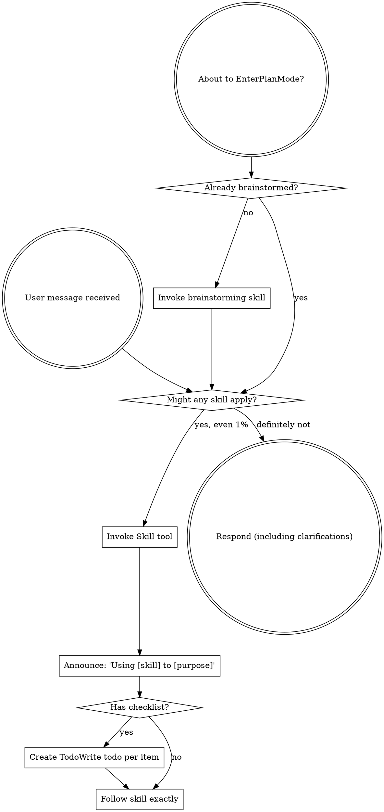

Reading additional input from stdin...
OpenAI Codex v0.128.0 (research preview)
--------
workdir: /Users/yangyihan/Downloads/hail-mary-chat
model: gpt-5.5
provider: openai
approval: never
sandbox: read-only
reasoning effort: xhigh
reasoning summaries: none
session id: 019e3f44-bc0f-72c2-8712-618d5f8f61f3
--------
user
Round 3 (final) cross-review of the companion mode design spec.

Read these files in order:
1. docs/superpowers/specs/2026-05-19-companion-mode-design.md (original spec — note: NOT yet revised; revisions are still pending)
2. docs/superpowers/specs/companion-review/round-1-codex.md (your Round 1 findings)
3. docs/superpowers/specs/companion-review/round-2-claude.md (author's Round 1 responses)
4. docs/superpowers/specs/companion-review/round-2-codex.md (your Round 2 findings)
5. docs/superpowers/specs/companion-review/round-3-claude.md (author's Round 2 responses with REVISED directions)

Author has changed direction on 4 fixes that you marked inadequate (fix 1 dropped audioPlayback extension, fix 3 switched to web/public static assets, fix 5 switched to Tap-to-Start, fix 9 explicit Vitest setup).

Your Round 3 (final) job:
(a) For each revised direction in round-3-claude.md, judge: 'consensus, ready' or 'still inadequate because X' — be concrete.
(b) Are there remaining holes the previous 2 rounds didn't surface that you now see?
(c) Acceptance of the 4 'final open questions for plan phase' as plan-phase work (not blocking spec)?

Output (under 600 words):
- Per revised fix: consensus / still inadequate
- Any NEW remaining hole
- Acceptance of plan-phase open questions
- FINAL VERDICT: 'consensus, spec ready for plan phase' OR 'consensus not reached, here are the items the user must decide'

Be concise. This is final round.
codex
I’ll use the Superpowers startup workflow, then read the requested review files in order and keep this to a final-round judgment rather than broad redesign.
exec
/bin/zsh -lc "sed -n '1,220p' /Users/yangyihan/.codex/plugins/cache/openai-curated/superpowers/eed16198/skills/using-superpowers/SKILL.md" in /Users/yangyihan/Downloads/hail-mary-chat
 succeeded in 0ms:
---
name: using-superpowers
description: Use when starting any conversation - establishes how to find and use skills, requiring Skill tool invocation before ANY response including clarifying questions
---

<SUBAGENT-STOP>
If you were dispatched as a subagent to execute a specific task, skip this skill.
</SUBAGENT-STOP>

<EXTREMELY-IMPORTANT>
If you think there is even a 1% chance a skill might apply to what you are doing, you ABSOLUTELY MUST invoke the skill.

IF A SKILL APPLIES TO YOUR TASK, YOU DO NOT HAVE A CHOICE. YOU MUST USE IT.

This is not negotiable. This is not optional. You cannot rationalize your way out of this.
</EXTREMELY-IMPORTANT>

## Instruction Priority

Superpowers skills override default system prompt behavior, but **user instructions always take precedence**:

1. **User's explicit instructions** (CLAUDE.md, GEMINI.md, AGENTS.md, direct requests) — highest priority
2. **Superpowers skills** — override default system behavior where they conflict
3. **Default system prompt** — lowest priority

If CLAUDE.md, GEMINI.md, or AGENTS.md says "don't use TDD" and a skill says "always use TDD," follow the user's instructions. The user is in control.

## How to Access Skills

**In Claude Code:** Use the `Skill` tool. When you invoke a skill, its content is loaded and presented to you—follow it directly. Never use the Read tool on skill files.

**In Copilot CLI:** Use the `skill` tool. Skills are auto-discovered from installed plugins. The `skill` tool works the same as Claude Code's `Skill` tool.

**In Gemini CLI:** Skills activate via the `activate_skill` tool. Gemini loads skill metadata at session start and activates the full content on demand.

**In other environments:** Check your platform's documentation for how skills are loaded.

## Platform Adaptation

Skills use Claude Code tool names. Non-CC platforms: see `references/copilot-tools.md` (Copilot CLI), `references/codex-tools.md` (Codex) for tool equivalents. Gemini CLI users get the tool mapping loaded automatically via GEMINI.md.

# Using Skills

## The Rule

**Invoke relevant or requested skills BEFORE any response or action.** Even a 1% chance a skill might apply means that you should invoke the skill to check. If an invoked skill turns out to be wrong for the situation, you don't need to use it.



## Red Flags

These thoughts mean STOP—you're rationalizing:

| Thought | Reality |
|---------|---------|
| "This is just a simple question" | Questions are tasks. Check for skills. |
| "I need more context first" | Skill check comes BEFORE clarifying questions. |
| "Let me explore the codebase first" | Skills tell you HOW to explore. Check first. |
| "I can check git/files quickly" | Files lack conversation context. Check for skills. |
| "Let me gather information first" | Skills tell you HOW to gather information. |
| "This doesn't need a formal skill" | If a skill exists, use it. |
| "I remember this skill" | Skills evolve. Read current version. |
| "This doesn't count as a task" | Action = task. Check for skills. |
| "The skill is overkill" | Simple things become complex. Use it. |
| "I'll just do this one thing first" | Check BEFORE doing anything. |
| "This feels productive" | Undisciplined action wastes time. Skills prevent this. |
| "I know what that means" | Knowing the concept ≠ using the skill. Invoke it. |

## Skill Priority

When multiple skills could apply, use this order:

1. **Process skills first** (brainstorming, debugging) - these determine HOW to approach the task
2. **Implementation skills second** (frontend-design, mcp-builder) - these guide execution

"Let's build X" → brainstorming first, then implementation skills.
"Fix this bug" → debugging first, then domain-specific skills.

## Skill Types

**Rigid** (TDD, debugging): Follow exactly. Don't adapt away discipline.

**Flexible** (patterns): Adapt principles to context.

The skill itself tells you which.

## User Instructions

Instructions say WHAT, not HOW. "Add X" or "Fix Y" doesn't mean skip workflows.

exec
/bin/zsh -lc 'wc -l docs/superpowers/specs/2026-05-19-companion-mode-design.md docs/superpowers/specs/companion-review/round-1-codex.md docs/superpowers/specs/companion-review/round-2-claude.md docs/superpowers/specs/companion-review/round-2-codex.md docs/superpowers/specs/companion-review/round-3-claude.md' in /Users/yangyihan/Downloads/hail-mary-chat
 succeeded in 0ms:
     428 docs/superpowers/specs/2026-05-19-companion-mode-design.md
      34 docs/superpowers/specs/companion-review/round-1-codex.md
      90 docs/superpowers/specs/companion-review/round-2-claude.md
    5501 docs/superpowers/specs/companion-review/round-2-codex.md
     198 docs/superpowers/specs/companion-review/round-3-claude.md
    6251 total

codex
The requested files are manageable except Round 2 Codex, which is long. I’m reading them in the order you specified and will focus the final answer on the four revised directions plus any truly new blockers.
exec
/bin/zsh -lc "sed -n '1,220p' docs/superpowers/specs/2026-05-19-companion-mode-design.md" in /Users/yangyihan/Downloads/hail-mary-chat
 succeeded in 0ms:
# Companion Mode v1 — Design

_Date: 2026-05-19_
_Status: design draft — awaiting cross-review (Claude × codex, 3 rounds)_
_Author: Claude (brainstormed with @yangyihan)_

---

## 1. North star

Pre-recorded **non-verbal audio companion** mode. A user opens it
from the home screen or from inside a chat, and Rocky's presence
becomes ambient: a continuously-looping spaceship environment bed,
overlaid with occasional Rocky non-verbal triggers (hums, taps,
breaths, scrapes, rummaging). The user is not chatting — they are
studying, working, or going to sleep, and they want to know Rocky
is still there.

Aligned with PHM canon: Eridians sense the world via sound
vibration, not vision, so audio-only presence is the most
"Rocky-true" interaction in the product.

### Why now

- **L1 retention** is the bottleneck. Users who don't want to chat
  right now have no reason to open the app — companion mode gives
  them one.
- **Zero marginal cost**: static R2 assets, no LLM, no TTS spend.
- **Lore wedge**: nothing else in the app exploits the
  vibration-sense canon.

### Out of scope (v1)

- Multi-channel menu ("Rocky working" / "Rocky resting" / etc.) — v2
- Adaptive trigger cadence (idle-aware) — v2
- Rocky verbal lines — use chat
- Affinity / rapport changes — explicitly no, regardless of usage
- voice_credits consumption — companion is free
- Bedtime stories — PR #38 paused, separate scope
- Cross-device companion sync — future

---

## 2. Architecture

```
[Client]
  ├─ CompanionScreen.tsx        (new — full-screen surface)
  ├─ useCompanionAudio.ts       (new — env loop + trigger scheduler + sleep timer)
  ├─ wakeLock.ts                (new, ~30 LOC — Screen Wake Lock API w/ iOS fallback)
  ├─ audioPlayback.ts           (existing, modified — add 'companion' slot type)
  └─ MediaSession metadata      (existing pattern)

[Server]
  └─ GET /api/companion/asset-urls   (new, tiny — returns presigned GETs for
                                       env bed + 20 triggers in one response)
     no other new endpoints

[Storage R2]
  rocky-audio/companion/v1/
  ├─ env-bed-01.mp3                       (~10 min, ~7 MB, seamless loop, 96kbps)
  └─ triggers/                            (20 short clips, ~1.5 MB total, 128kbps)
      ├─ hum-{01..04}.mp3
      ├─ tap-{01..04}.mp3
      ├─ scrape-{01..04}.mp3
      ├─ breath-{01..04}.mp3
      └─ rummage-{01..04}.mp3
```

**Total first-load weight: ~8-9 MB.** Subsequent opens hit the browser
HTTP cache via the same R2 object keys.

### Components & responsibilities

| Component | Type | Responsibility |
|---|---|---|
| `CompanionScreen.tsx` | new | Full-screen surface. Renders breathing dot + elapsed counter + sleep-timer control + Exit + Dim toggle. On mount: `audioPlayback.claimSlot('companion')`. On unmount: `releaseSlot`. |
| `useCompanionAudio.ts` | new | Two `HTMLAudioElement`s — base loop (`loop=true`) + single trigger element (reassigned per trigger). 30s–2min random interval, "no adjacent duplicates" algorithm. Sleep-timer fade (8s base volume → 0). States: `loading / playing / fading / done / error`. |
| `wakeLock.ts` | new | `navigator.wakeLock.request('screen')` wrapper. Silent fallback on iOS Safari (which currently does not support it on lock screen). |
| `audioPlayback.ts` | modified | Add `'companion'` slot type. `claimSlot('companion')` stops any in-flight TTS. Inverse defense: a TTS `claimSlot` during companion → companion auto-pauses + logs (defense — should not happen due to UI mutex). |
| `StartScreen.tsx` | modified | Add third CTA "STAY CONNECTED" / "陪着我" below `DIAL IN` / `OPEN CHANNEL` row. |
| `ChatInterface.tsx` | modified | Add new icon button in `status-actions` row near red hangup, labeled "STAY ON LINE". On click: `endSession()` (runs through existing consolidate path) → navigate to companion. |
| `App.tsx` | modified | Phase machine: `'home' \| 'echo' \| 'favorites' \| 'chat'` → add `'companion'`. Mutex enforced at navigation layer: entering companion forces chat exit; entering chat forces companion exit. |

---

## 3. Asset library

| Type | Count | Length | Bitrate | Total size |
|---|---|---|---|---|
| Env bed | 1 | ~10 min | 96 kbps mp3 | ~7 MB |
| Rocky triggers (5 groups × 4 variants) | 20 | 0.5–3s each | 128 kbps mp3 | ~1.5 MB |
| **Total** | **21 files** | — | — | **~8.5 MB** |

Groups: `hum` (4), `tap` (4), `scrape` (4), `breath` (4), `rummage` (4).

### Sourcing plan (per project directive: search online before recording)

| Asset | Step 1 — search online | Step 2 — clip existing | Step 3 — fresh recording |
|---|---|---|---|
| Env bed | **Freesound / Pixabay / Zapsplat** for "spaceship ambience", "sci-fi room tone", "fan hum", "control room ambient" (CC0 / CC-BY preferred). Audacity remix into seamless 10-min loop. | n/a | Only if step 1 yields nothing usable. |
| Rocky non-verbal triggers | n/a — must be Rocky's voice line, not findable online | Scan `rocky_voice_human.MP3` + `rocky_voice_human_2.MP3` for clippable non-verbal segments (hums, mouth-clicks, breaths, page flips). Optimistic estimate: ~10 of 20 triggers come from existing material. | Studio session for the rest (1–2 days). |

### Production estimate

| Phase | Duration | Notes |
|---|---|---|
| Recon: scan old recordings + Freesound search | 1 day | Plan-phase deliverable: "x of 20 triggers covered by existing material, y CC0 ambient candidates for env bed" |
| Env bed production (search-or-record + Audacity loop work) | 1–2 days | Step 1 path: 1 day. Step 3 fallback: 2 days. |
| Trigger recording (gaps not covered by old material) | 1–2 days | Depends on recon outcome. |
| Mix + seamless-loop QA + bitrate encoding | 1 day | One pass per asset; verify no audible loop click; verify trigger peaks consistent |
| **Total** | **3–6 working days** | Range depends on how much recon reduces fresh recording |

---

## 4. UX state machine

```
[home / chat]
   │
   ↓  CTA: "Stay Connected"  (home)
   ↓  CTA: "Stay On Line"    (chat → endSession() first)
   │
[loading]   ← parallel fetch env bed + 20 triggers; UI shows breathing dot + "tuning in…"
   │
   ↓  all critical assets loaded (env bed + at least 4 triggers)
   ↓  triggers still loading in background lazy
   │
[playing]
   │
   ↓  user taps Exit  |  sleep timer hits 0
   │
[fading]    ← 8s base volume → 0, trigger schedule stopped
   │
   ↓  fade complete
   │
[done]
   │
   ↓
[home]

side branch:
[error]   ← env bed fetch failed | network gone
   │
   ↓  retry button | exit
```

### Phase transitions

| From | To | Trigger |
|---|---|---|
| `home` | `loading` | user taps "Stay Connected" |
| `chat` | `loading` | user taps "Stay On Line" → `endSession()` runs (existing consolidate path) → navigate companion |
| `loading` | `playing` | env bed + ≥4 triggers loaded (rest lazy) |
| `loading` | `error` | env bed fetch fails (5s timeout or HTTP error) |
| `playing` | `fading` | user Exit | sleep timer = 0 |
| `fading` | `done` | 8s fade elapsed |
| `done` | `home` | automatic |
| `error` | `loading` | retry |
| `error` | `home` | exit |

---

## 5. UI specs

### Default chrome ("a-style")

```
┌─────────────────────────────────────┐
│  ☾                                ✕ │  ← dim toggle (top-left) | exit (top-right)
│                                     │
│                                     │
│              ◯                      │  ← breathing dot (slow pulse, 4s cycle)
│           Rocky · 在                 │  ← static label
│                                     │
│            32:14                    │  ← elapsed time, large
│                                     │
│  ┌─────────────────────────────┐    │
│  │  ⏱ Sleep timer · 剩 23:14  │   │  ← sleep-timer pill, tappable opens picker
│  └─────────────────────────────┘    │
│                                     │
└─────────────────────────────────────┘
```

### Dim chrome ("c-style", same component, `companionDim=true`)

```
┌─────────────────────────────────────┐
│                                     │
│                                     │
│           (nearly black)            │
│                                     │
│                                     │
│                                     │
│                                     │
│                                     │
│                                     │
│  🛰 Rocky · 32:14 · 剩 23 min        │  ← bottom bar only, low-contrast
└─────────────────────────────────────┘
```

The dim chrome reuses the same React component tree; only the styles
collapse + opacity drop. Tapping anywhere on screen toggles back to
full chrome briefly (3s auto-redim) for sleep-timer adjustment.

### Sleep timer picker

Bottom sheet, 5 options: `off / 15 / 30 / 45 / 60 min`.
Default selection: **30 min**.
Re-tapping the same option closes the sheet.
Changing the option resets the countdown from the new value (does
NOT accumulate against elapsed time).

### Breathing dot animation

Pure CSS: `box-shadow` + `opacity` keyframe, 4s cycle, ease-in-out.
On every Rocky trigger fire, the dot briefly brightens (300ms
boost) — a subliminal visual coupling between sound and visual.

---

exec
/bin/zsh -lc "sed -n '221,460p' docs/superpowers/specs/2026-05-19-companion-mode-design.md" in /Users/yangyihan/Downloads/hail-mary-chat
 succeeded in 0ms:

## 6. Audio coordination

**Critical lesson from PR #38 review**: any new audio source MUST
integrate with `audioPlayback.ts` slot system, otherwise companion
audio can play simultaneously with chat TTS.

### Changes to `audioPlayback.ts`

```ts
type AudioSlotType = 'tts' | 'favorite' | 'echo' | 'companion';  // 'companion' new

// claimSlot('companion') stops any in-flight TTS and releases all
// other slot types. Same exclusivity contract as existing types.
// releaseSlot('companion') is called on CompanionScreen unmount.
```

### Mutex enforcement (defense in depth)

1. **UI-level**: navigation to `phase='companion'` exits chat;
   navigation back to chat exits companion. The two phases cannot
   coexist.
2. **Audio-level**: `audioPlayback` slot system guarantees only one
   slot owner at any time. If a defensive bug somewhere triggers a
   TTS claim during companion, companion auto-pauses and logs a
   warning (caught by future telemetry; ignored by user as a stop).

---

## 7. Background playback (screen off / lock / app-background)

| Mechanism | Purpose | iOS Safari behavior |
|---|---|---|
| `HTMLAudioElement` | Plays audio in background tab + lock screen | ✅ Supported; subject to OS-level audio session policy |
| MediaSession metadata | Lock-screen "now playing" UI | ✅ Supported — set `title="Rocky · Companion"`, `artist="Hail Mary Chat"`, `artwork=[<rocky-avatar-url>]` |
| MediaSession actions | Play/pause from lock screen | ✅ Supported — wire `play`, `pause`, `stop` |
| Screen Wake Lock API | Prevent screen sleep | ❌ Not supported on iOS Safari (as of iOS 16.4+, partial; before, none). Silent fallback; audio continues regardless. |

### iOS background-kill recovery

iOS will sometimes pause/kill HTMLAudio in background after extended
periods (varies by device, battery state, OS version). On resume:

1. `<audio>` element state is checked on visibility-change event
2. If `paused` and our state says `playing` → show "Tap to resume Rocky"
   toast at bottom of screen
3. One tap re-issues `audio.play()` (which counts as a user gesture
   for autoplay policy)
4. Trigger schedule resumes from current wall-clock offset (no rewind)

---

## 8. Error handling

| Scenario | Behavior |
|---|---|
| Env bed HTTP fetch fails | `error` state, retry button + exit. Triggers don't start without bed. |
| Single trigger fetch fails | Skip silently, log to console; next trigger fires normally. With 20 triggers, one missing isn't user-detectable. |
| Wake Lock API denied | Silent fallback; audio continues; screen may dim per OS settings. No user-facing message (Wake Lock failure on iOS is expected). |
| `endSession()` from chat fails | Show toast "Couldn't end chat cleanly — companion not started"; stay on chat. (Defensive: never strand the user in a half-state.) |
| iOS pauses audio in background | On visibility-change, detect paused state, show "Tap to resume Rocky" |
| Network drops mid-session | Already-loaded audio keeps playing; if a trigger fails to load mid-stream, log + skip + try next |
| User auth state expires | Companion continues (presigned URLs were issued at companion-mount time, 1h expiry — covers all sleep timer durations) |
| Long session > 1h, presigned URL expires | On URL expiry detection (audio fetch 403): re-fetch `/api/companion/asset-urls` and reassign `audio.src`. Seamless if env bed buffer is enough; brief gap acceptable. |

---

## 9. Server / data model

**v1 verdict: one new endpoint, zero new DB tables.**

### `GET /api/companion/asset-urls` (new)

Auth: optional (companion is free for all, but signing presigned
URLs requires server context anyway). Anonymous users get a stub
session token good enough to call this endpoint.

Response:
```json
{
  "env_bed": "https://r2-presigned/.../env-bed-01.mp3?...",
  "triggers": [
    { "id": "hum-01", "url": "https://r2-presigned/.../hum-01.mp3?..." },
    ...
    { "id": "rummage-04", "url": "https://r2-presigned/.../rummage-04.mp3?..." }
  ],
  "expires_at": 1729123456  // unix seconds, 1h from issue
}
```

All 21 URLs in one response. Client caches the response for ~55min
(short of expiry) and re-fetches if it stays past that.

### DB

No new tables. No writes during companion. Defer "who used
companion, how long" to v2 when we want analytics.

### Storage

Asset paths are static: `rocky-audio/companion/v1/env-bed-01.mp3`,
`rocky-audio/companion/v1/triggers/<group>-<n>.mp3`. Uploaded
manually via `edgespark storage` once at v1 ship time. No dynamic
upload path.

---

## 10. Test plan (manual, v1 ship gate)

### Happy path
- [ ] Home → "Stay Connected" → audio starts within 2s on cold cache, ≤0.5s on warm
- [ ] Chat → "Stay On Line" → chat ends + consolidate runs + companion starts
- [ ] Sleep timer 30min → audio fades over last 8s → home
- [ ] Exit button → 8s fade + home

### Background / screen-off
- [ ] Phone lock → audio continues
- [ ] Switch tab → audio continues
- [ ] iOS Safari lock-screen MediaSession shows "Rocky · Companion · MM:SS"
- [ ] MediaSession play/pause from lock screen works
- [ ] iOS long-background pause → resume toast appears → one tap resumes

### Trigger correctness
- [ ] Trigger interval roughly 30s–2min over a 30-min sample
- [ ] No adjacent duplicate triggers in a 30-min sample
- [ ] env bed loops seamlessly (no audible click at boundary)
- [ ] Breathing dot brightens on each trigger fire

### Mutex / coordination
- [ ] In companion → tap home → companion unwinds cleanly
- [ ] In chat with TTS playing → tap "Stay On Line" → TTS stops, companion starts
- [ ] Wake Lock denied (iOS) → audio still plays
- [ ] Network drops 5s then recovers → trigger schedule continues without crash

### Error states
- [ ] Block `/api/companion/asset-urls` → loading → error state → retry works
- [ ] Block env bed URL only → loading → error state → retry works
- [ ] Block one trigger URL → other triggers play normally; that one silently skipped

### Dim toggle
- [ ] Toggle on → UI collapses to bottom-bar only
- [ ] Tap screen in dim mode → full chrome briefly visible (3s auto-redim)
- [ ] localStorage persists across reload

---

## 11. Performance & cost

| | v1 estimate |
|---|---|
| First-load bandwidth | ~8.5 MB |
| Steady-state bandwidth | 0 (assets loop locally) |
| Server CPU per session | ~1 request total (`/api/companion/asset-urls`) |
| R2 GET ops per session | 21 (one per asset, presigned) |
| Cost @ 1k DAU × 30 min/day | R2 GETs: 21k/day, ~$0.01/day; bandwidth: ~0.5 GB/day after cache, ~$0.05/day. Negligible. |

---

## 12. Open questions for plan phase

These get resolved at writing-plans time, not now:

- [ ] **Recon: clippable old material.** Run a 1-pass review of `rocky_voice_human.MP3` + `_2.MP3` and report "x of 20 triggers covered, y need fresh recording, z marginal".
- [ ] **Recon: CC0 ambient candidates.** Identify 3–5 specific Freesound / Pixabay candidates for env bed; verify license + seamless-loopability.
- [ ] **iOS Wake Lock fallback UX.** Confirm exact behavior: do we display anything when Wake Lock is denied, or fully silent? (Currently planned: fully silent.)
- [ ] **`App.tsx` phase machine refactor.** Map the minimal diff for adding `'companion'` phase + state propagation. May reveal opportunity for tighter abstraction; do not over-refactor.
- [ ] **Asset upload mechanism.** `edgespark storage put` from CLI vs commit assets into repo + sync via CI. v1: manual upload via CLI is fine; document the steps in ADMIN.md.
- [ ] **Companion screen accessibility.** Aria labels for breathing dot, screen reader announcements when trigger fires (or NOT — debatable for a meditative mode), keyboard nav for Exit + Sleep timer + Dim toggle.
- [ ] **i18n strings.** New keys for "Stay Connected" / "Stay On Line" / "Sleep timer" / "剩 X 分钟" / etc. across en/zh/ja.

---

## 13. Validation checklist (pre-implementation)

Before plan phase begins, all of these must be ✅:

- [x] Use case (b: study/work/sleep companion) confirmed
- [x] Audio nature (c: non-verbal pre-recorded, Eridian-lore aligned) confirmed
- [x] v1 shape (b: single channel, env bed + triggers) confirmed
- [x] Entry points (c: home CTA + chat "stay on line") confirmed
- [x] Mutual exclusivity (companion ↔ chat) confirmed
- [x] #38 BedtimePlayer paused, lessons absorbed, not folded into companion v1
- [x] Cost / gating (free for all, no affinity gate, no voice_credits) confirmed
- [x] Asset structure (1 env bed + 20 triggers, 30s–2min cadence, no-adjacent-duplicate) confirmed
- [x] Visual surface (a-style default + dim toggle to c-style) confirmed
- [x] Sleep timer defaults (off/15/30/45/60, default 30, 8s fade) confirmed
- [x] No pause/resume in v1 confirmed
- [x] Asset sourcing policy: search online first for env-bed-class assets; Rocky non-verbal must be his voice line (clip existing or record fresh) confirmed

---

## 14. Cross-review status

This spec will go through 3 rounds of cross-review between Claude
and codex before being handed to the user for final approval. Each
round's findings + responses are appended below.

### Round 1
_pending_

### Round 2
_pending_

### Round 3
_pending_

### Consensus
_pending_

exec
/bin/zsh -lc "sed -n '1,120p' docs/superpowers/specs/companion-review/round-1-codex.md" in /Users/yangyihan/Downloads/hail-mary-chat
 succeeded in 0ms:
**Top 3 Load-Bearing Concerns**
1. Audio mutex design is not implementable as written. Current [audioPlayback.ts](/Users/yangyihan/Downloads/hail-mary-chat/web/src/utils/audioPlayback.ts:51) has untyped `claimSlot()` and tracks one bound `Audio`, but companion wants two `HTMLAudioElement`s.
2. Chat → companion transition is wrong. [endSession()](/Users/yangyihan/Downloads/hail-mary-chat/web/src/utils/sessionApi.ts:88) is fire-and-forget and swallows failures, so the spec’s “stay on chat if end fails” behavior cannot happen.
3. Free anonymous presign endpoint has no abuse story. One script can repeatedly mint 21 URLs and drive R2 GET/bandwidth costs.

**Findings**
- BLOCK §6.1: Spec invents `claimSlot('companion')`, `releaseSlot('companion')`, and slot types, but current API has no type parameter and one global token. `attachAudio()` replaces `currentBound` without stopping a previous same-token bound audio. Two companion elements would either be invisible to the mutex or leak/overlap. Suggested fix: redesign `audioPlayback` for explicit owners + multiple bound elements, or make companion a single managed/mixed audio source.

- BLOCK §2/§4/§8: Chat handoff depends on awaitable `endSession()`, but current `endSession` returns `void`; ChatInterface hangup immediately calls `onBack()` after a meaningless `try/catch`. Suggested fix: add an awaitable `endSessionStrict()` or change the spec to accept best-effort consolidation.

- BLOCK §9/§11: `/api/companion/asset-urls` is optional-auth and free, but no per-IP/device/session rate limit, bot gate, cache key strategy, or abuse logging is specified. Existing visible bot defense is register-only. Suggested fix: add rate limits before plan phase, preferably IP+device hourly caps and cacheable public/static asset delivery where possible.

- FIX §2/§4: App integration claim is stale. [App.tsx](/Users/yangyihan/Downloads/hail-mary-chat/web/src/App.tsx:12) uses `start | chat | echo | favorites`, not `home`; `home` is internal to StartScreen. Suggested fix: specify exact `AppPhase` and callback changes.

- FIX §7: Autoplay is under-specified. Companion starts after async fetches using new `Audio` objects; on iOS/Safari that may reject unless playback is tied to a user gesture or pre-unlocked element. Suggested fix: synchronous tap-to-start/unlock path and explicit `play().catch(NotAllowedError)` UI.

- FIX §7: MediaSession claims are too strong. Repo has no existing `mediaSession` pattern from `rg`; MDN marks MediaSession limited availability. “MM:SS” lock-screen display is not guaranteed by metadata alone. Suggested fix: feature-detect, wrap unsupported handlers, test real iOS Safari, and clear handlers on unmount.

- FIX §4/§8: Sleep timer repeats PR #38 ambiguity. It mixes countdown, wall-clock resume, paused background audio, and playback fade without defining whether time advances while audio is paused/killed. Suggested fix: choose wall-clock or playback-time and test pause/background cases.

- FIX §5/§10: PR #38 lessons not fully absorbed. No Escape-key behavior, no reduced-motion requirement for breathing dot/boost/auto-redim, and accessibility is deferred to open questions. Suggested fix: make these v1 acceptance criteria.

- FIX §10/§13: Test plan is almost entirely manual. No unit tests for scheduler no-adjacent-duplicate, timer math, stale-token cleanup, URL expiry retry, or endpoint rate limiting. Suggested fix: add automated hook/util tests plus server tests.

- FIX §11: Cache/cost estimate is suspect. Presigned URLs usually vary by query string, so “same R2 object keys” does not guarantee browser cache hits. 1k cold users × 8.5 MB is ~8.5 GB, not 0.5 GB. Suggested fix: use immutable public/CDN URLs or prove cache headers/key behavior.

- FIX §3: 3-6 asset days is optimistic. License review, loop QA, normalization, device checks, and missing mp3 renders are real work. Suggested fix: split recon from production and include asset acceptance criteria.

- NIT §13: “#38 lessons absorbed” is prematurely checked. The spec still repeats audio integration, reduced motion, Escape, timer, and render/asset gaps.

**Final Verdict**
needs revision before plan phase

Sources used for browser/API checks: MDN Autoplay Guide, MDN MediaSession, MDN Screen Wake Lock.

exec
/bin/zsh -lc "sed -n '1,140p' docs/superpowers/specs/companion-review/round-2-claude.md" in /Users/yangyihan/Downloads/hail-mary-chat
 succeeded in 0ms:
# Round 2 — Claude's responses to Round 1 codex review

Marked **AGREE** / **PARTIAL** / **DISAGREE**, each with a concrete fix plan or pushback.

## Top 3 load-bearing concerns

### 1. Audio mutex — **AGREE**

Spec invented an API that doesn't exist. Real plan:

- Extend `web/src/utils/audioPlayback.ts` with one small surgical addition: `claimSlot({ onSlotLost?: () => void })` returning `{ token, signal }`. ~10 LOC change, fully backward compatible (current callers pass no opts).
- Companion calls `claimSlot()` once on mount and registers `onSlotLost`.
- Companion manages its TWO `HTMLAudioElement`s (base + trigger) INTERNALLY. It never calls `attachAudio`.
- When any other slot user (`useRockyTTS`, `FavoritesScreen`, `EchoInterface`) later calls `claimSlot()`, `audioPlayback` fires companion's `onSlotLost` callback first, then proceeds with the new claim. Companion's `onSlotLost` stops both its audios.
- On companion unmount: `releaseSlot()` + companion explicitly stops both audios.
- `audioPlayback`'s single-slot mental model is preserved. From its POV, companion is just one slot owner.

### 2. `endSession` is fire-and-forget — **AGREE on the bug, REVISE the spec**

`endSession()` is fire-and-forget BY DESIGN — it uses `keepalive: true` to survive page unload during consolidation. It cannot be awaited; errors are unobservable.

Spec change: drop the "stay on chat if end fails" clause from §8. New behavior: "Stay On Line" tap calls `endSession(session_id)` synchronously, then navigates to companion in the same tick. Consolidation runs in background. No failure path keeps the user in chat — that path is impossible given the current API.

### 3. Anonymous presign endpoint abuse — **AGREE**

Kill the endpoint entirely. Use a **public R2 bucket** (or public-readable prefix on `rocky-audio`) with stable URLs:

```
https://<r2-public-host>/companion/v1/env-bed-01.mp3
https://<r2-public-host>/companion/v1/triggers/hum-01.mp3
...
```

`Cache-Control: public, max-age=31536000, immutable` on each object.

No `/api/companion/asset-urls`. No presigning. No rate limiting needed. No auth at all. Side benefit: stable URLs → real browser cache (resolves codex's §11 caching point).

## Findings

- **BLOCK §6.1**: see Top 3 #1.
- **BLOCK §2/§4/§8**: see Top 3 #2.
- **BLOCK §9/§11**: see Top 3 #3.

- **FIX §2/§4 phase literal — AGREE**: `AppPhase` becomes `'start' | 'chat' | 'echo' | 'favorites' | 'companion'`. New `onCompanion` callback alongside existing `onEcho` / `onFavorites` in StartScreen. ChatInterface gets a new `onStayOnLine` callback prop.

- **FIX §7 autoplay — AGREE**: two-part fix.
  - (a) Inside the entry-tap handler (synchronous gesture context): create both `Audio` elements, call `audio.load()`, kick off a warm-up `audio.play()` with empty/silent src then immediate `audio.pause()` — this satisfies iOS's gesture-tied autoplay unlock.
  - (b) Async fetch of real src after gesture context; if `play()` rejects `NotAllowedError` despite warm-up, show "Tap to start" fallback UI requiring one more tap.

- **FIX §7 MediaSession — AGREE**: feature-detect `'mediaSession' in navigator`. Wrap handlers in try/catch. "MM:SS" on lock screen is best-effort and validated only via real-device QA on iOS Safari + Chrome Android — not guaranteed by metadata alone. Clear handlers on unmount.

- **FIX §4/§8 sleep timer — AGREE (explicit wall-clock)**: wall-clock semantics. Timer counts down based on `Date.now()` deltas, NOT audio playback time. If iOS pauses our audio in background, timer continues. If user returns from background after the timer would have hit 0, immediately fire fade+done. Reasoning: user mental model is "turn off in 30 min", not "play 30 min worth of audio".

- **FIX §5/§10 PR #38 lessons — AGREE (promote to v1 acceptance)**:
  - Escape key closes companion (modeled on existing ChatInterface hangup-confirm pattern at `web/src/components/ChatInterface.tsx:679`).
  - `prefers-reduced-motion` overrides on: breathing dot pulse, trigger-fire brightness boost, dim-toggle auto-redim animation, fade-out transitions.
  - Accessibility checklist (aria labels, keyboard nav, focus management) is v1 ship gate, not v2.

- **FIX §10/§13 automated tests — AGREE (add three unit tests)**:
  - `scheduler.test.ts`: `pickNextTrigger` never returns most-recent; distribution over 1000 picks within [30s, 120s].
  - `sleepTimer.test.ts`: wall-clock decrement; fade entry at 8s-remaining mark; terminal state idempotent.
  - `audioPlayback.test.ts`: `onSlotLost` fires on subsequent `claimSlot`; fires exactly once; does not fire on `releaseSlot` from same owner.

- **FIX §11 cache cost — AGREE (recalc)**: with public R2 + immutable cache:
  - Cold first-load: 8.5 MB
  - Browser cache after first load: 0 (immutable + max-age=31536000)
  - 1k cold users × 8.5 MB ≈ 8.5 GB/day worst case if every user is cold-cache (unrealistic)
  - With realistic returning-user ratio + browser cache + R2 edge cache: <1 GB/day
  - R2 egress: free up to 10 GB/month at current tier (or near-free). Practical cost ≈ $0.

- **FIX §3 asset days — AGREE (split estimate)**:
  - Recon: 1-2 days (scan old Rocky recordings + Freesound license review)
  - Production: 3-5 days (trigger recording + env bed remix + mix + seamless loop QA)
  - Integration QA: 1 day (test on real iOS device + various network conditions)
  - Total: **5-8 working days**

- **NIT §13 prematurely checked — AGREE**: the "audio coordination integrated" line gets unchecked until §6 revision actually lands in code.

## Disagreements

**None.** All Round 1 findings are valid.

## New concerns I noticed while drafting these responses

- **audioPlayback extension ripple effects**: The new `claimSlot(opts)` signature with optional `opts` must be backward-compatible — `opts` is optional, undefined behaves identically to today. But when companion is the slot owner, ANY existing user calling `claimSlot()` will preempt it (correct behavior). I should audit `useRockyTTS`, `FavoritesScreen`, `EchoInterface`, `MessageBubble` for stale-token assumptions. The current `isOwner(token)` check should handle this, but worth a unit test.

- **Audio unlock warm-up source**: Needs an actual silent/empty audio source for the warm-up `play()` call. Two options:
  - (a) Ship a tiny `silent.mp3` (~100 bytes) alongside the companion assets
  - (b) Generate a `data:audio/mpeg;base64,...` silent buffer at runtime
  - Lean (a) — fewer surprises, lives in the same asset directory.

exec
/bin/zsh -lc "sed -n '1,220p' docs/superpowers/specs/companion-review/round-2-codex.md" in /Users/yangyihan/Downloads/hail-mary-chat
 succeeded in 0ms:
Reading additional input from stdin...
OpenAI Codex v0.128.0 (research preview)
--------
workdir: /Users/yangyihan/Downloads/hail-mary-chat
model: gpt-5.5
provider: openai
approval: never
sandbox: read-only
reasoning effort: xhigh
reasoning summaries: none
session id: 019e3f3d-967a-7120-932c-c9a75cdb73cf
--------
user
Round 2 cross-review of the companion mode design spec.

Read these three files in this order:
1. docs/superpowers/specs/2026-05-19-companion-mode-design.md (the original spec)
2. docs/superpowers/specs/companion-review/round-1-codex.md (your Round 1 findings)
3. docs/superpowers/specs/companion-review/round-2-claude.md (author's responses to your Round 1)

Your Round 2 job:
(a) Verify each AGREE-d fix in round-2-claude.md would actually resolve the underlying Round 1 issue.
(b) Find NEW concerns introduced by the proposed fixes (especially: audioPlayback extension ripple effects on useRockyTTS/FavoritesScreen/EchoInterface — read those files; public R2 bucket vs existing rocky-audio bucket access policy — does the rocky-audio bucket exist as public or private, what's required for public assets).
(c) Push back on any fix that's still inadequate.
(d) List open questions that MUST be resolved before plan phase.

Output (under 800 words, structured):
- Adequacy verdict per fix (one line each: 'fix N: adequate' or 'fix N: inadequate because X')
- NEW concerns from the proposed fixes
- Open questions MUST be resolved before plan
- Final verdict: 'ready for plan after revisions' or 'still needs another round'

Be sharp.
codex
I’m using `superpowers:using-superpowers` for the session workflow, then I’ll read the three review files in order and inspect the affected audio code and storage policy.
exec
/bin/zsh -lc "sed -n '1,220p' /Users/yangyihan/.codex/plugins/cache/openai-curated/superpowers/eed16198/skills/using-superpowers/SKILL.md" in /Users/yangyihan/Downloads/hail-mary-chat
 succeeded in 0ms:
---
name: using-superpowers
description: Use when starting any conversation - establishes how to find and use skills, requiring Skill tool invocation before ANY response including clarifying questions
---

<SUBAGENT-STOP>
If you were dispatched as a subagent to execute a specific task, skip this skill.
</SUBAGENT-STOP>

<EXTREMELY-IMPORTANT>
If you think there is even a 1% chance a skill might apply to what you are doing, you ABSOLUTELY MUST invoke the skill.

IF A SKILL APPLIES TO YOUR TASK, YOU DO NOT HAVE A CHOICE. YOU MUST USE IT.

This is not negotiable. This is not optional. You cannot rationalize your way out of this.
</EXTREMELY-IMPORTANT>

## Instruction Priority

Superpowers skills override default system prompt behavior, but **user instructions always take precedence**:

1. **User's explicit instructions** (CLAUDE.md, GEMINI.md, AGENTS.md, direct requests) — highest priority
2. **Superpowers skills** — override default system behavior where they conflict
3. **Default system prompt** — lowest priority

If CLAUDE.md, GEMINI.md, or AGENTS.md says "don't use TDD" and a skill says "always use TDD," follow the user's instructions. The user is in control.

## How to Access Skills

**In Claude Code:** Use the `Skill` tool. When you invoke a skill, its content is loaded and presented to you—follow it directly. Never use the Read tool on skill files.

**In Copilot CLI:** Use the `skill` tool. Skills are auto-discovered from installed plugins. The `skill` tool works the same as Claude Code's `Skill` tool.

**In Gemini CLI:** Skills activate via the `activate_skill` tool. Gemini loads skill metadata at session start and activates the full content on demand.

**In other environments:** Check your platform's documentation for how skills are loaded.

## Platform Adaptation

Skills use Claude Code tool names. Non-CC platforms: see `references/copilot-tools.md` (Copilot CLI), `references/codex-tools.md` (Codex) for tool equivalents. Gemini CLI users get the tool mapping loaded automatically via GEMINI.md.

# Using Skills

## The Rule

**Invoke relevant or requested skills BEFORE any response or action.** Even a 1% chance a skill might apply means that you should invoke the skill to check. If an invoked skill turns out to be wrong for the situation, you don't need to use it.


## Red Flags

These thoughts mean STOP—you're rationalizing:

| Thought | Reality |
|---------|---------|
| "This is just a simple question" | Questions are tasks. Check for skills. |
| "I need more context first" | Skill check comes BEFORE clarifying questions. |
| "Let me explore the codebase first" | Skills tell you HOW to explore. Check first. |
| "I can check git/files quickly" | Files lack conversation context. Check for skills. |
| "Let me gather information first" | Skills tell you HOW to gather information. |
| "This doesn't need a formal skill" | If a skill exists, use it. |
| "I remember this skill" | Skills evolve. Read current version. |
| "This doesn't count as a task" | Action = task. Check for skills. |
| "The skill is overkill" | Simple things become complex. Use it. |
| "I'll just do this one thing first" | Check BEFORE doing anything. |
| "This feels productive" | Undisciplined action wastes time. Skills prevent this. |
| "I know what that means" | Knowing the concept ≠ using the skill. Invoke it. |

## Skill Priority

When multiple skills could apply, use this order:

1. **Process skills first** (brainstorming, debugging) - these determine HOW to approach the task
2. **Implementation skills second** (frontend-design, mcp-builder) - these guide execution

"Let's build X" → brainstorming first, then implementation skills.
"Fix this bug" → debugging first, then domain-specific skills.

## Skill Types

**Rigid** (TDD, debugging): Follow exactly. Don't adapt away discipline.

**Flexible** (patterns): Adapt principles to context.

The skill itself tells you which.

## User Instructions

Instructions say WHAT, not HOW. "Add X" or "Fix Y" doesn't mean skip workflows.

codex
`superpowers:receiving-code-review` also fits because this is a review-response validation task, so I’m loading that guidance before judging the proposed fixes.
exec
/bin/zsh -lc "sed -n '1,240p' /Users/yangyihan/.codex/plugins/cache/openai-curated/superpowers/eed16198/skills/receiving-code-review/SKILL.md" in /Users/yangyihan/Downloads/hail-mary-chat
 succeeded in 0ms:
---
name: receiving-code-review
description: Use when receiving code review feedback, before implementing suggestions, especially if feedback seems unclear or technically questionable - requires technical rigor and verification, not performative agreement or blind implementation
---

# Code Review Reception

## Overview

Code review requires technical evaluation, not emotional performance.

**Core principle:** Verify before implementing. Ask before assuming. Technical correctness over social comfort.

## The Response Pattern

```
WHEN receiving code review feedback:

1. READ: Complete feedback without reacting
2. UNDERSTAND: Restate requirement in own words (or ask)
3. VERIFY: Check against codebase reality
4. EVALUATE: Technically sound for THIS codebase?
5. RESPOND: Technical acknowledgment or reasoned pushback
6. IMPLEMENT: One item at a time, test each
```

## Forbidden Responses

**NEVER:**
- "You're absolutely right!" (explicit CLAUDE.md violation)
- "Great point!" / "Excellent feedback!" (performative)
- "Let me implement that now" (before verification)

**INSTEAD:**
- Restate the technical requirement
- Ask clarifying questions
- Push back with technical reasoning if wrong
- Just start working (actions > words)

## Handling Unclear Feedback

```
IF any item is unclear:
  STOP - do not implement anything yet
  ASK for clarification on unclear items

WHY: Items may be related. Partial understanding = wrong implementation.
```

**Example:**
```
your human partner: "Fix 1-6"
You understand 1,2,3,6. Unclear on 4,5.

❌ WRONG: Implement 1,2,3,6 now, ask about 4,5 later
✅ RIGHT: "I understand items 1,2,3,6. Need clarification on 4 and 5 before proceeding."
```

## Source-Specific Handling

exec
/bin/zsh -lc 'tail -n 220 docs/superpowers/specs/companion-review/round-2-codex.md' in /Users/yangyihan/Downloads/hail-mary-chat
 succeeded in 0ms:
     4	 * Define your storage buckets here for compile-time type safety.
     5	 * This file is the source of truth for bucket metadata.
     6	 * Bucket names are first-level path prefixes in the environment's R2 bucket.
     7	 *
     8	 * After editing this file, run:
     9	 *   edgespark storage apply
    10	 *
    11	 * Usage in code:
    12	 *   import { buckets } from "@defs";
    13	 *   await edgespark.storage.from(buckets.uploads).put("file.jpg", buffer);
    14	 */
    15	
    16	import type { BucketDef } from "@sdk/server-types";
    17	
    18	// P5 F2: cache of rendered TTS audio clips. Keyed by SHA-256 of
    19	// text+lang+voice_id so repeat requests skip MiniMax entirely.
    20	// Directory layout: audio/<first2chars>/<rest>.mp3
    21	export const rockyAudio: BucketDef<"rocky-audio"> = {
    22	  bucket_name: "rocky-audio",
    23	  description: "Cached TTS audio clips (content-addressed)",
    24	};
   104	```typescript
   105	// ❌ WRONG — streaming client files through Worker
   106	const formData = await c.req.formData();
   107	const file = formData.get("image") as File;
   108	await storage.from(buckets.images).put(path, await file.arrayBuffer());
   109	
   110	// ✅ RIGHT — client uploads directly to storage
   111	const { uploadUrl, requiredHeaders } = await storage.from(buckets.uploads)
   112	  .createPresignedPutUrl("uploads/file.jpg", 3600, {
   113	    contentType: "image/jpeg",
   114	  });
   115	return c.json({ uploadUrl, requiredHeaders });
   116	```
   117	
   118	**Server-generated content → `storage.put()` is correct:**
   119	
   120	```typescript
   121	// Server creates the bytes (thumbnails, exports, webhook payloads)
   122	await storage.from(buckets.exports).put("report.csv", csvBuffer);
   123	```
   124	
   125	**Client downloads → MUST use presigned GET URLs. NEVER return `s3://` URIs.**
   126	
   127	```typescript
   128	const { downloadUrl } = await storage.from(bucket).createPresignedGetUrl(path, 3600);
   129	return c.json({ downloadUrl });
   130	```
   131	
   132	**When the S3 URI string is untrusted, use `tryParseS3Uri()`:**
   123	/** HTTP metadata stored with an object. */
   124	export interface StorageHttpMetadata {
   125	  readonly contentType?: string;
   126	  readonly contentDisposition?: string;
   127	  readonly contentEncoding?: string;
   128	  readonly cacheControl?: string;
   129	}
   130	
   218	   * @example await storage.from(buckets.exports).put("report.csv", csvBytes);
   219	   */
   220	  put(
   221	    path: string,
   222	    file: StoragePutBody,
   223	    options?: StorageHttpMetadata
   224	  ): Promise<void>;
   225	  /**
   226	   * Download a file. Returns `null` when it does not exist.
   227	   * @example const file = await storage.from(buckets.uploads).get("file.txt");
   228	   */
   262	  }>;
   263	  /**
   264	   * Create a presigned GET URL for a direct client download.
   265	   * @example const { downloadUrl } = await storage.from(buckets.uploads).createPresignedGetUrl("image.jpg", 3600);
   266	   */
   267	  createPresignedGetUrl(path: string, expiresInSecs?: number): Promise<{
   268	    readonly downloadUrl: string;

exec
/bin/zsh -lc "rg -n \"interface BucketDef|type BucketDef\" server/src/__generated__/server-types.d.ts && nl -ba server/src/__generated__/server-types.d.ts | sed -n '108,120p'" in /Users/yangyihan/Downloads/hail-mary-chat
 succeeded in 0ms:
111:export interface BucketDef<Name extends string = string> {
   108	/**
   109	 * Bucket definition from `src/defs/storage_schema.ts`.
   110	 */
   111	export interface BucketDef<Name extends string = string> {
   112	  readonly bucket_name: Name;
   113	  readonly description: string;
   114	}
   115	
   116	/** S3-style object reference (`s3://bucket/path`). Persist this in your database. */
   117	export type S3Uri<BucketName extends string = string> =
   118	  `s3://${BucketName}/${string}`;
   119	
   120	/** Binary payload accepted by `bucket.put()`. */

exec
/bin/zsh -lc 'du -sh web/public/audio web/public/audio/defaults 2>/dev/null || true' in /Users/yangyihan/Downloads/hail-mary-chat
 succeeded in 0ms:
2.7M	web/public/audio
2.0M	web/public/audio/defaults

exec
/bin/zsh -lc 'find web/public/audio -maxdepth 3 -type f | head -40' in /Users/yangyihan/Downloads/hail-mary-chat
 succeeded in 0ms:
web/public/audio/rocky_ref.wav
web/public/audio/defaults/zh_1.mp3
web/public/audio/defaults/greeting_zh.mp3
web/public/audio/defaults/zh_2.mp3
web/public/audio/defaults/farewell_zh.mp3
web/public/audio/defaults/zh_3.mp3
web/public/audio/defaults/zh_6.mp3
web/public/audio/defaults/greeting_returning_en.mp3
web/public/audio/defaults/greeting_returning_ja.mp3
web/public/audio/defaults/zh_4.mp3
web/public/audio/defaults/zh_5.mp3
web/public/audio/defaults/greeting_returning_zh.mp3
web/public/audio/defaults/greeting_en.mp3
web/public/audio/defaults/greeting_ja.mp3
web/public/audio/defaults/farewell_en.mp3
web/public/audio/defaults/farewell_ja.mp3
web/public/audio/defaults/ja_4.mp3
web/public/audio/defaults/en_6.mp3
web/public/audio/defaults/ja_5.mp3
web/public/audio/defaults/en_5.mp3
web/public/audio/defaults/en_4.mp3
web/public/audio/defaults/ja_6.mp3
web/public/audio/defaults/ja_2.mp3
web/public/audio/defaults/en_1.mp3
web/public/audio/defaults/ja_3.mp3
web/public/audio/defaults/ja_1.mp3
web/public/audio/defaults/en_3.mp3
web/public/audio/defaults/en_2.mp3
web/public/audio/rocky_h/iamrocky.mp3
web/public/audio/rocky_h/ilike.mp3
web/public/audio/rocky_h/sayhello.mp3
web/public/audio/rocky_h/dirty.mp3
web/public/audio/rocky_o/unhappy.mp3
web/public/audio/rocky_o/hello1.mp3
web/public/audio/rocky_o/hello2.mp3
web/public/audio/rocky_o/laugh.mp3
web/public/audio/rocky_o/talk1.mp3
web/public/audio/rocky_o/inahurry.mp3
web/public/audio/rocky_o/talk2.mp3
web/public/audio/rocky_o/talk3.mp3

exec
/bin/zsh -lc "rg -n \"get\\(.*r2_key|createPresignedGetUrl|rockyAudio\\).*put|storage\\.from\\(buckets\\.rockyAudio\\)\" server/src/index.ts" in /Users/yangyihan/Downloads/hail-mary-chat
 succeeded in 0ms:
2440:    const file = await storage.from(buckets.rockyAudio).get(cached[0].r2_key);
2589:        await storage.from(buckets.rockyAudio).put(r2Key, buf);
2885:    await storage.from(buckets.rockyAudio).put(r2Key, bytes);
2939:    .createPresignedGetUrl(r2Key, GIFT_URL_TTL_SECS);
2984:          .createPresignedGetUrl(r.r2_key, GIFT_URL_TTL_SECS);
3166:        .createPresignedGetUrl(r.r2_key, 3600);
3343:            .createPresignedGetUrl(cache.r2_key, 3600);
3622:          await storage.from(buckets.rockyAudio).delete(cacheRows[0].r2_key);

codex
**Adequacy Verdict**
- fix 1: inadequate because `useRockyTTS` is not a slot user; it owns `ttsAudioRef` directly and only `stopTTS()` knows how to stop it, while `claimSlot()` only stops `currentBound` + shared Rocky audio. See [useRockyTTS.ts](/Users/yangyihan/Downloads/hail-mary-chat/web/src/hooks/useRockyTTS.ts:108) and [audioPlayback.ts](/Users/yangyihan/Downloads/hail-mary-chat/web/src/utils/audioPlayback.ts:51).
- fix 2: adequate; revising to best-effort `endSession()` matches current void/keepalive behavior.
- fix 3: inadequate because `rocky-audio` exists but is currently modeled/used as private EdgeSpark storage, not a public asset host.
- fix 4: adequate; `AppPhase = 'start' | 'chat' | 'echo' | 'favorites' | 'companion'` matches current app reality.
- fix 5: partially adequate, but only if the tap handler creates/unlocks the actual audio elements that companion later uses; “mount creates audio after navigation” would lose gesture context.
- fix 6: adequate; feature-detect + best-effort MediaSession + cleanup resolves the overclaim.
- fix 7: adequate; wall-clock timer semantics resolves the pause/background ambiguity.
- fix 8: adequate; Escape, reduced motion, and a11y promoted to v1 gates.
- fix 9: inadequate because the repo has no test runner configured; “add three unit tests” needs a concrete Vitest/JSDOM or pure-util harness plan.
- fix 10: inadequate until public delivery is real; the cost/cache math depends on unresolved hosting and unproven returning-user assumptions.
- fix 11: adequate; 5-8 working days with integration QA is more credible.
- fix 12: adequate; unchecking the premature validation item is right.

**NEW Concerns**
- `EchoInterface` uses `useRockyTTS(false)` directly and never calls `claimSlot()`; auto-speak and replay can bypass the new `onSlotLost` path. See [EchoInterface.tsx](/Users/yangyihan/Downloads/hail-mary-chat/web/src/components/EchoInterface.tsx:38).
- `releaseSlot()` is global, not token-scoped. With long-lived companion ownership, stale release paths should be prevented with `releaseSlot(token)` or equivalent.
- CLI confirms `rocky-audio` exists: `rocky-audio 2026-04-17T05:41:44Z Cached TTS audio clips`. But [storage_schema.ts](/Users/yangyihan/Downloads/hail-mary-chat/server/src/defs/storage_schema.ts:21) only declares name/description, and local EdgeSpark guidance says client downloads use presigned GETs. Treat it as private unless external platform config proves otherwise.
- Making the existing bucket public would risk exposing cached TTS/gift objects. A public prefix is not established by repo types/CLI.
- Immutable `/companion/v1/...` URLs mean replacements must use new paths; otherwise clients cache bad assets for a year.

**Open Questions MUST Be Resolved Before Plan**
- What exact public asset mechanism is supported: separate public bucket, R2 custom domain, Worker route, or `web/public` static assets?
- If reusing `rocky-audio`, how is only `companion/` exposed while `audio/` and `gift/` remain private?
- What is the final audio contract for `useRockyTTS`: does it call `claimSlot()`, or does `audioPlayback` gain a registered global stopper?
- Where are companion `Audio` elements created so iOS unlock stays inside the user gesture?
- What test harness is being added, and where do audio/scheduler/timer tests run?

**Final Verdict**
still needs another round
tokens used
195,976
**Adequacy Verdict**
- fix 1: inadequate because `useRockyTTS` is not a slot user; it owns `ttsAudioRef` directly and only `stopTTS()` knows how to stop it, while `claimSlot()` only stops `currentBound` + shared Rocky audio. See [useRockyTTS.ts](/Users/yangyihan/Downloads/hail-mary-chat/web/src/hooks/useRockyTTS.ts:108) and [audioPlayback.ts](/Users/yangyihan/Downloads/hail-mary-chat/web/src/utils/audioPlayback.ts:51).
- fix 2: adequate; revising to best-effort `endSession()` matches current void/keepalive behavior.
- fix 3: inadequate because `rocky-audio` exists but is currently modeled/used as private EdgeSpark storage, not a public asset host.
- fix 4: adequate; `AppPhase = 'start' | 'chat' | 'echo' | 'favorites' | 'companion'` matches current app reality.
- fix 5: partially adequate, but only if the tap handler creates/unlocks the actual audio elements that companion later uses; “mount creates audio after navigation” would lose gesture context.
- fix 6: adequate; feature-detect + best-effort MediaSession + cleanup resolves the overclaim.
- fix 7: adequate; wall-clock timer semantics resolves the pause/background ambiguity.
- fix 8: adequate; Escape, reduced motion, and a11y promoted to v1 gates.
- fix 9: inadequate because the repo has no test runner configured; “add three unit tests” needs a concrete Vitest/JSDOM or pure-util harness plan.
- fix 10: inadequate until public delivery is real; the cost/cache math depends on unresolved hosting and unproven returning-user assumptions.
- fix 11: adequate; 5-8 working days with integration QA is more credible.
- fix 12: adequate; unchecking the premature validation item is right.

**NEW Concerns**
- `EchoInterface` uses `useRockyTTS(false)` directly and never calls `claimSlot()`; auto-speak and replay can bypass the new `onSlotLost` path. See [EchoInterface.tsx](/Users/yangyihan/Downloads/hail-mary-chat/web/src/components/EchoInterface.tsx:38).
- `releaseSlot()` is global, not token-scoped. With long-lived companion ownership, stale release paths should be prevented with `releaseSlot(token)` or equivalent.
- CLI confirms `rocky-audio` exists: `rocky-audio 2026-04-17T05:41:44Z Cached TTS audio clips`. But [storage_schema.ts](/Users/yangyihan/Downloads/hail-mary-chat/server/src/defs/storage_schema.ts:21) only declares name/description, and local EdgeSpark guidance says client downloads use presigned GETs. Treat it as private unless external platform config proves otherwise.
- Making the existing bucket public would risk exposing cached TTS/gift objects. A public prefix is not established by repo types/CLI.
- Immutable `/companion/v1/...` URLs mean replacements must use new paths; otherwise clients cache bad assets for a year.

**Open Questions MUST Be Resolved Before Plan**
- What exact public asset mechanism is supported: separate public bucket, R2 custom domain, Worker route, or `web/public` static assets?
- If reusing `rocky-audio`, how is only `companion/` exposed while `audio/` and `gift/` remain private?
- What is the final audio contract for `useRockyTTS`: does it call `claimSlot()`, or does `audioPlayback` gain a registered global stopper?
- Where are companion `Audio` elements created so iOS unlock stays inside the user gesture?
- What test harness is being added, and where do audio/scheduler/timer tests run?

**Final Verdict**
still needs another round

exec
/bin/zsh -lc "sed -n '1,260p' docs/superpowers/specs/companion-review/round-3-claude.md" in /Users/yangyihan/Downloads/hail-mary-chat
 succeeded in 0ms:
# Round 3 — Claude's responses to Round 2 codex review

codex was right on the 4 inadequate items. The proposed Round 2 fixes
had real holes. This round revises **direction** for those four, not
patches the patches.

## Fix 1 — Audio mutex: **DROP the audioPlayback extension entirely**

codex correctly identified that `useRockyTTS` is NOT a slot user — it
owns `ttsAudioRef` directly, and `claimSlot()` only stops the shared
preset audio singleton + `currentBound`. My proposed `onSlotLost`
callback would not fire when TTS runs, because TTS doesn't claim the
slot. EchoInterface has the same bypass (uses `useRockyTTS(false)`).

So adding `onSlotLost` to audioPlayback doesn't buy the
defense-in-depth I wanted. **Drop it.**

**Revised approach: rely on UI-level mutex.**

- App.tsx phase machine guarantees mutual exclusivity:
  `'start' | 'chat' | 'echo' | 'favorites' | 'companion'`
- When companion is mounted, chat is unmounted, echo is unmounted,
  favorites is unmounted. `useRockyTTS` doesn't exist in the React
  tree. TTS cannot fire during companion's lifetime.
- Companion calls existing `claimSlot()` on entry — this stops any
  in-flight audio that survived the navigation tick (via existing
  `stopActiveAudio` + `stopSharedAudio`). No new API needed.
- Companion manages its TWO `HTMLAudioElement`s INTERNALLY for its
  entire lifetime. Never calls `attachAudio`.
- On companion unmount: pause+null both internal audios + `releaseSlot()`.
- audioPlayback.ts: **zero changes**.

**Consequence**: if a future UI bug breaks mutex (e.g., a chat
component leaks past phase transition), TTS could fire during
companion. That's a UI bug. Defense in depth via `onSlotLost` was a
gold-plate; UI mutex is the real contract.

**This also resolves codex's EchoInterface-bypass concern** —
EchoInterface unmounts when companion mounts. No active TTS source
exists during companion's lifetime.

## Fix 3 — Asset hosting: **switch to `web/public/audio/companion/v1/`**

codex correctly flagged that making `rocky-audio` public would expose
all the existing private TTS cache and gift media. And there's no
established "public prefix" mechanism in the EdgeSpark storage model
exposed in the repo.

**Revised approach: static assets in `web/public/`**, same pattern as
the existing static audio.

```
web/public/audio/
├── defaults/                  (existing — TTS preset clips, ~2 MB)
├── rocky_h/                   (existing — Rocky humanesque clips)
├── rocky_o/                   (existing — Rocky originals)
└── companion/v1/              (new — companion mode assets, ~8.5 MB)
    ├── env-bed-01.mp3
    ├── silent.mp3             (~100 bytes for autoplay unlock if needed)
    └── triggers/
        ├── hum-{01..04}.mp3
        ├── tap-{01..04}.mp3
        ├── scrape-{01..04}.mp3
        ├── breath-{01..04}.mp3
        └── rummage-{01..04}.mp3
```

- Served by the EdgeSpark Worker as static assets (same path as existing files in `web/public/`)
- Stable URLs (`/audio/companion/v1/env-bed-01.mp3` etc.) — real browser cache works
- `Cache-Control` headers: EdgeSpark's static asset handling sets immutable+long-max-age by default; verify and document in plan
- No R2 bucket access policy puzzle
- No new server endpoint
- **Asset versioning**: replacements bump path (`v1` → `v2`); old URLs naturally orphan. Resolves codex's "immutable URLs = forever-bad-cache" concern.

**Downside**: web build size goes from ~current to ~current+8.5 MB.
Acceptable. First deploy after assets ship is slower (one-time).

**Open question for plan phase**: does EdgeSpark static asset
serving set `Cache-Control: public, max-age=31536000, immutable` by
default, or do we need explicit config? Plan phase verifies via
`curl -I https://teaching-collie-6315.edgespark.app/audio/defaults/greeting_zh.mp3`.

## Fix 5 — Autoplay: **drop warm-up, use explicit "Tap to Start"**

codex correctly identified that "create audio elements after
navigation" loses gesture context. Warm-up tricks (silent.mp3 play
then pause inside the entry-tap handler) work but are brittle and
testing them across iOS/Android/desktop variations is a tax I don't
want.

**Revised approach: explicit "Tap to Start" UX after assets load.**

```
[Home / Chat]
  ↓ User taps "Stay Connected" (just navigates; no audio handle creation)
  ↓
[Companion · Loading]
  ← Shows breathing dot + "Tuning in..."
  ← Parallel fetch: env bed + first 4 triggers via simple <audio preload="auto">
  ↓ All critical assets loaded
[Companion · Ready]
  ← Shows large centered button: "TAP TO START"
  ← Below: dim sleep-timer pill (off / 15 / 30 / 45 / 60 min, default 30)
  ↓ User taps "TAP TO START"
  ← Inside this tap handler: create base+trigger Audio elements,
    set src, call play(). Gesture context preserved.
[Companion · Playing]
```

UX cost: one additional deliberate tap before audio starts.
Benefit: zero autoplay-policy edge cases, no warm-up code, no
silent.mp3 needed.

**Plan-phase decision**: do we still ship `silent.mp3`? Only if we
ever want to programmatically unlock outside a gesture (e.g.
sleep-timer-triggered resume on iOS background pause). For v1: skip
`silent.mp3`. "Tap to Start" is enough.

## Fix 9 — Test harness: **explicit Vitest setup as v1 deliverable**

codex correctly flagged that the web/ side has no test runner. "Add
unit tests" without a harness is hand-waving.

**Revised approach: add Vitest + jsdom + RTL to web/package.json as
part of v1 plan**, plus three unit tests:

```
web/
├── package.json (add vitest, @vitest/ui, jsdom, @testing-library/react)
├── vitest.config.ts (new — jsdom env, ts-paths, csstools)
└── src/
    └── __tests__/
        ├── companionScheduler.test.ts     (no-adjacent-duplicate, range)
        ├── companionSleepTimer.test.ts    (wall-clock decrement, fade entry, idempotent done)
        └── companionAudioBoundary.test.ts (mount → claimSlot called; unmount → releaseSlot + both audios paused)
```

Add `npm test` script. CI hook is plan-phase (not v1 blocker if no CI
exists; doc test commands in ADMIN.md or new TESTING.md).

**Plan-phase tasks** explicit:
1. Add deps + vitest.config.ts
2. Write the three test files
3. Verify `npm test` runs green locally
4. Document command in repo doc

Server-side: existing typecheck is sufficient for v1; no new server
endpoint means no new server tests.

## Fix 10 — Cost: **trivial now**

With static asset hosting + EdgeSpark Worker's default static asset
caching:
- First load: ~8.5 MB per cold device
- Steady state: 0 (browser cache via stable URL + far-future
  Cache-Control, assuming verified default behavior)
- R2: not involved
- Worker: trivial CPU (static asset path is already optimized in
  EdgeSpark)

No more "1k DAU × 8.5 MB" arithmetic needed — browser cache after
first-load is the rule.

## Other items (codex marked adequate or accepted)

- Fix 2 (endSession best-effort) — accepted as is.
- Fix 4 (AppPhase literal) — accepted as is.
- Fix 6 (MediaSession feature-detect) — accepted as is.
- Fix 7 (wall-clock sleep timer) — accepted as is.
- Fix 8 (Escape + reduced-motion + a11y as v1 gates) — accepted as is.
- Fix 11 (5-8 days production) — accepted as is.
- Fix 12 (uncheck premature validation) — accepted as is.

## Responses to codex's NEW concerns from R2

| codex concern | Resolution in this round |
|---|---|
| EchoInterface bypasses onSlotLost | Moot — Fix 1 dropped. UI mutex covers it. |
| `releaseSlot()` is global not token-scoped | Moot — Fix 1's companion design doesn't rely on token ownership across long sessions. |
| `rocky-audio` private, public exposure risk | Moot — Fix 3 uses `web/public` not R2 |
| No public asset mechanism established | Resolved — `web/public/audio/companion/v1/` (existing static serving path) |
| Immutable URLs = forever-bad-cache risk | Resolved — versioned paths (`v1` → `v2`) for any replacement |

## Final open questions remaining for Plan phase

These I expect codex to confirm acceptable as plan-phase work (not
blocking spec approval):

1. EdgeSpark Worker static asset Cache-Control defaults — verify by curl
2. Exact Audio API surface in CompanionScreen `Tap to Start` handler — synchronous create + load + src assignment + play, error handling for NotAllowedError fallback (rare given explicit gesture)
3. Vitest config specifics (test environment, css/asset mocks)
4. Asset recon results: how many of 20 triggers are clippable from existing rocky_voice_human*.MP3, what specific Freesound candidates for env bed (1-2 days plan-phase deliverable, doesn't gate spec approval)

## Final verdict request for codex

After these REVISED directions (Fix 1 dropped, Fix 3 switched to
static, Fix 5 switched to Tap-to-Start, Fix 9 explicit Vitest plan),
is the spec ready for plan phase, or is there a remaining hole?

codex
I’m checking the concrete unmount/audio behavior now because the revised Fix 1 depends on UI teardown actually stopping TTS, not just hiding the chat screen.
exec
/bin/zsh -lc "sed -n '1,220p' web/src/hooks/useRockyTTS.ts" in /Users/yangyihan/Downloads/hail-mary-chat
 succeeded in 0ms:
import { useRef, useCallback, useState, useEffect } from 'react';
import type { Lang } from '../i18n';
import {
  playSharedAudio,
  stopSharedAudio,
  getGreetingAudioSequence,
  getIntroAudioSequence,
  getMoodAudio,
  getLikeAudio,
  getDirtyAudio,
  type RockyMood,
} from '../utils/rockyAudio';
import { findDefaultAudioByReply } from '../utils/defaultDialogs';
import { parseSpeakerBlocks, extractBlockText, isTtsTextMeaningful } from '../utils/messageCleanup';

// ── TTS: 通过 EdgeSpark worker 代理（/api/tts，auth required）
// 服务器端注入 MiniMax API key，浏览器不持有任何凭据
const API_BASE = import.meta.env.VITE_API_URL || '';

const VALID_MOODS: RockyMood[] = ['happy', 'unhappy', 'question', 'inahurry', 'laugh', 'talk'];

interface UseRockyTTSReturn {
  speak: (text: string, lang: Lang, msgId?: string) => void;
  stop: () => void;
  isSpeaking: boolean;
  isEnabled: boolean;
  toggle: () => void;
  ttsQuotaExceeded: boolean;
  ttsInsufficientCredits: boolean;
}

// ── 解析 LLM 回复，提取 mood + 特殊标记 + 正文 ──
function parseRockyReply(content: string) {
  const lines = content.split('\n');
  let mood: RockyMood = 'talk';
  let hasIntro = false;
  let hasLike = false;
  let hasDirty = false;
  const textParts: string[] = [];

  for (const line of lines) {
    const trimmed = line.trim();
    if (!trimmed) continue;

    // [MOOD:happy] 标签
    const moodMatch = trimmed.match(/^\[MOOD:(\w+)\]$/);
    if (moodMatch) {
      const m = moodMatch[1] as RockyMood;
      if (VALID_MOODS.includes(m)) mood = m;
      continue;
    }

    // [INTRO] 标签
    if (trimmed === '[INTRO]') { hasIntro = true; continue; }
    // [LIKE] 标签
    if (trimmed === '[LIKE]') { hasLike = true; continue; }
    // [DIRTY] 标签
    if (trimmed === '[DIRTY]') { hasDirty = true; continue; }

    // 跳过音符行
    if (/^[♫♩♪❗\s]{3,}$/.test(trimmed)) continue;

    // 提取翻译正文
    if (/^\[(Translation|翻译|翻訳)\]/.test(trimmed)) {
      let text = trimmed.replace(/^\[(Translation|翻译|翻訳)\]\s*/, '');
      // 如果有 INTRO 标签，去掉开头的 "I am Rocky" 类内容，避免和预录音频重复
      if (hasIntro) {
        text = text.replace(/^I am Rocky[.!?,\s]*/i, '').replace(/^Rocky here[.!?,\s]*/i, '');
      }
      if (text) textParts.push(text);
      continue;
    }

    // 其他文本行
    if (!/^【Grace/.test(trimmed)) {
      textParts.push(trimmed);
    } else {
      const graceText = trimmed.replace(/^【Grace[^】]*】\s*/, '');
      if (graceText) textParts.push(graceText);
    }
  }

  return { mood, hasIntro, hasLike, hasDirty, text: textParts.join(' ') };
}

export function useRockyTTS(skipTTS = false): UseRockyTTSReturn {
  const [isSpeaking, setIsSpeaking] = useState(false);
  const [isEnabled, setIsEnabled] = useState(true);
  const [ttsQuotaExceeded, setTtsQuotaExceeded] = useState(false);
  const [ttsInsufficientCredits, setTtsInsufficientCredits] = useState(false);
  const cancelledRef = useRef(false);
  const abortCtrlRef = useRef<AbortController | null>(null);

  // ── 播放单个音频（可中断，用共享 Audio 元素） ──
  const playInterruptible = useCallback((src: string): Promise<void> => {
    if (cancelledRef.current) return Promise.resolve();
    return playSharedAudio(src);
  }, []);

  // ── 依次播放音频序列（可中断） ──
  const playSequenceInterruptible = useCallback(async (srcs: string[]) => {
    for (const src of srcs) {
      if (cancelledRef.current) return;
      await playInterruptible(src);
    }
  }, [playInterruptible]);

  // ── TTS 专用 Audio 元素 ──
  const ttsAudioRef = useRef<HTMLAudioElement | null>(null);

  // ── TTS：走 EdgeSpark 代理（GET /api/tts?text=...），返回 audio/mpeg 二进制
  const fetchTTS = useCallback((
    text: string,
    lang: Lang,
    msgId?: string,
    speaker: 'rocky' | 'grace' = 'rocky',
  ): Promise<HTMLAudioElement | null> => {
    if (skipTTS || !isTtsTextMeaningful(text) || ttsQuotaExceeded || ttsInsufficientCredits) return Promise.resolve(null);

    const abortCtrl = new AbortController();
    abortCtrlRef.current = abortCtrl;

    return (async () => {
      try {
        // Pass the client-generated message id so the server can link
        // this audio back to the matching messages row via tts_content_hash.
        const msgParam = msgId ? `&message_id=${encodeURIComponent(msgId)}` : '';
        // speaker=grace routes to the cloned Gosling voice on the server.
        // Default 'rocky' matches legacy URLs so audio_cache hits from
        // pre-Grace deploys stay valid.
        const speakerParam = speaker === 'grace' ? `&speaker=grace` : '';
        const url = `${API_BASE}/api/tts?text=${encodeURIComponent(text)}&lang=${encodeURIComponent(lang)}${msgParam}${speakerParam}`;
        const res = await fetch(url, {
          method: 'GET',
          credentials: 'include',
          signal: abortCtrl.signal,
        });

        if (!res.ok) {
          if (res.status === 402) { setTtsInsufficientCredits(true); return null; }
          if (res.status === 429) { setTtsQuotaExceeded(true); return null; }
          console.error('TTS HTTP error:', res.status);
          return null;
        }

        if (cancelledRef.current) return null;

        const bytes = new Uint8Array(await res.arrayBuffer());
        if (!bytes.byteLength || cancelledRef.current) return null;

        const blobUrl = URL.createObjectURL(new Blob([bytes], { type: 'audio/mpeg' }));

        // 加载 Audio 元素
        const audio = new Audio();
        audio.preload = 'auto';

        await new Promise<void>((resolve, reject) => {
          audio.oncanplaythrough = () => { audio.oncanplaythrough = null; audio.onerror = null; resolve(); };
          audio.onerror = () => { audio.oncanplaythrough = null; audio.onerror = null; reject(); };
          audio.src = blobUrl;
          audio.load();
        });

        if (cancelledRef.current) { URL.revokeObjectURL(blobUrl); return null; }

        (audio as HTMLAudioElement & { _blobUrl?: string })._blobUrl = blobUrl;
        return audio;
      } catch (err) {
        if ((err as Error).name === 'AbortError') return null;
        console.error('TTS failed:', err);
        return null;
      } finally {
        abortCtrlRef.current = null;
      }
    })();
  }, [skipTTS, ttsQuotaExceeded, ttsInsufficientCredits]);

  // ── 播放已就绪的 TTS Audio 元素 ──
  const playTTSAudio = useCallback((audio: HTMLAudioElement): Promise<void> => {
    if (cancelledRef.current) {
      const url = (audio as HTMLAudioElement & { _blobUrl?: string })._blobUrl;
      if (url) URL.revokeObjectURL(url);
      return Promise.resolve();
    }
    ttsAudioRef.current = audio;
    return new Promise<void>((resolve) => {
      const cleanup = () => {
        const url = (audio as HTMLAudioElement & { _blobUrl?: string })._blobUrl;
        if (url) URL.revokeObjectURL(url);
        audio.onended = null;
        audio.onerror = null;
        ttsAudioRef.current = null;
        resolve();
      };
      audio.onended = cleanup;
      audio.onerror = cleanup;
      audio.play().catch(cleanup);
    });
  }, []);

  // ── 请求+播放一步到位 ──
  const speakWithTTS = useCallback(async (
    text: string,
    lang: Lang,
    msgId?: string,
    speaker: 'rocky' | 'grace' = 'rocky',
  ): Promise<void> => {
    const audio = await fetchTTS(text, lang, msgId, speaker);
    if (audio) await playTTSAudio(audio);
  }, [fetchTTS, playTTSAudio]);

  // ── 主播放函数 ──
  const speak = useCallback(
    async (content: string, lang: Lang, msgId?: string) => {
      if (!isEnabled) return;
      cancelledRef.current = false;
      setIsSpeaking(true);

      // === Greeting 特殊处理: hello音效 + sayhello + 预录音频 ===
      // First-call greeting (new user, no consolidated history).

exec
/bin/zsh -lc "sed -n '1,180p' web/src/utils/audioPlayback.ts" in /Users/yangyihan/Downloads/hail-mary-chat
 succeeded in 0ms:
// ── Global single-track audio coordinator ─────────────────────────
//
// Why this exists:
//   Before, FavoritesScreen and ChatInterface each held their own
//   audioRef + AbortController. PR #25 fixed the rapid-tap race
//   *within* a single component, but cross-component playback could
//   still overlap (e.g. tapping a favorite while ChatInterface's
//   useRockyTTS shared `_sharedAudio` was still mid-mood-chirp). The
//   user reported Rocky echo presets "sometimes can't play, especially
//   when other audio is playing" — that's the symptom.
//
// Single-slot model:
//   At most one Audio element is bound at a time. Every play attempt
//   (favorite, chat block, anywhere) goes through `claimSlot()` which
//   atomically:
//     1. aborts any pending fetch from a previous claim
//     2. pauses any currently-playing audio
//     3. calls stopSharedAudio() to stop the rockyAudio singleton
//        used by useRockyTTS (this is the cross-component fix)
//     4. mints a new monotonic token
//   The caller then computes its src (sync for static paths, after
//   awaits for /api/tts), and calls `attachAudio(token, src, ...)`.
//   If a newer claim happened in the meantime, attachAudio is a no-op
//   that revokes any blob URL the caller passed in.
//
// Why a token instead of just AbortSignal:
//   Static paths skip the fetch entirely, so AbortSignal alone can't
//   tell us whether we still own the slot. The token check is a single
//   integer compare that works for both sync and async paths.

import { stopSharedAudio } from './rockyAudio';

interface BoundAudio {
  audio: HTMLAudioElement;
  blobUrl: string | null;
  onEnded: (() => void) | null;
}

let currentToken = 0;
let currentAbort: AbortController | null = null;
let currentBound: BoundAudio | null = null;

/**
 * Reserve the global audio slot for a new playback. Stops anything
 * currently playing (including useRockyTTS's shared singleton) and
 * returns:
 *   - `token`: pass to `attachAudio` and `isOwner` to verify the slot
 *     is still ours after async work.
 *   - `signal`: pass to `fetch(...)`. Aborts when a newer claim runs.
 */
export function claimSlot(): { token: number; signal: AbortSignal } {
  // Stop whatever is on the slot now.
  stopActiveAudio();
  // Stop the rockyAudio singleton (used by useRockyTTS). This is the
  // bit FavoritesScreen wasn't doing before — auto-TTS chirps could
  // keep going after a user-initiated favorite tap.
  stopSharedAudio();
  // Abort any in-flight fetch from the previous claim.
  if (currentAbort) {
    currentAbort.abort();
    currentAbort = null;
  }

  const token = ++currentToken;
  const ctrl = new AbortController();
  currentAbort = ctrl;
  return { token, signal: ctrl.signal };
}

/**
 * Bind an Audio element to the slot for the given token and start
 * playback. Returns true if playback started, false if the token no
 * longer owns the slot (caller should treat as stale; the blob URL
 * passed in opts.blobUrl will be revoked here in that case).
 *
 * `onEnded` fires when playback finishes naturally OR when a newer
 * claim takes the slot. UI uses it to reset the "playing" indicator
 * regardless of which path ended the playback.
 */
export function attachAudio(
  token: number,
  src: string,
  opts: { blobUrl?: string | null; onEnded?: () => void } = {}
): boolean {
  if (token !== currentToken) {
    // A newer claim has happened during the caller's async work.
    if (opts.blobUrl) URL.revokeObjectURL(opts.blobUrl);
    return false;
  }

  const audio = new Audio(src);
  const bound: BoundAudio = {
    audio,
    blobUrl: opts.blobUrl ?? null,
    onEnded: opts.onEnded ?? null,
  };
  currentBound = bound;

  const finish = () => {
    // Only act if this exact bound entry is still the active one. A
    // newer claim may have already replaced us; in that case
    // stopActiveAudio already cleaned up, and the onEnded callback
    // already fired from there.
    if (currentBound !== bound) return;
    currentBound = null;
    if (bound.blobUrl) URL.revokeObjectURL(bound.blobUrl);
    if (bound.onEnded) bound.onEnded();
  };

  audio.onended = finish;
  audio.onerror = finish;
  audio.play().catch(finish);
  return true;
}

/**
 * True if `token` is still the owner. Use after every `await` before
 * touching React state to prevent stale callbacks from clobbering a
 * newer playback.
 */
export function isOwner(token: number): boolean {
  return token === currentToken;
}

/**
 * Stop whatever's playing right now and abort any in-flight fetch.
 * Use this from "toggle off" handlers and unmount cleanups.
 */
export function releaseSlot(): void {
  stopActiveAudio();
  if (currentAbort) {
    currentAbort.abort();
    currentAbort = null;
  }
  // Bump the token so any in-flight async work loses ownership too.
  currentToken++;
}

// Internal: tear down whatever is bound, firing onEnded so the UI
// component that owns the bound audio resets its "playing" indicator.
function stopActiveAudio(): void {
  if (!currentBound) return;
  const bound = currentBound;
  currentBound = null;
  bound.audio.pause();
  bound.audio.onended = null;
  bound.audio.onerror = null;
  if (bound.blobUrl) URL.revokeObjectURL(bound.blobUrl);
  if (bound.onEnded) bound.onEnded();
}

exec
/bin/zsh -lc "sed -n '1,220p' web/src/App.tsx" in /Users/yangyihan/Downloads/hail-mary-chat
 succeeded in 0ms:
import { useState, useCallback, useEffect } from 'react';
import ChatInterface from './components/ChatInterface';
import EchoInterface from './components/EchoInterface';
import FavoritesScreen from './components/FavoritesScreen';
import StartScreen from './components/StartScreen';
import { LangProvider } from './i18n/LangContext';
import { preloadAllRockyAudio } from './utils/rockyAudio';
import type { ChatMode } from './utils/playLimit';
import type { LevelUpPayload, RecentHistoryMessage } from './utils/sessionApi';
import './styles/terminal.css';

type AppPhase = 'start' | 'chat' | 'echo' | 'favorites';

export default function App() {
  const [phase, setPhase] = useState<AppPhase>('start');
  const [chatMode, setChatMode] = useState<ChatMode>('text');
  const [sessionId, setSessionId] = useState<string | null>(null);
  const [pendingLevelUp, setPendingLevelUp] = useState<LevelUpPayload | null>(null);
  // Pre-loaded conversation tail handed in by StartScreen via
  // /api/session/start. Forwarded into ChatInterface so the user sees
  // their last conversation above the new greeting on re-entry.
  const [pendingHistory, setPendingHistory] = useState<RecentHistoryMessage[]>([]);

  useEffect(() => {
    preloadAllRockyAudio();
  }, []);

  const handleConnected = useCallback(
    (mode: ChatMode, session_id: string, levelUp: LevelUpPayload | null, history: RecentHistoryMessage[]) => {
      setChatMode(mode);
      setSessionId(session_id);
      setPendingLevelUp(levelUp);
      setPendingHistory(history);
      setPhase('chat');
    },
    []
  );

  const handleEcho = useCallback(() => {
    setSessionId(null);
    setPhase('echo');
  }, []);

  const handleFavorites = useCallback(() => {
    setPhase('favorites');
  }, []);

  const handleBackToStart = useCallback(() => {
    setSessionId(null);
    setPhase('start');
  }, []);

  const handleBackFromFavorites = useCallback(() => {
    // If we were in chat, try to go back there; otherwise home.
    if (sessionId) setPhase('chat');
    else setPhase('start');
  }, [sessionId]);

  return (
    <LangProvider>
      {phase === 'start' && (
        <StartScreen
          onConnected={handleConnected}
          onEcho={handleEcho}
          onFavorites={handleFavorites}
        />
      )}
      {phase === 'chat' && sessionId && (
        <ChatInterface
          mode={chatMode}
          sessionId={sessionId}
          onBack={handleBackToStart}
          initialLevelUp={pendingLevelUp}
          onLevelUpDismiss={() => setPendingLevelUp(null)}
          initialHistory={pendingHistory}
        />
      )}
      {phase === 'echo' && <EchoInterface onBack={handleBackToStart} />}
      {phase === 'favorites' && <FavoritesScreen onBack={handleBackFromFavorites} />}
    </LangProvider>
  );
}

exec
/bin/zsh -lc "sed -n '1,160p' web/package.json" in /Users/yangyihan/Downloads/hail-mary-chat
 succeeded in 0ms:
{
  "name": "hail-mary-chat-web",
  "private": true,
  "version": "0.0.0",
  "type": "module",
  "scripts": {
    "dev": "vite",
    "build": "vite build",
    "lint": "eslint .",
    "preview": "vite preview"
  },
  "dependencies": {
    "@edgespark/web": "^0.0.2",
    "@gsap/react": "^2.1.2",
    "gsap": "^3.15.0",
    "html2canvas": "^1.4.1",
    "react": "^19.2.4",
    "react-dom": "^19.2.4",
    "three": "^0.183.2"
  },
  "devDependencies": {
    "@eslint/js": "^9.39.4",
    "@types/node": "^24.12.0",
    "@types/react": "^19.2.14",
    "@types/react-dom": "^19.2.3",
    "@types/three": "^0.183.1",
    "@vitejs/plugin-react": "^6.0.1",
    "eslint": "^9.39.4",
    "eslint-plugin-react-hooks": "^7.0.1",
    "eslint-plugin-react-refresh": "^0.5.2",
    "globals": "^17.4.0",
    "typescript": "^5.9.3",
    "typescript-eslint": "^8.57.0",
    "vite": "^8.0.1"
  }
}

exec
/bin/zsh -lc "sed -n '220,520p' web/src/hooks/useRockyTTS.ts" in /Users/yangyihan/Downloads/hail-mary-chat
 succeeded in 0ms:
      // First-call greeting (new user, no consolidated history).
      // Note: previous version had 200ms setTimeout between mood and voice.
      // Removed — adds latency with no audible benefit.
      if (msgId === 'greeting') {
        await playSequenceInterruptible(getGreetingAudioSequence());
        if (!cancelledRef.current) {
          await playInterruptible(`/audio/defaults/greeting_${lang}.mp3`);
        }
        setIsSpeaking(false);
        return;
      }

      // Returning-user greeting. Same hello chirp as first-call (so
      // returning users still get the warm "incoming signal" texture)
      // but a different pre-recorded voice line — shorter, framed
      // around "Rocky was waiting for your signal". Routed via a
      // distinct mp3 path so the cache lookup doesn't conflict with
      // the first-call greeting.
      if (msgId === 'greeting-returning') {
        await playSequenceInterruptible(getGreetingAudioSequence());
        if (!cancelledRef.current) {
          await playInterruptible(`/audio/defaults/greeting_returning_${lang}.mp3`);
        }
        setIsSpeaking(false);
        return;
      }

      // === Farewell 特殊处理: mood音效 + 预录音频 ===
      if (msgId?.startsWith('farewell-')) {
        if (!cancelledRef.current) {
          await playInterruptible(getMoodAudio('unhappy'));
        }
        if (!cancelledRef.current) {
          await playInterruptible(`/audio/defaults/farewell_${lang}.mp3`);
        }
        setIsSpeaking(false);
        return;
      }

      // === 预置对话: mood 音频 + 本地预录 TTS ===
      if (msgId?.startsWith('default-')) {
        const { mood, hasLike } = parseRockyReply(content);
        const defaultAudio = findDefaultAudioByReply(content, lang);
        if (!cancelledRef.current) {
          await playInterruptible(getMoodAudio(mood));
        }
        if (hasLike && !cancelledRef.current) {
          await playInterruptible(getLikeAudio());
        }
        if (defaultAudio && !cancelledRef.current) {
          await playInterruptible(defaultAudio);
        }
        setIsSpeaking(false);
        return;
      }

      // === Multi-speaker (Rocky + Grace cameo) ===
      // parseSpeakerBlocks returns a single Rocky block for all legacy
      // single-speaker messages, so the old playback path runs unchanged
      // below. Only branch here when there's actual cross-speaker content.
      const blocks = parseSpeakerBlocks(content);
      if (blocks.length > 1) {
        if (skipTTS) { setIsSpeaking(false); return; }
        for (let i = 0; i < blocks.length; i++) {
          if (cancelledRef.current) break;
          const block = blocks[i];
          const blockText = extractBlockText(block.rawContent, block.speaker);
          if (!blockText.trim()) continue;
          if (block.speaker === 'rocky') {
            // Rocky blocks retain their full signature: mood chirp +
            // optional LIKE, then TTS. DIRTY/INTRO intentionally skipped
            // inside mid-turn Rocky blocks — those tags belong to
            // whole-reply reactions; a cameo turn shouldn't retrigger
            // them. If they ever appear, parseRockyReply on the full
            // content still caught them for the opening block.
            const { mood: bMood, hasLike: bLike } = parseRockyReply(block.rawContent);
            if (!cancelledRef.current) await playInterruptible(getMoodAudio(bMood));
            if (bLike && !cancelledRef.current) await playInterruptible(getLikeAudio());
            if (!cancelledRef.current) await speakWithTTS(blockText, lang, msgId, 'rocky');
          } else {
            // Grace blocks: no mood chirp (that's a Rocky-only texture).
            // Just the cloned Gosling voice speaking the line.
            if (!cancelledRef.current) await speakWithTTS(blockText, lang, msgId, 'grace');
          }
          // Short silence between blocks so two different voices don't
          // slam into each other. Not added after the last block.
          if (i < blocks.length - 1 && !cancelledRef.current) {
            await new Promise((r) => setTimeout(r, 300));
          }
        }
        setIsSpeaking(false);
        return;
      }

      const { mood, hasIntro, hasLike, hasDirty, text } = parseRockyReply(content);

      // === Text 模式：自定义回复不播任何音频 ===
      if (skipTTS) {
        setIsSpeaking(false);
        return;
      }

      // === DIRTY 警告 ===
      if (hasDirty && !cancelledRef.current) {
        await playInterruptible(getDirtyAudio());
        // dirty 之后还播正文（警告内容）
        if (text && !cancelledRef.current) {
          await speakWithTTS(text, lang, msgId);
        }
        setIsSpeaking(false);
        return;
      }

      // === 自我介绍 ===
      if (hasIntro && !cancelledRef.current) {
        await playSequenceInterruptible(getIntroAudioSequence());
        if (text && !cancelledRef.current) {
          await speakWithTTS(text, lang, msgId);
        }
        setIsSpeaking(false);
        return;
      }

      // === 普通回复: mood 音频 + TTS 并行下载，串行播放 ===

      // 1. 并行：mood 音效播放 + TTS 下载
      const ttsPromise = text ? fetchTTS(text, lang, msgId) : Promise.resolve(null);

      if (!cancelledRef.current) {
        await playInterruptible(getMoodAudio(mood));
      }

      // 2. 如果有 LIKE 标签，播放 ilike
      if (hasLike && !cancelledRef.current) {
        await playInterruptible(getLikeAudio());
      }

      // 3. 等 TTS 加载就绪
      const ttsAudio = await ttsPromise;

      // 4. 播放 TTS
      if (ttsAudio && !cancelledRef.current) {
        await playTTSAudio(ttsAudio);
      }

      setIsSpeaking(false);
    },
    [isEnabled, playInterruptible, playSequenceInterruptible, speakWithTTS]
  );

  const stop = useCallback(() => {
    cancelledRef.current = true;
    abortCtrlRef.current?.abort();
    stopSharedAudio();
    if (ttsAudioRef.current) {
      ttsAudioRef.current.pause();
      ttsAudioRef.current.currentTime = 0;
      const url = (ttsAudioRef.current as HTMLAudioElement & { _blobUrl?: string })._blobUrl;
      if (url) URL.revokeObjectURL(url);
      ttsAudioRef.current = null;
    }
    setIsSpeaking(false);
  }, []);

  const toggle = useCallback(() => {
    setIsEnabled((prev) => {
      if (prev) stop();
      return !prev;
    });
  }, [stop]);

  useEffect(() => {
    return () => {
      abortCtrlRef.current?.abort();
      stopSharedAudio();
      if (ttsAudioRef.current) {
        ttsAudioRef.current.pause();
        ttsAudioRef.current.currentTime = 0;
        ttsAudioRef.current = null;
      }
    };
  }, []);

  return { speak, stop, isSpeaking, isEnabled, toggle, ttsQuotaExceeded, ttsInsufficientCredits };
}

exec
/bin/zsh -lc "sed -n '1,220p' web/src/utils/rockyAudio.ts" in /Users/yangyihan/Downloads/hail-mary-chat
 succeeded in 0ms:
// Rocky 原始音频管理 —— 预加载 + 按场景播放
// 使用共享 Audio 元素解决移动端自动播放限制

// ── 原始 Eridian 语音 (rockyvoice_o) ──
const ROCKY_O = {
  hello1: '/audio/rocky_o/hello1.mp3',
  hello2: '/audio/rocky_o/hello2.mp3',
  happy: '/audio/rocky_o/happy.mp3',
  unhappy: '/audio/rocky_o/unhappy.mp3',
  question: '/audio/rocky_o/question.mp3',
  inahurry: '/audio/rocky_o/inahurry.mp3',
  laugh: '/audio/rocky_o/laugh.mp3',
  talk1: '/audio/rocky_o/talk1.mp3',
  talk2: '/audio/rocky_o/talk2.mp3',
  talk3: '/audio/rocky_o/talk3.mp3',
} as const;

// ── 英语翻译语音 (rockyvoice_h) ──
const ROCKY_H = {
  sayhello: '/audio/rocky_h/sayhello.mp3',
  iamrocky: '/audio/rocky_h/iamrocky.mp3',
  ilike: '/audio/rocky_h/ilike.mp3',
  dirty: '/audio/rocky_h/dirty.mp3',
} as const;

// LLM 输出的 mood 标签 → 原始音频映射
export type RockyMood = 'happy' | 'unhappy' | 'question' | 'inahurry' | 'laugh' | 'talk';

const MOOD_TO_AUDIO: Record<RockyMood, string[]> = {
  happy: [ROCKY_O.happy],
  unhappy: [ROCKY_O.unhappy],
  question: [ROCKY_O.question],
  inahurry: [ROCKY_O.inahurry],
  laugh: [ROCKY_O.laugh],
  talk: [ROCKY_O.talk1, ROCKY_O.talk2, ROCKY_O.talk3],
};

// ── 共享 Audio 元素（移动端关键） ──
// iOS Safari 要求：在用户手势中对某个 Audio 元素调用 play() 后，
// 该元素后续可以不需要手势就播放。但 new Audio() 创建的新元素不行。
// 所以我们用一个全局共享的元素，在用户点击时解锁，之后换 src 复用。
let _sharedAudio: HTMLAudioElement | null = null;

// Generation counter — bumped by stopSharedAudio(). playSharedAudio()
// captures it at the start of its async pipeline and aborts before
// setting audio.src if the generation has moved on. Without this, a
// pending fetch inside playSharedAudio could resolve AFTER the caller
// stopped playback (e.g. user navigated away from chat) and restart
// the shared element on a stale src — exactly the "Rocky echo can't
// play, especially when other audio is playing" symptom users hit.
let _sharedGen = 0;
let _sharedAbort: AbortController | null = null;

/** 获取共享 Audio 元素 */
export function getSharedAudio(): HTMLAudioElement {
  if (!_sharedAudio) {
    _sharedAudio = new Audio();
  }
  return _sharedAudio;
}

/**
 * 在用户手势（click/tap）中调用，解锁移动端音频播放。
 * 必须在 StartScreen 按钮的 click handler 中同步调用。
 */
export function unlockAudio() {
  const audio = getSharedAudio();
  audio.src = 'data:audio/mp3;base64,SUQzBAAAAAAAI1RTU0UAAAAPAAADTGF2ZjU4Ljc2LjEwMAAAAAAAAAAAAAAA//tQAAAAAAAAAAAAAAAAAAAAAAAAAAAAAAAAAAAAAAAAAAAAWGluZwAAAA8AAAACAAABhgC7u7u7u7u7u7u7u7u7u7u7u7u7u7u7u7u7u7u7u7u7u7u7u7u7u7u7u7u7u7u7u7u7u7u7//////////////////////////////////////////////////////////////////8AAAAATGF2YzU4LjEzAAAAAAAAAAAAAAAAJAAAAAAAAAABhkTP3mYAAAAAAAAAAAAAAAAA//tQAAAAAAAAAAAAAAAAAAAAAAAAAAAAAAAAAAAAAAAAAAAAWGluZwAAAA8AAAACAAABhgC7u7u7u7u7u7u7u7u7u7u7u7u7u7u7u7u7u7u7u7u7u7u7u7u7u7u7u7u7u7u7u7u7u7u7//////////////////////////////////////////////////////////////////8AAAAATGF2YzU4LjEzAAAAAAAAAAAAAAAAJAAAAAAAAAABhkTP3mYAAAAAAAAAAAAAAAAA';
  audio.play().catch(() => {});
}

/**
 * 用共享 Audio 元素播放指定 src，返回播放完毕的 Promise。
 * 先 fetch 为 blob 再设置 src，避免 iOS Safari 对远程 URL 加载失败时
 * 渲染原生 "Load failed" 覆盖层。
 *
 * Cancellation: captures _sharedGen at start. If stopSharedAudio()
 * runs (which bumps _sharedGen and aborts the fetch), the post-fetch
 * code path bails before touching audio.src — without this, a pending
 * fetch could resolve and restart playback after the caller already
 * stopped audio.
 */
export function playSharedAudio(src: string): Promise<void> {
  return new Promise((resolve) => {
    const audio = getSharedAudio();
    // Take ownership of the singleton. Three things, in order:
    //   1. Pause + clear handlers on the currently-playing audio.
    //      Without this, if our new fetch fails (network drop) we
    //      never reach the `play()` path that overwrites audio.src,
    //      so the previous call's audio keeps playing audibly while
    //      the user thinks the new playback "didn't happen". This is
    //      the Echo-can't-play-when-other-audio-is-playing symptom.
    //   2. Abort any in-flight fetch from a previous playSharedAudio
    //      so its post-fetch microtask bails (via the gen check
    //      below) instead of clobbering our about-to-be-bound src.
    //   3. Bump _sharedGen so older callers' promises (still resolving
    //      via the bailed gen-check path) don't race us at audio.src.
    audio.pause();
    audio.onended = null;
    audio.onerror = null;
    if (_sharedAbort) {
      _sharedAbort.abort();
      _sharedAbort = null;
    }
    _sharedGen++;
    const myGen = _sharedGen;
    const ctrl = new AbortController();
    _sharedAbort = ctrl;

    const play = (url: string, revoke?: boolean) => {
      // Re-check generation before setting src — stopSharedAudio may
      // have run between the fetch resolving and this microtask.
      if (myGen !== _sharedGen) {
        if (revoke) URL.revokeObjectURL(url);
        resolve();
        return;
      }
      audio.onended = () => {
        audio.onended = null; audio.onerror = null;
        if (revoke) URL.revokeObjectURL(url);
        resolve();
      };
      audio.onerror = () => {
        audio.onended = null; audio.onerror = null;
        if (revoke) URL.revokeObjectURL(url);
        resolve();
      };
      audio.src = url;
      audio.play().catch(() => { if (revoke) URL.revokeObjectURL(url); resolve(); });
    };

    fetch(src, { signal: ctrl.signal })
      .then((r) => {
        if (!r.ok) throw new Error(r.statusText);
        return r.blob();
      })
      .then((blob) => {
        if (myGen !== _sharedGen) {
          // Stopped during fetch — drop the blob, do not start.
          resolve();
          return;
        }
        const blobUrl = URL.createObjectURL(blob);
        play(blobUrl, true);
      })
      .catch(() => resolve());
  });
}

/**
 * 停止共享 Audio 播放. Bumps the generation so any in-flight
 * playSharedAudio aborts before re-binding src on the shared element.
 * Aborts the in-flight fetch as well, so the network request doesn't
 * keep going after the user navigated away.
 */
export function stopSharedAudio() {
  _sharedGen++;
  if (_sharedAbort) {
    _sharedAbort.abort();
    _sharedAbort = null;
  }
  if (_sharedAudio) {
    _sharedAudio.pause();
    _sharedAudio.currentTime = 0;
    _sharedAudio.onended = null;
    _sharedAudio.onerror = null;
  }
}

// ── 预加载 ──
export function preloadAllRockyAudio() {
  // 用 fetch 预加载到浏览器缓存，不创建额外 Audio 元素
  const allSrcs = [...Object.values(ROCKY_O), ...Object.values(ROCKY_H)];
  allSrcs.forEach((src) => { fetch(src).catch(() => {}); });
}

/** 随机选一个 */
function pickRandom<T>(arr: T[]): T {
  return arr[Math.floor(Math.random() * arr.length)];
}

// ── 场景化播放 ──

export function getGreetingAudioSequence(): string[] {
  return [pickRandom([ROCKY_O.hello1, ROCKY_O.hello2])];
}

export function getIntroAudioSequence(): string[] {
  return [ROCKY_O.happy, ROCKY_H.iamrocky];
}

export function getMoodAudio(mood: RockyMood): string {
  const candidates = MOOD_TO_AUDIO[mood];
  return pickRandom(candidates);
}

export function getLikeAudio(): string {
  return ROCKY_H.ilike;
}

export function getDirtyAudio(): string {
  return ROCKY_H.dirty;
}

export { ROCKY_O, ROCKY_H };

exec
/bin/zsh -lc "rg -n \"useRockyTTS|tts\\.stop|stop\\(\\)|return \\(\\) =>|onBack|endSession\" web/src/components/ChatInterface.tsx web/src/components/EchoInterface.tsx" in /Users/yangyihan/Downloads/hail-mary-chat
 succeeded in 0ms:
web/src/components/ChatInterface.tsx:4:import { useRockyTTS } from '../hooks/useRockyTTS';
web/src/components/ChatInterface.tsx:9:  endSession,
web/src/components/ChatInterface.tsx:45:function EndedPanel({ quotaExceeded, onBack }: { quotaExceeded: boolean; onBack: () => void }) {
web/src/components/ChatInterface.tsx:53:        <button className="ended-play-btn" onClick={onBack}>{t('ended.callAgain', lang)}</button>
web/src/components/ChatInterface.tsx:62:  onBack: () => void;
web/src/components/ChatInterface.tsx:79:  onBack,
web/src/components/ChatInterface.tsx:111:  const { speak, stop: stopTTS, isSpeaking: ttsSpeaking, ttsQuotaExceeded, ttsInsufficientCredits } = useRockyTTS(!voiceEnabled);
web/src/components/ChatInterface.tsx:199:    return () => {
web/src/components/ChatInterface.tsx:200:      endSession(sessionId);
web/src/components/ChatInterface.tsx:208:      endSession(sessionId);
web/src/components/ChatInterface.tsx:211:    return () => window.removeEventListener('pagehide', onPageHide);
web/src/components/ChatInterface.tsx:344:    return () => clearInterval(id);
web/src/components/ChatInterface.tsx:357:    return () => {
web/src/components/ChatInterface.tsx:413:      // useRockyTTS owns its own ttsAudioRef + cancelledRef state that
web/src/components/ChatInterface.tsx:575:  // then drop back to home. pagehide already fires endSession on tab
web/src/components/ChatInterface.tsx:582:      endSession(sessionId);
web/src/components/ChatInterface.tsx:584:      console.warn('endSession on hangup failed', err);
web/src/components/ChatInterface.tsx:586:    onBack();
web/src/components/ChatInterface.tsx:587:  }, [stopTTS, sessionId, onBack]);
web/src/components/ChatInterface.tsx:682:    return () => document.removeEventListener('keydown', onKey);
web/src/components/ChatInterface.tsx:697:    return () => {
web/src/components/ChatInterface.tsx:961:          <EndedPanel quotaExceeded={isQuotaExceeded} onBack={onBack} />
web/src/components/EchoInterface.tsx:4:import { useRockyTTS } from '../hooks/useRockyTTS';
web/src/components/EchoInterface.tsx:26:  onBack: () => void;
web/src/components/EchoInterface.tsx:33:export default function EchoInterface({ onBack }: EchoInterfaceProps) {
web/src/components/EchoInterface.tsx:38:  const { speak, stop: stopTTS, isSpeaking: ttsSpeaking } = useRockyTTS(false);
web/src/components/EchoInterface.tsx:78:  // pre-recorded MP3 sequence in useRockyTTS — zero network cost.
web/src/components/EchoInterface.tsx:210:              onClick={onBack}
web/src/components/EchoInterface.tsx:254:                onClick={onBack}

exec
/bin/zsh -lc "sed -n '180,230p' web/src/components/ChatInterface.tsx" in /Users/yangyihan/Downloads/hail-mary-chat
exec
/bin/zsh -lc "sed -n '680,710p' web/src/components/ChatInterface.tsx" in /Users/yangyihan/Downloads/hail-mary-chat
exec
/bin/zsh -lc "sed -n '560,595p' web/src/components/ChatInterface.tsx" in /Users/yangyihan/Downloads/hail-mary-chat
 succeeded in 0ms:
  // strip needs fresh data for:
  //   1. The user just finished a session that got consolidated
  //      server-side (rapport bumped, progress_to_next changed).
  //      /api/session/start hands back the new affinity_level but
  //      not progress_to_next, so we need /api/me.
  //   2. /api/session/start returned a level-up flag (initialLevelUp).
  //      The level transition fact is already in hand, but trust /
  //      warmth + the post-level progress baseline still live behind
  //      /api/me, so we need to refetch them anyway.
  // Both call paths used to fire their own useEffect; on a fresh
  // login-with-levelup that double-triggered /api/me. Consolidated
  // into a single mount-time fetch — initialLevelUp now relies on
  // this effect to also pull the post-level data.
  useEffect(() => {
    refreshMe();
  }, [refreshMe]);

  // Close session on unmount
  useEffect(() => {
    return () => {
      endSession(sessionId);
    };
  }, [sessionId]);

  // Close on page unload. Using pagehide rather than visibilitychange so
  // mobile keyboard show/hide doesn't end the session early.
  useEffect(() => {
    const onPageHide = () => {
      endSession(sessionId);
    };
    window.addEventListener('pagehide', onPageHide);
    return () => window.removeEventListener('pagehide', onPageHide);
  }, [sessionId]);

  // Force-scroll to the bottom on first mount. Without this, returning
  // users with pre-loaded history land at the TOP of the chat-area
  // (oldest historical message in view) and have to manually scroll
  // down to find the new greeting + input box. The smart-scroll
  // effect below can't handle this case — it gates on either
  // "just sent a message" or "already near bottom", and on first
  // mount neither is true. `behavior: 'auto'` (instant, no smooth
  // animation) is intentional: a half-second smooth scroll past 50
  // historical bubbles looks janky and the user didn't initiate the
  // scroll, so animating draws attention to a transition they didn't
  // ask for.
  useEffect(() => {
    requestAnimationFrame(() => {
      chatEndRef.current?.scrollIntoView({ behavior: 'auto', block: 'end', inline: 'nearest' });
    });
  }, []);


 succeeded in 0ms:
    };
    document.addEventListener('keydown', onKey);
    return () => document.removeEventListener('keydown', onKey);
  }, [hangupConfirmOpen]);

  useEffect(() => {
    if (!exportOpen) return;
    const onDocClick = (e: MouseEvent) => {
      const target = e.target as HTMLElement | null;
      if (target?.closest('.export-menu') || target?.closest('.export-toggle')) return;
      setExportOpen(false);
    };
    const onKey = (e: globalThis.KeyboardEvent) => {
      if (e.key === 'Escape') setExportOpen(false);
    };
    document.addEventListener('mousedown', onDocClick);
    document.addEventListener('keydown', onKey);
    return () => {
      document.removeEventListener('mousedown', onDocClick);
      document.removeEventListener('keydown', onKey);
    };
  }, [exportOpen]);

  // Horizontal swipe to toggle mobile view. Attached only to chat-pane —
  // the hologram pane hosts OrbitControls which own its touch events.
  const onTouchStart = useCallback((e: React.TouchEvent<HTMLDivElement>) => {
    if (window.innerWidth >= 768) return;
    const touch = e.touches[0];
    touchStartRef.current = { x: touch.clientX, y: touch.clientY };
  }, []);


 succeeded in 0ms:
    // with it and we'd yank focus away mid-flow.
    if (exportOpen) return;
    textareaRef.current?.focus();
  }, [messages, isLoading, isEnded, exportOpen]);

  const handleSubmit = (e: FormEvent) => {
    e.preventDefault();
    const text = input.trim();
    if (!text || isLoading) return;
    stopTTS();
    setInput('');
    sendMessage(text);
  };

  // Manual hang-up: end the session cleanly so consolidation still runs,
  // then drop back to home. pagehide already fires endSession on tab
  // close but a user-initiated exit should be immediate + visible. Two
  // steps — the icon button opens a confirm modal; this actually ends.
  const handleHangupConfirmed = useCallback(() => {
    setHangupConfirmOpen(false);
    stopTTS();
    try {
      endSession(sessionId);
    } catch (err) {
      console.warn('endSession on hangup failed', err);
    }
    onBack();
  }, [stopTTS, sessionId, onBack]);

  // Enter submits; Shift+Enter inserts a newline (Slack-style).
  const handleKeyDown = (e: KeyboardEvent<HTMLTextAreaElement>) => {
    if (e.key !== 'Enter' || e.shiftKey || e.nativeEvent.isComposing) return;
    e.preventDefault();
    const text = input.trim();
    if (!text || isLoading) return;
    stopTTS();

exec
/bin/zsh -lc "sed -n '60,105p' web/src/components/EchoInterface.tsx && sed -n '190,220p' web/src/components/EchoInterface.tsx" in /Users/yangyihan/Downloads/hail-mary-chat
 succeeded in 0ms:

  // Reflect speak()'s finish back into playingMsgId so the icon toggles
  // off when the audio ends naturally.
  useEffect(() => {
    if (!ttsSpeaking) setPlayingMsgId(null);
  }, [ttsSpeaking]);

  const findFavoriteFor = useCallback(
    (msg: DisplayMessage): FavoriteRow | undefined => {
      const clean = extractPlayableText(msg.content, lang);
      if (!clean) return undefined;
      return favoritesList.find((f) => f.message_content === clean);
    },
    [favoritesList, lang]
  );

  // Replay via the same speak() that autoplays preset replies. For
  // greeting / default-<id> / farewell-<id> IDs this uses the locally
  // pre-recorded MP3 sequence in useRockyTTS — zero network cost.
  const handleMessagePlay = useCallback(
    (msg: DisplayMessage) => {
      if (playingMsgId === msg.id) {
        stopTTS();
        setPlayingMsgId(null);
        return;
      }
      stopTTS();
      setPlayingMsgId(msg.id);
      speak(msg.content, lang, msg.id);
    },
    [playingMsgId, speak, stopTTS, lang]
  );

  const handleToggleFavorite = useCallback(
    async (msg: DisplayMessage) => {
      if (!isAuthenticated) return; // button hidden in this branch, defensive
      const existing = findFavoriteFor(msg);
      if (existing) {
        const ok = await removeFavorite(existing.id);
        if (ok) setFavoritesList((fs) => fs.filter((f) => f.id !== existing.id));
        return;
      }
      const text = extractPlayableText(msg.content, lang);
      if (!text) return;
      const res = await addFavorite({
        message_content: text,
          </svg>
        )}
      </button>

      <div className="hologram-pane" aria-hidden={mobileView === 'chat'}>
        <RockyModel isSpeaking={ttsSpeaking} />
      </div>

      <div
        className="chat-pane"
        aria-hidden={mobileView === 'hologram'}
        onTouchStart={onTouchStart}
        onTouchEnd={onTouchEnd}
      >
        <div className="status-bar">
          <span className="echo-badge">ROCKY ECHO</span>
          <div className="status-actions">
            <button
              type="button"
              className="status-iconbtn hangup"
              onClick={onBack}
              title={t('echo.back', lang)}
              aria-label={t('echo.back', lang)}
            >
              <svg viewBox="0 0 24 24" width="14" height="14" fill="none" stroke="currentColor" strokeWidth="2" strokeLinecap="round" strokeLinejoin="round">
                <path d="M22 12l-3-3a14 14 0 0 0-14 0l-3 3 2.5 2.5a1 1 0 0 0 1.4 0l2-2a1 1 0 0 1 1-.3 13 13 0 0 0 5.2 0 1 1 0 0 1 1 .3l2 2a1 1 0 0 0 1.4 0L22 12z" transform="rotate(135 12 12)" />
              </svg>
            </button>
            <LangSwitcher />
          </div>
        </div>

exec
/bin/zsh -lc "sed -n '1,80p' web/src/components/EchoInterface.tsx && sed -n '220,275p' web/src/components/EchoInterface.tsx" in /Users/yangyihan/Downloads/hail-mary-chat
 succeeded in 0ms:
import { useRef, useEffect, useState, useCallback } from 'react';
import { useChat } from '../hooks/useChat';
import type { DisplayMessage } from '../hooks/useChat';
import { useRockyTTS } from '../hooks/useRockyTTS';
import { useAuthSession } from '../hooks/useAuthSession';
import { useLang } from '../i18n/LangContext';
import { t } from '../i18n';
import { getDefaultQuestions } from '../utils/defaultDialogs';
import { extractPlayableText, extractMood } from '../utils/messageCleanup';
import {
  fetchFavorites,
  addFavorite,
  removeFavorite,
  type FavoriteRow,
} from '../utils/sessionApi';
import Starfield from './Starfield';
import RockyModel from './RockyModel';
import MessageBubble from './MessageBubble';
import LangSwitcher from './LangSwitcher';

// Rocky Echo — the read-only broadcast mode. No server session, no LLM,
// no credits. Every reply comes from defaultDialogs.ts (hand-authored Q&A
// + pre-rendered MP3 under /audio/defaults). Useful for logged-out
// visitors and users who just want a taste before dialing in.
interface EchoInterfaceProps {
  onBack: () => void;
}

type MobileView = 'chat' | 'hologram';

const SWIPE_THRESHOLD = 80;

export default function EchoInterface({ onBack }: EchoInterfaceProps) {
  const { lang } = useLang();
  // sessionId left undefined — useChat still runs, but the server path
  // never fires because findDefaultDialog intercepts every message.
  const { messages, sendMessage, isEnded, turnsLeft } = useChat(lang, 'voice', undefined);
  const { speak, stop: stopTTS, isSpeaking: ttsSpeaking } = useRockyTTS(false);
  const { isAuthenticated, me } = useAuthSession();
  const [mobileView, setMobileView] = useState<MobileView>('chat');
  const [playingMsgId, setPlayingMsgId] = useState<string | null>(null);
  const [favoritesList, setFavoritesList] = useState<FavoriteRow[]>([]);
  const chatEndRef = useRef<HTMLDivElement>(null);
  const chatAreaRef = useRef<HTMLDivElement>(null);
  const lastSpokenIdRef = useRef<string>('');
  const greetingSpoken = useRef(false);
  const touchStartRef = useRef<{ x: number; y: number } | null>(null);

  // Load favorites once if logged in. Echo is anon-accessible but the
  // favorite endpoint requires auth — skip when not signed in.
  useEffect(() => {
    if (!isAuthenticated) {
      setFavoritesList([]);
      return;
    }
    fetchFavorites().then((res) => {
      if (res) setFavoritesList(res.items);
    });
  }, [isAuthenticated]);

  // Reflect speak()'s finish back into playingMsgId so the icon toggles
  // off when the audio ends naturally.
  useEffect(() => {
    if (!ttsSpeaking) setPlayingMsgId(null);
  }, [ttsSpeaking]);

  const findFavoriteFor = useCallback(
    (msg: DisplayMessage): FavoriteRow | undefined => {
      const clean = extractPlayableText(msg.content, lang);
      if (!clean) return undefined;
      return favoritesList.find((f) => f.message_content === clean);
    },
    [favoritesList, lang]
  );

  // Replay via the same speak() that autoplays preset replies. For
  // greeting / default-<id> / farewell-<id> IDs this uses the locally
  // pre-recorded MP3 sequence in useRockyTTS — zero network cost.
  const handleMessagePlay = useCallback(
    (msg: DisplayMessage) => {
        </div>

        <div className="mode-bar">
          <span className="mode-bar-label">{t('echo.hint', lang)}</span>
          <span className="mode-bar-remaining">{remaining.length} / {allQuestions.length}</span>
        </div>

        <div ref={chatAreaRef} className="chat-area">
          {messages.map((msg) => (
            <MessageBubble
              key={msg.id}
              message={msg}
              lang={lang}
              callsign={me?.callsign ?? null}
              onPlay={msg.role === 'assistant' ? handleMessagePlay : undefined}
              onToggleFavorite={
                msg.role === 'assistant' && isAuthenticated
                  ? handleToggleFavorite
                  : undefined
              }
              isFavoritedFor={() => !!findFavoriteFor(msg)}
              isPlayingFor={() => playingMsgId === msg.id}
            />
          ))}
          <div ref={chatEndRef} />
        </div>

        <div className="echo-questions">
          {remaining.length === 0 ? (
            <div className="echo-allanswered">
              <span className="echo-allanswered-text">{t('echo.allAnswered', lang)}</span>
              <button
                type="button"
                className="echo-allanswered-cta"
                onClick={onBack}
              >
                {t('echo.allAnsweredCta', lang)}
              </button>
            </div>
          ) : (
            remaining.map((q) => (
              <button
                key={q}
                type="button"
                className="echo-question-chip"
                onClick={() => handleQuestion(q)}
                disabled={isEnded || turnsLeft <= 0}
              >
                {q}
              </button>
            ))
          )}
        </div>
      </div>
    </div>
  );

exec
/bin/zsh -lc "rg -n \"useEffect\\(|return \\(\\) =>|stopTTS|speak\\(\" web/src/components/EchoInterface.tsx" in /Users/yangyihan/Downloads/hail-mary-chat
 succeeded in 0ms:
38:  const { speak, stop: stopTTS, isSpeaking: ttsSpeaking } = useRockyTTS(false);
51:  useEffect(() => {
61:  // Reflect speak()'s finish back into playingMsgId so the icon toggles
63:  useEffect(() => {
76:  // Replay via the same speak() that autoplays preset replies. For
82:        stopTTS();
86:      stopTTS();
88:      speak(msg.content, lang, msg.id);
90:    [playingMsgId, speak, stopTTS, lang]
119:  useEffect(() => {
129:  useEffect(() => {
138:      setTimeout(() => speak(last.content, lang, last.id), 120);
142:    speak(last.content, lang, last.id);
150:    stopTTS();

exec
/bin/zsh -lc "sed -n '112,160p' web/src/components/EchoInterface.tsx" in /Users/yangyihan/Downloads/hail-mary-chat
 succeeded in 0ms:
        if (reload) setFavoritesList(reload.items);
      }
    },
    [findFavoriteFor, isAuthenticated, lang]
  );

  // Smart auto-scroll — same heuristic as ChatInterface.
  useEffect(() => {
    const area = chatAreaRef.current;
    if (!area) return;
    const distance = area.scrollHeight - area.scrollTop - area.clientHeight;
    if (distance < 120) {
      chatEndRef.current?.scrollIntoView({ behavior: 'smooth' });
    }
  }, [messages]);

  // Speak the greeting / preset replies when they settle.
  useEffect(() => {
    const last = messages[messages.length - 1];
    if (!last || last.role !== 'assistant') return;
    if (last.isStreaming) return;
    if (last.id === lastSpokenIdRef.current) return;
    if (last.id === 'greeting' && !greetingSpoken.current) {
      greetingSpoken.current = true;
      lastSpokenIdRef.current = last.id;
      // Minimal defer so the greeting bubble paints before audio starts.
      setTimeout(() => speak(last.content, lang, last.id), 120);
      return;
    }
    lastSpokenIdRef.current = last.id;
    speak(last.content, lang, last.id);
  }, [messages, speak, lang]);

  const allQuestions = getDefaultQuestions(lang);
  const askedSet = new Set(messages.filter((m) => m.role === 'user').map((m) => m.content));
  const remaining = allQuestions.filter((q) => !askedSet.has(q));

  const handleQuestion = (q: string) => {
    stopTTS();
    sendMessage(q);
  };

  const onTouchStart = (e: React.TouchEvent<HTMLDivElement>) => {
    if (window.innerWidth >= 768) return;
    const touch = e.touches[0];
    touchStartRef.current = { x: touch.clientX, y: touch.clientY };
  };
  const onTouchEnd = (e: React.TouchEvent<HTMLDivElement>) => {
    if (window.innerWidth >= 768) return;

codex
**Per Revised Fix**

- fix 1: **still inadequate**. UI mutex is the right primary contract, but `claimSlot()` does not stop `useRockyTTS`’s private `ttsAudioRef`, and `useRockyTTS` unmount cleanup does not set `cancelledRef=true`. A pending `speak()` chain can continue after unmount. Spec must require `Stay On Line` to call `stopTTS()` before phase change, or make the hook’s unmount cleanup equivalent to `stop()`.

- fix 3: **consensus, ready**. `web/public/audio/companion/v1/` avoids private R2 exposure, removes presign/rate-limit concerns, and versioned paths solve immutable-cache replacement risk.

- fix 5: **consensus, ready**. Explicit `Ready → TAP TO START → Playing` is cleaner than autoplay unlock tricks and keeps `play()` inside a real user gesture.

- fix 9: **consensus, ready**. Explicit Vitest/jsdom/RTL setup plus named tests is concrete enough for v1 plan work.

**NEW Remaining Hole**

Tap-to-Start introduces a `Ready` state; the spec should say the sleep timer starts on `Playing`, not on `Loading` or `Ready`. That is minor and can be handled in plan, unlike fix 1.

**Plan-Phase Open Questions**

Accepted as plan-phase work: Cache-Control verification, exact Tap-to-Start Audio API details, Vitest config specifics, and asset recon are not spec blockers.

**FINAL VERDICT**

**Consensus not reached, here are the items the user must decide:** fix 1 needs one explicit decision before plan phase: either `Stay On Line` calls `stopTTS()` before navigating to companion, or `useRockyTTS` unmount cleanup is strengthened to fully cancel future playback.
tokens used
103,507
**Per Revised Fix**

- fix 1: **still inadequate**. UI mutex is the right primary contract, but `claimSlot()` does not stop `useRockyTTS`’s private `ttsAudioRef`, and `useRockyTTS` unmount cleanup does not set `cancelledRef=true`. A pending `speak()` chain can continue after unmount. Spec must require `Stay On Line` to call `stopTTS()` before phase change, or make the hook’s unmount cleanup equivalent to `stop()`.

- fix 3: **consensus, ready**. `web/public/audio/companion/v1/` avoids private R2 exposure, removes presign/rate-limit concerns, and versioned paths solve immutable-cache replacement risk.

- fix 5: **consensus, ready**. Explicit `Ready → TAP TO START → Playing` is cleaner than autoplay unlock tricks and keeps `play()` inside a real user gesture.

- fix 9: **consensus, ready**. Explicit Vitest/jsdom/RTL setup plus named tests is concrete enough for v1 plan work.

**NEW Remaining Hole**

Tap-to-Start introduces a `Ready` state; the spec should say the sleep timer starts on `Playing`, not on `Loading` or `Ready`. That is minor and can be handled in plan, unlike fix 1.

**Plan-Phase Open Questions**

Accepted as plan-phase work: Cache-Control verification, exact Tap-to-Start Audio API details, Vitest config specifics, and asset recon are not spec blockers.

**FINAL VERDICT**

**Consensus not reached, here are the items the user must decide:** fix 1 needs one explicit decision before plan phase: either `Stay On Line` calls `stopTTS()` before navigating to companion, or `useRockyTTS` unmount cleanup is strengthened to fully cancel future playback.
